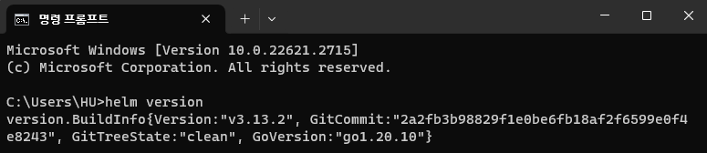

# 도구 설치하기

이 문서에서는 Kubernetes 환경 제어에 필요한 kubectl과 Helm,     
그리고 실제 K8S를 설치할 Ubuntu 환경을 편리하게 구성할 수 있는 Multipass를 설치합니다.

## kubectl 설치하기

kubectl은 K8S의 상태를 확인하고 제어할 수 있는 커맨드 라인 도구(CLI)입니다.

import Tabs from "@theme/Tabs";
import TabItem from "@theme/TabItem";

:::info
아래 방법으로 설치할 수 없다면 다음 링크를 참고하여 설치하세요.   
https://kubernetes.io/docs/tasks/tools/#kubectl
:::

```mdx-code-block
<Tabs groupId="operating-systems">
  <TabItem value="win" label="Windows">
```

1. 아래 링크에서 kubectl을 다운로드받습니다.   
   https://dl.k8s.io/release/v1.28.4/bin/windows/amd64/kubectl.exe
2. 다운로드받은 `kubectl.exe` 파일을 원하는 위치로 이동시킵니다.
3. `kubectl.exe` 파일이 있는 폴더를 `PATH` 환경변수에 추가합니다.

```mdx-code-block
  </TabItem>
  <TabItem value="mac" label="macOS">
```

1. Homebrew를 통해 간단하게 설치할 수 있습니다.  
   ```
   brew install kubectl
   ```

```mdx-code-block
  </TabItem>
</Tabs>
```

<br />

터미널에서 `kubectl version --client` 명령어를 입력하여 제대로 설치되었는지 확인합니다.


## Helm 설치하기

Helm은 K8S를 위한 패키지 매니저입니다.

:::info
아래 방법으로 설치할 수 없다면 다음 링크를 참고하여 설치하세요.   
https://helm.sh/docs/intro/install/
:::

```mdx-code-block
<Tabs groupId="operating-systems">
  <TabItem value="win" label="Windows">
```

1. 아래 링크에서 원하는 버전의 Helm을 다운로드받습니다.  
   https://github.com/helm/helm/releases
2. 압축을 풀고 `helm.exe` 파일을 원하는 위치로 이동시킵니다.
3. `helm.exe` 파일이 있는 폴더를 `PATH` 환경변수에 추가합니다.

```mdx-code-block
  </TabItem>
  <TabItem value="mac" label="macOS">
```

1. Homebrew를 통해 간단하게 설치할 수 있습니다.  
   ```
   brew install helm
   ```

```mdx-code-block
  </TabItem>
</Tabs>
```

<br />

터미널에서 `helm version` 명령어를 입력하여 제대로 설치되었는지 확인합니다.



## Multipass 설치하기

Multipass는 Canonical에서 만든 Ubuntu VM 환경 구성을 돕는 도구입니다.

:::info
아래 방법으로 설치할 수 없다면 다음 링크를 참고하여 설치하세요.   
https://multipass.run/install
:::

```mdx-code-block
<Tabs groupId="operating-systems">
  <TabItem value="win" label="Windows">
```

1. 아래 링크에서 설치 파일을 다운로드받고 실행합니다.  
   https://multipass.run/download/windows

```mdx-code-block
  </TabItem>
  <TabItem value="mac" label="macOS">
```

1. Homebrew를 통해 간단하게 설치할 수 있습니다.  
   ```
   brew install --cask multipass
   ```

```mdx-code-block
  </TabItem>
</Tabs>
```

<br />

터미널에서 `multipass version` 명령어를 입력하여 제대로 설치되었는지 확인합니다.


<!--Re-edited on 240119-->