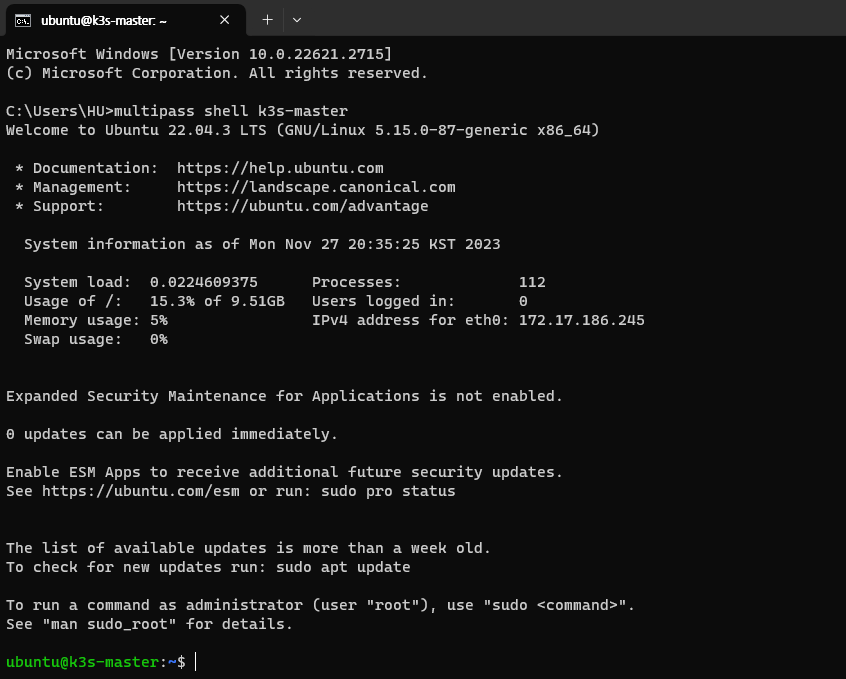
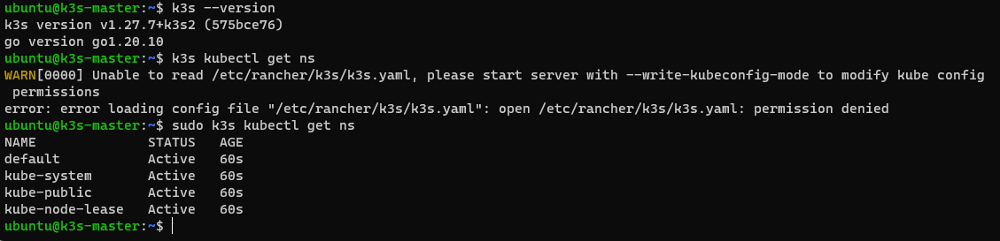
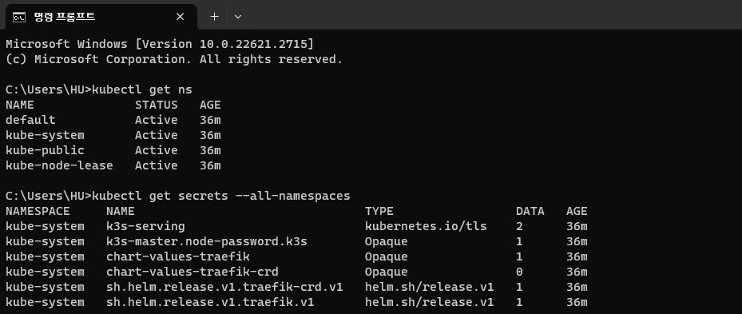

# K3S 설치하기

이 문서에서는 Multipass로 VM을 생성하고, VM에 K3S를 설치해 보겠습니다.

## Ubuntu VM 생성하기

다음 명령어를 실행해 Multipass에서 사용 가능한 Ubuntu 이미지를 확인합니다.

```
> multipass find

Image                       Aliases           Version          Description
core                        core16            20200818         Ubuntu Core 16
core18                                        20211124         Ubuntu Core 18
core20                                        20230119         Ubuntu Core 20
core22                                        20230717         Ubuntu Core 22
20.04                       focal             20231124         Ubuntu 20.04 LTS
22.04                       jammy,lts         20231026         Ubuntu 22.04 LTS
23.04                       lunar             20231113         Ubuntu 23.04
...
```

여기서는 22.04 버전을 사용하겠습니다.  
다음 명령어를 실행해 VM 인스턴스를 생성합니다.

```
# multipass launch [alias] --name [your-name]
  --memory [your-mem] --disk [your-disk] --cpus [your-cpu]

multipass launch jammy --name k3s-master --memory 2G --disk 10G --cpus 2
```

`multipass list` 명령어로 현재 인스턴스 상태를 확인할 수 있습니다.

```
> multipass list
Name                    State             IPv4             Image
k3s-master              Running           172.17.178.221   Ubuntu 22.04 LTS
```

<br/>

:::note 인스턴스 설정을 변경해야 할 때
인스턴스 설정을 변경하려면 다음과 같이 진행합니다.

1. 인스턴스가 실행중이라면 중지합니다.

   ```
   multipass stop k3s-master
   ```

2. 인스턴스 설정값을 변경합니다. `multipass get` 명령어로 값을 확인할 수 있고, `multipass set` 명령어로 값을 변경할 수 있습니다.  
   여기서는 CPU, 메모리, 디스크 사양을 모두 변경해 보겠습니다.

   ```
   > multipass get local.k3s-master.cpus
   2

   > multipass get local.k3s-master.disk
   10.0GiB

   > multipass get local.k3s-master.memory
   2.0GiB

   > multipass set local.k3s-master.cpus=3
   > multipass set local.k3s-master.disk=50.0GiB
   > multipass set local.k3s-master.memory=4.0GiB
   ```

3. 변경 후 다시 인스턴스를 실행합니다.

   ```
   multipass start k3s-master
   ```

:::

## VM에 접속하여 K3S 설치하기

[K3S][k3s]는 Rancher에서 만든 경량화 쿠버네티스 설치 도구입니다.  
가볍고 설치가 간편하여 테스트 환경에 적합하고, 실무에서도 사용이 가능합니다.

VM에서 K3S를 설치하기 위해 VM Shell에 접속합니다.

```
multipass shell k3s-master
```



정상적으로 VM Shell에 접속이 된 것을 확인할 수 있습니다.  
이제 K3S를 설치하면 됩니다. 여기서는 기본 옵션[^1]으로 설치하겠습니다.

```
curl -sfL https://get.k3s.io | sh -
```

이후 `k3s --version` 명령어로 설치를 확인하고, `kubectl` 을 사용할 수도 있습니다.

```
# Get Namespace for example
sudo k3s kubectl get ns
```



## VM의 K8S 환경을 호스트에서 제어하기

K3S를 설치했지만, 현재는 VM 내부에서만 접근이 가능합니다.  
편리한 작업을 위해 이를 호스트 컴퓨터에서 제어할 수 있도록 설정해 보겠습니다.

VM 외부에 있다면 다시 VM Shell에 접속합니다.

```
multipass shell k3s-master
```

K3S 설정파일은 `/etc/rancher/k3s/k3s.yaml` 에 있습니다.[^2] 이 파일을 호스트로 복사합니다.

```cmd
ubuntu@k3s-master:~$ sudo chmod 777 /etc/rancher/k3s/k3s.yaml
ubuntu@k3s-master:~$
logout

# Ctrl + D to logout
# Now we're on host

> multipass copy-files k3s-master:/etc/rancher/k3s/k3s.yaml Downloads/k3s-master.yaml
```

도착지로 설정한 폴더로 이동하면 `k3s-master.yaml` 파일이 있습니다.  
파일을 텍스트 편집기 등으로 열면 다음과 같이 되어 있습니다.

```yaml title="k3s-master.yaml" {5}
apiVersion: v1
clusters:
  - cluster:
      certificate-authority-data: (REDACTED...)
      server: https://127.0.0.1:6443
    name: default
contexts:
  - context:
      cluster: default
      user: default
    name: default
current-context: default
kind: Config
preferences: {}
users:
  - name: default
    user: (REDACTED...)
```

여기서 `127.0.0.1` 로 되어 있는 부분을 VM의 IP 주소로 변경해야 합니다.  
VM의 IP 주소는 `multipass list` 명령어를 통해 확인할 수 있습니다.

```cmd {3}
C:\Users\HU>multipass list
Name                    State             IPv4             Image
k3s-master              Running           172.17.186.245   Ubuntu 22.04 LTS
                                          10.42.0.0
                                          10.42.0.1
```

여기서는 추가로 IP 주소 외에 `cluster`, `user`, `context` 이름도 변경하겠습니다.

```yaml title="k3s-master.yaml" {5-6,9-12,16}
apiVersion: v1
clusters:
  - cluster:
      certificate-authority-data: (REDACTED...)
      server: https://172.17.186.245:6443
    name: master-cluster
contexts:
  - context:
      cluster: master-cluster
      user: master-user
    name: master
current-context: master
kind: Config
preferences: {}
users:
  - name: master-user
    user: (REDACTED...)
```

수정한 내용을 `${HOME}/.kube/config` 파일로 옮기고 터미널을 재실행합니다.  
(만약 파일이 없다면 새로 생성합니다)

이제 호스트에서 `kubectl` 로 VM의 K8S 환경을 제어할 수 있습니다.



<br/>

[k3s]: https://k3s.io

[^1]: https://docs.k3s.io/quick-start#install-script
[^2]: https://docs.k3s.io/cluster-access

<!--Re-edited on 240120-->
