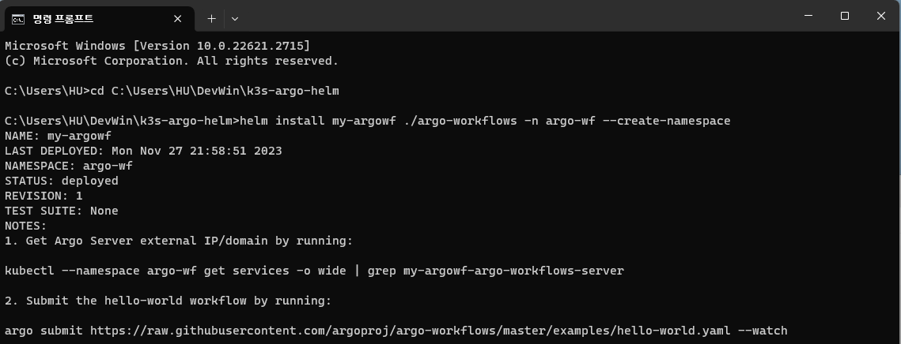
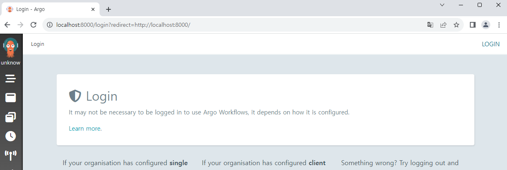

# Hello, Argo Workflows!

이 문서에서는 Helm chart로 기본 Argo Workflows 앱을 배포해 보겠습니다.

## Argo Helm chart 다운로드

다음 Repository에서 Helm chart를 다운로드합니다.  
https://github.com/argoproj/argo-helm

다운로드받은 Chart를 적당한 곳에 위치시킵니다. 여기서는 다음과 같이 배치했습니다.

```
k3s-argo-helm
|- argo-cd
|- argo-events
|- argo-workflows
|- ...
```

## Helm chart 설치하기

이제 Argo Workflows를 배포해 봅시다.  
Chart가 위치한 폴더에서 다음 명령어를 실행합니다.

```
helm install my-argowf ./argo-workflows -n argo-wf --create-namespace
```



정상적으로 설치가 되었습니다.  
`kubectl get all -n argo-wf` 명령어로 리소스를 확인합니다.

```
C:\Users\HU\DevWin\k3s-argo-helm>kubectl get all -n argo-wf
NAME                                                               READY   STATUS    RESTARTS   AGE
pod/my-argowf-argo-workflows-workflow-controller-ffc5b5c4d-ctnwz   1/1     Running   0          2m21s
pod/my-argowf-argo-workflows-server-774d4bf6dd-thzwl               1/1     Running   0          2m21s

NAME                                      TYPE        CLUSTER-IP    EXTERNAL-IP   PORT(S)    AGE
service/my-argowf-argo-workflows-server   ClusterIP   10.43.13.95   <none>        2746/TCP   2m21s

NAME                                                           READY   UP-TO-DATE   AVAILABLE   AGE
deployment.apps/my-argowf-argo-workflows-workflow-controller   1/1     1            1           2m21s
deployment.apps/my-argowf-argo-workflows-server                1/1     1            1           2m21s

NAME                                                                     DESIRED   CURRENT   READY   AGE
replicaset.apps/my-argowf-argo-workflows-workflow-controller-ffc5b5c4d   1         1         1       2m21s
replicaset.apps/my-argowf-argo-workflows-server-774d4bf6dd               1         1         1       2m21s
```

Argo Workflows 앱에 접근도 해 봅시다.  
간단하게 확인하기 위해 `kubectl port-forward` 명령어를 사용하겠습니다.

```
kubectl port-forward svc/my-argowf-argo-workflows-server -n argo-wf 8000:2746
```

이제 브라우저를 열고 `localhost:8000` 주소로 접속해 봅니다.



지금은 로그인을 할 수 없지만, 잘 실행되었습니다!  
배포된 앱을 삭제하려면 다음 명령어를 실행합니다.

```
helm uninstall my-argowf -n argo-wf
```

<!--Re-edited on 240101-->
