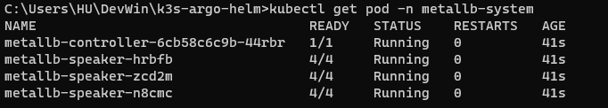
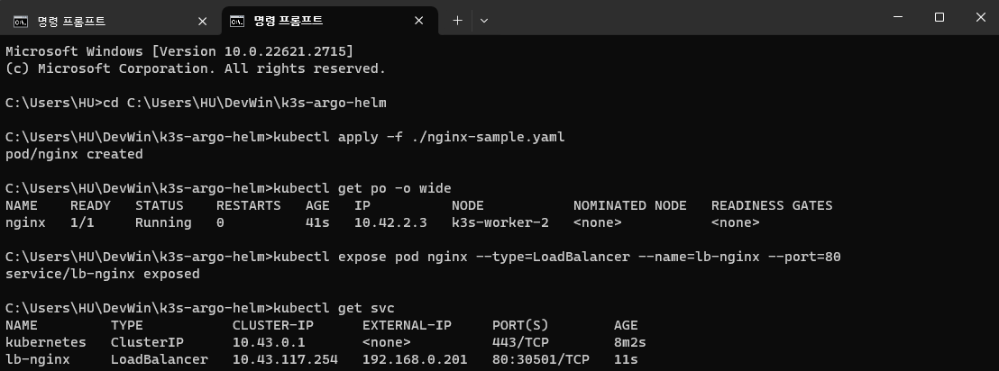
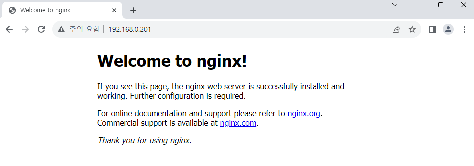

# MetalLB 설치하기

MetalLB는 bare metal 환경의 K8S 환경에서 사용 가능한 Load-Balancer입니다.  
MetalLB를 사용하면 클라우드 공급자(GCP, AWS 등)의 도움 없이도 서비스를 외부에 공개하기 용이합니다.

## MetalLB helm chart 다운로드

다음 Repository에서 helm chart를 다운로드합니다.  
https://github.com/metallb/metallb/tree/main

## Namespace 생성

speaker Pod에 권한을 주기 위해[^1] 다음과 같이 Namespace 설정 파일을 생성합니다.

```yaml title="metallb-ns.yaml"
apiVersion: v1
kind: Namespace
metadata:
  name: metallb-system
  labels:
    pod-security.kubernetes.io/enforce: privileged
    pod-security.kubernetes.io/audit: privileged
    pod-security.kubernetes.io/warn: privileged
```

설정이 완료되면 다음 명령어로 Namespace를 생성합니다.

```
kubectl apply -f ./metallb-ns.yaml
```

## helm chart 설치하기

우선 helm chart에서 MetalLB 버전을 설정해야 합니다.  
chart를 관찰해 보면 controller와 speaker image를 불러올 때 tag를 받고 있으며  
`Chart.yaml`의 `appVersion`을 기본값으로 사용하고 있습니다.  
이를 최신 버전인 `v0.13.12`로 설정하겠습니다.

```yaml title="Chart.yaml" {17}
apiVersion: v2
name: metallb
description: A network load-balancer implementation for Kubernetes using standard

(...)

# This is the chart version. This version number should be incremented each time you make changes
# to the chart and its templates, including the app version.
# Versions are expected to follow Semantic Versioning (https://semver.org/)
# NOTE: this value is updated by the metallb release process
version: 1.0.0

# This is the version number of the application being deployed. This version number should be
# incremented each time you make changes to the application. Versions are not expected to
# follow Semantic Versioning. They should reflect the version the application is using.
# NOTE: this value is updated by the metallb release process
appVersion: v0.13.12
```

이제 helm으로 MetalLB를 설치합니다.

```
helm install metallb -n metallb-system ./metallb
```



위 설정처럼 노드 개수만큼 speaker가 생성되면 정상적으로 MetalLB가 설치된 것입니다.

## Layer 2 Config 설정하기

다음으로는 앱 생성시 Service에 외부 고정 IP를 할당받도록 layer 2 config를 설정합니다.

아래 링크를 참조하여 다음과 같은 설정 파일을 생성합니다.  
ip는 허용 범위 내에서 자유롭게 변경하시면 됩니다.  
https://metallb.universe.tf/configuration/#layer-2-configuration

```yaml title="metallb-ipconfig.yaml"
apiVersion: metallb.io/v1beta1
kind: IPAddressPool
metadata:
  name: metallb-pool
  namespace: metallb-system
spec:
  addresses:
    - 192.168.0.200-192.168.0.250
---
apiVersion: metallb.io/v1beta1
kind: L2Advertisement
metadata:
  name: metallb-advertise
  namespace: metallb-system
```

설정이 완료되면 다음 명령어로 Object를 생성합니다.

```
kubectl apply -f ./metallb-ipconfig.yaml
```

## IP 접근 확인하기

테스트를 위해 Pod를 하나 생성해 보겠습니다.

```yaml title="nginx-sample.yaml"
apiVersion: v1
kind: Pod
metadata:
  name: nginx
  labels:
    env: test
spec:
  containers:
    - name: nginx
      image: nginx
      imagePullPolicy: IfNotPresent
  nodeSelector:
    kubernetes.io/hostname: k3s-worker-2
```

Pod를 생성하고, 서비스로 80번 포트를 개방합니다.

```
kubectl apply -f ./nginx-sample.yaml

kubectl expose pod nginx --type=LoadBalancer --name=lb-nginx --port=80

kubectl get svc
```



정상적으로 외부 IP가 할당되었습니다.  
브라우저로 접속해 보면, nginx 페이지를 확인할 수 있습니다.



[^1]: https://metallb.universe.tf/installation/#installation-with-helm
