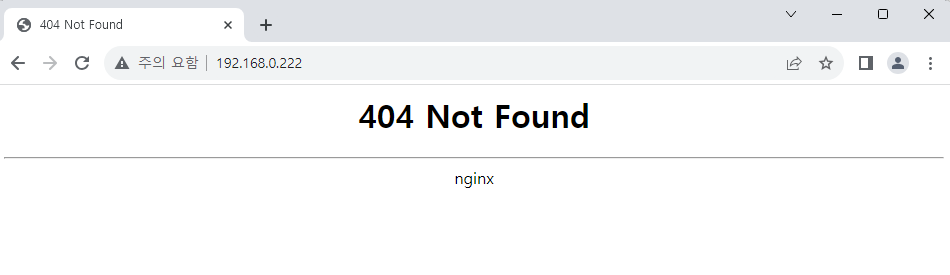
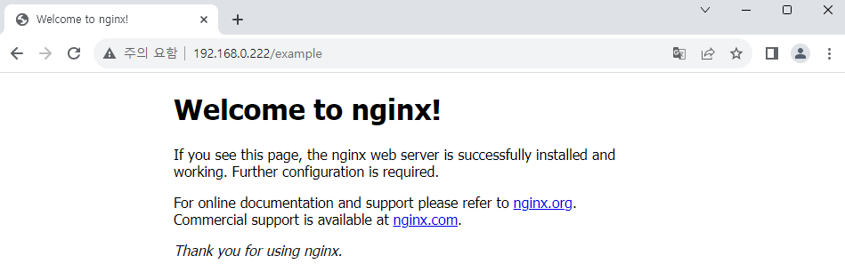

# Ingress NGINX Controller 설치하기

MetalLB에 이어 Ingress NGINX Controller를 설치하고 테스트해 보겠습니다.  
Ingress NGINX Controller는 K8S 환경에서 NGINX를 Reverse Proxy와 Load-Balancer로 활용 가능하게 해 줍니다. 클라이언트의 요청을 안정적으로 받아 라우팅까지 할 수 있어 최근에 높은 관심을 받고 있는 MSA 환경 구축에 효과적입니다.

## Helm chart 다운로드 & 설치

NGINX 진영에서 만든 [nginxinc/kubernetes-ingress][ref1]도 있습니다만,  
여기서는 Kubernetes에서 공식 지원하는 Helm chart를 사용하겠습니다.

다음 Repository에서 Helm chart를 다운로드합니다.  
https://github.com/kubernetes/ingress-nginx/

다운로드받은 chart를 `helm install` 명령어로 설치합니다.

```
helm install ingress-nginx -n ingress-nginx ./ingress-nginx --create-namespaces
```

`ingress-nginx-controller` Service는 기본으로 `LoadBalancer` type으로 설정되어 있기 때문에,  
해당 type으로 생성되면서 External IP까지 할당받은 것을 확인할 수 있습니다.


:::note 고정 IP 설정하기

`values.yaml` 파일에서 `controller.service.loadBalancerIP` 값을 MetalLB에서 설정했던 범위 내 고정값으로 변경하면 IP 주소를 고정할 수 있습니다. 예를 들어, `192.168.0.222` 등을 입력합니다.

이후 `helm upgrade` 명령어로 변경사항을 반영합니다.

```
helm upgrade ingress-nginx -n ingress-nginx ./ingress-nginx
```

:::

## Ingress 생성 & 테스트하기

테스트를 위해 다시 NGINX 앱을 생성하고 노출하겠습니다.  
대신 이번에는 `example` 이라는 새로운 Namespace에 생성하고, Service에 `LoadBalancer` type도 설정하지 않았습니다.

```yaml title="nginx-sample.yaml"
apiVersion: v1
kind: Pod
metadata:
  name: nginx
  labels:
    env: test
spec:
  containers:
    - name: nginx
      image: nginx
      imagePullPolicy: IfNotPresent
  nodeSelector:
    kubernetes.io/hostname: k3s-worker-2
```

```
kubectl create ns example

kubectl apply -f ./nginx-sample.yaml -n example

kubectl expose pod nginx -n example --name=lb-nginx --port=80
```

현재 `lb-nginx` Service는 일반적인 방법으로는 외부에서 접근이 불가능한 상태입니다.  
목표는 해당 Service를 `/example` 경로에 할당하는 것입니다.

`lb-nginx` Service를 Ingress Controller에 연결하기 위해 새로운 Service와 Ingress 파일을 작성합니다.  
`ExternalName` type을 사용하면 다른 Namespace의 Service도 연결할 수 있습니다.[^1]

```yaml title="custom-ingress.yaml" {17,19}
kind: Service
apiVersion: v1
metadata:
  name: example-svc
  namespace: my-ingress
spec:
  type: ExternalName
  externalName: lb-nginx.example.svc.cluster.local
  # service-name.namespace-name.svc.cluster.local
---
apiVersion: networking.k8s.io/v1
kind: Ingress
metadata:
  name: custom-ingress
  namespace: my-ingress
  annotations:
    nginx.ingress.kubernetes.io/rewrite-target: /
spec:
  ingressClassName: "nginx"
  rules:
    - http:
        paths:
          - path: /example
            pathType: Prefix
            backend:
              service:
                name: example-svc
                port:
                  number: 80
```

Ingress 설정에서 강조된 2개 항목은 반드시 올바르게 설정해야 합니다.  
`spec.ingressClassName` 에 `nginx` 를 입력한 이유는 해당 값이 기본값이기 때문입니다.

```
> k get IngressClass --all-namespaces
NAME      CONTROLLER                      PARAMETERS   AGE
traefik   traefik.io/ingress-controller   <none>       77m
nginx     k8s.io/ingress-nginx            <none>       39m
```

이제 설정한 Service와 Ingress를 생성합니다.

```
kubectl create ns my-ingress
kubectl apply -f ./custom-ingress.yaml
```

<br />

브라우저에서 `ingress-nginx-controller` Service에 할당된 IP 주소에 접속합니다.  
접속은 가능하지만, 홈 주소에 연결된 항목이 없기 때문에 404 Not Found가 출력됩니다.



이제 위에서 설정한 `/example` 주소로 이동하면, NGINX 페이지를 확인할 수 있습니다.



<br />

[ref1]: https://github.com/nginxinc/kubernetes-ingress

[^1]: https://stackoverflow.com/a/59845018

<!--Re-edited on 240120-->
