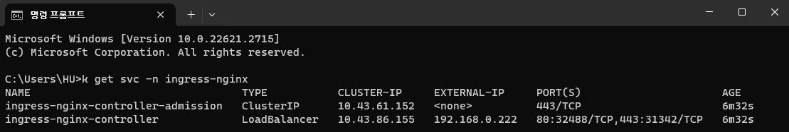
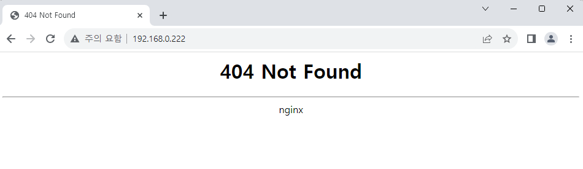
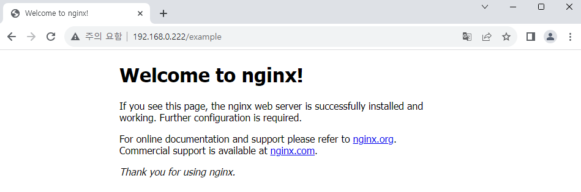

# Ingress NGINX Controller 설치하기

MetalLB에 이어 Ingress NGINX Controller를 설치하고 테스트해 보겠습니다.  
Ingress NGINX Controller는 K8S 환경에서 NGINX를 reverse proxy와 load balancer로 사용하게 해 줍니다. 클라이언트의 요청을 안정적으로 받아 라우팅까지 할 수 있어 최근에 높은 관심을 받고 있는 MSA 환경을 구축하는 데 효과적입니다.

## Ingress NGINX Controller helm chart 다운로드

다음 Repository에서 helm chart를 다운로드합니다.  
https://github.com/kubernetes/ingress-nginx/

다운로드받은 chart를 `helm install` 명령어로 설치합니다.

```
helm install ingress-nginx -n ingress-nginx ./ingress-nginx --create-namespaces
```

`ingress-nginx-controller` 서비스는 기본으로 LoadBalancer type으로 설정되어 있기 때문에,  
해당 타입으로 생성되면서 외부 IP까지 할당받은 것을 확인할 수 있습니다.



:::note 고정 IP를 설정하려면

`values.yaml`에서 `controller.service.loadBalancerIP` 값을 MetalLB에서 설정한 범위 내의 고정값으로 변경하면 IP를 고정할 수 있습니다. 예를 들어, `192.168.0.222` 같은 값을 입력합니다.

이후 다음 명령어로 변경사항을 반영할 수 있습니다.

```
helm upgrade ingress-nginx -n ingress-nginx ./ingress-nginx
```

:::

## 라우팅을 위한 Ingress 생성하기

테스트를 위해 다시 nginx 앱을 생성하고 노출하겠습니다.  
대신 이번에는 `example` 이라는 새로운 Namespace에 생성하고, 서비스에 LoadBalancer 타입도 설정하지 않았습니다.

```
kubectl create ns example

kubectl apply -f ./nginx-sample.yaml -n example

kubectl expose pod nginx -n example --name=lb-nginx --port=80
```

이제 nginx 서비스를 Ingress Controller에 연결하기 위해 새로운 Service와 Ingress 파일을 작성합니다.  
목표는 nginx 서비스를 `/example` 주소로 할당하는 것입니다.  
ExternalName 타입을 사용하면 다른 Namespace의 Service도 연결할 수 있습니다.[^1]

```yaml title="custom-ingress.yaml" {17,19}
kind: Service
apiVersion: v1
metadata:
  name: example-svc
  namespace: my-ingress
spec:
  type: ExternalName
  externalName: lb-nginx.example.svc.cluster.local
  # service-name.namespace-name.svc.cluster.local
---
apiVersion: networking.k8s.io/v1
kind: Ingress
metadata:
  name: custom-ingress
  namespace: my-ingress
  annotations:
    nginx.ingress.kubernetes.io/rewrite-target: /
spec:
  ingressClassName: "nginx"
  rules:
    - http:
        paths:
          - path: /example
            pathType: Prefix
            backend:
              service:
                name: example-svc
                port:
                  number: 80
```

Ingress에서 강조된 2개 항목은 반드시 올바르게 설정해 주어야 합니다.  
여기서 `spec.ingressClassName` 에 `nginx` 를 입력한 이유는 해당 값이 기본값이기 때문입니다.

```
> k get IngressClass --all-namespaces
NAME      CONTROLLER                      PARAMETERS   AGE
traefik   traefik.io/ingress-controller   <none>       77m
nginx     k8s.io/ingress-nginx            <none>       39m
```

이제 설정한 Service와 Ingress를 생성합니다.

```
kubectl create ns my-ingress
kubectl apply -f ./custom-ingress.yaml
```

<br />

브라우저로 `ingress-nginx-controller` 에 할당된 IP에 접속합니다.  
접속은 가능하지만, 홈 주소에 연결된 항목이 없기 때문에 404 Not Found가 출력됩니다.



이제 `/example` 주소로 이동해 보면, nginx 페이지를 확인할 수 있습니다.



<br />

[^1]: https://stackoverflow.com/a/59845018
