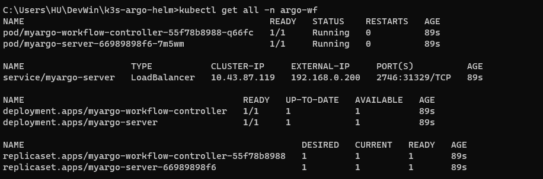
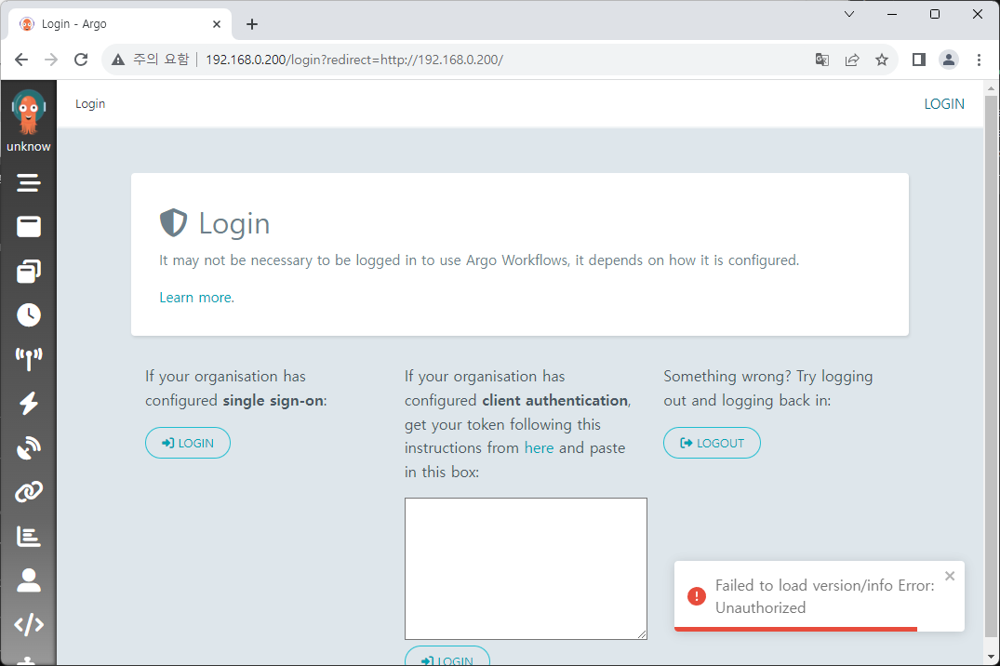
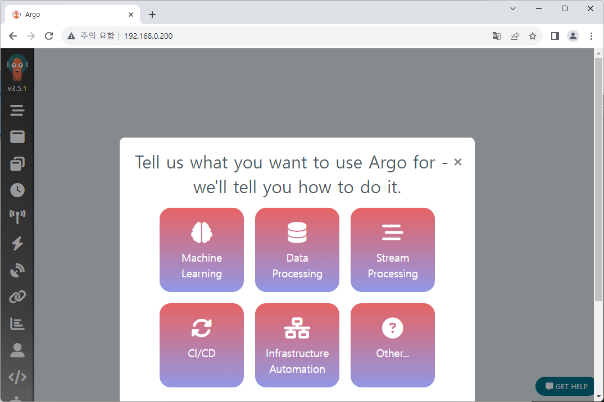

# Argo Workflows 재배포 + 로그인하기

필요한 환경 설정은 끝났습니다.  
이제 Argo Workflows를 설정을 수정하여 재배포하고 로그인까지 수행해 보겠습니다.

## Helm chart 수정

이전에는 따로 수정 없이 기본 옵션으로 Helm chart를 배포했습니다.  
이번에는 간단하게 chart를 수정해 보겠습니다.

1. `fullnameOverride` 를 원하는 이름으로 변경합니다.  
   여기서는 `myargo` 로 설정하겠습니다.

2. Master node에 배포하기 위해 `nodeSelector` 옵션을 변경합니다.  
   `controller.nodeSelector` 와 `server.nodeSelector`에 다음 label을 추가합니다.  
   - `node-role.kubernetes.io/master: "true"`

   이외에 다른 label 설정으로 변경하셔도 됩니다.  
   Node에 설정된 label은 다음 명령어로 확인할 수 있습니다.

   ```
   kubectl get nodes --show-labels
   ```

   라벨 설정과 관련된 내용은 여기서 다루지 않겠습니다.

3. 접근을 위한 Load-Balancer 설정을 위해 다음과 같이 `values.yaml` 을 수정합니다.

   ```yaml title="values.yaml" {5,7,11,28}
   (...)
   server:
     (...)
     # -- Service type for server pods
     serviceType: LoadBalancer
     # -- Service port for server
     servicePort: 80
     # -- Service node port
     serviceNodePort: # 32746
     # -- Service port name
     servicePortName: "http" # http

     serviceAccount:
       # -- Create a service account for the server
       create: true
       # -- Service account name
       name: ""
       # -- Labels applied to created service account
       labels: {}
       # -- Annotations applied to created service account
       annotations: {}

     # -- Annotations to be applied to the UI Service
     serviceAnnotations: {}
     # -- Optional labels to add to the UI Service
     serviceLabels: {}
     # -- Static IP address to assign to loadBalancer service type `LoadBalancer`
     loadBalancerIP: "192.168.0.200"
   (...)
   ```

## 로그인을 위한 Account 설정하기

SSO 방식을 사용해 타 OAuth 서비스와 연동하여 로그인을 구성할 수도 있지만,  
여기서는 token 로그인 방식[^1]을 적용하겠습니다.

token은 기본 계정 외에 새로 계정을 만들어 발행하겠습니다.  
(기본 계정에서 token 추출이 가능할 수 있지만, 이 문서에서는 설명하지 않습니다)

새로운 계정 설정을 위해 Helm chart template에 추가 파일을 작성합니다.  
RoleBinding, ServiceAccount, Secret 총 3개의 설정 파일을 작성해야 합니다.  
제가 설정한 이름 `huadmin` 은 알맞게 변경해 주세요. `values.yaml` 에 따로 분리하는 것도 좋습니다.

그리고 여기서는 Argo Helm chart에서 기본 생성하는 ClusterRole을 사용하였습니다.  
Role도 추가로 생성하고 싶다면 해당하는 `yaml` 파일을 하나 더 작성하고, RoleBinding에서 연결해 주시면 됩니다.

```yaml title="rb-admin.yaml"
apiVersion: rbac.authorization.k8s.io/v1
kind: RoleBinding
metadata:
  name: huadmin-rb
  namespace: {{ .Release.Namespace | quote }}
subjects:
- kind: ServiceAccount
  name: huadmin
roleRef:
  kind: ClusterRole
  name: {{ template "argo-workflows.fullname" . }}-admin
  apiGroup: rbac.authorization.k8s.io
```

```yaml title="sa-admin.yaml"
apiVersion: v1
kind: ServiceAccount
metadata:
  name: huadmin
  namespace: {{ .Release.Namespace | quote }}
secrets:
  - name: huadmin-sa
```

```yaml title="secret-admin-token.yaml"
apiVersion: v1
kind: Secret
metadata:
  name: huadmin-secret
  namespace: {{ .Release.Namespace | quote }}
  annotations:
    kubernetes.io/service-account.name: huadmin
type: kubernetes.io/service-account-token
```

## 배포 후 접속하기

설정이 끝났으니 다시 Argo Workflows를 배포해 봅시다.  
Helm chart가 위치한 폴더로 이동해 다음 명령어를 실행합니다.

```
helm install my-argowf ./argo-workflows -n argo-wf --create-namespace
```

이제 로그인을 위한 토큰을 확인해야 합니다. 아래의 명령어로 토큰을 확인할 수 있습니다.  
Linux는 그대로 확인하면 되고, Windows의 경우 master VM Shell에 들어가서 확인하시면 됩니다.  
그 외 다른 방법을 사용하셔도 됩니다.

```
ARGO_TOKEN="Bearer $(sudo k3s kubectl get secret huadmin-secret -n argo-wf -o=jsonpath='{.data.token}' | base64 --decode)"
echo $ARGO_TOKEN
```

token 값은 로그인에 필요하기 때문에 저장해 둡니다.



`kubectl` 로 조회해 보면 정상적으로 IP가 할당되었고, Helm chart에서 바꾼 이름 `myargo` 를 기반으로 리소스가 생성된 것을 확인할 수 있습니다.  
이제 브라우저로 해당 IP에 접속하면 로그인 화면이 나옵니다.



여기서 아까 저장해 두었던 토큰을 이용해 로그인을 진행합니다.



정상적으로 로그인되었습니다!

<br />

[^1]: https://argoproj.github.io/argo-workflows/access-token/
