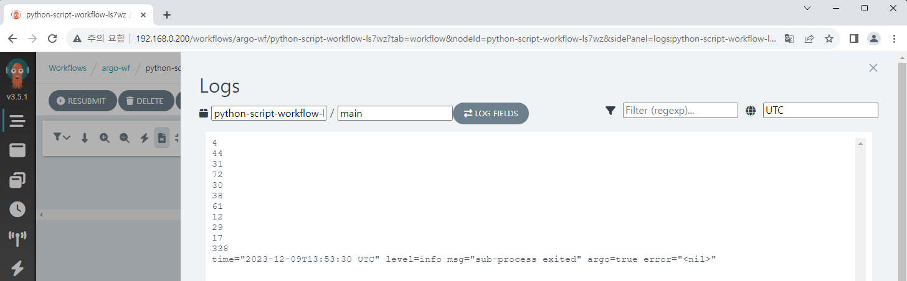
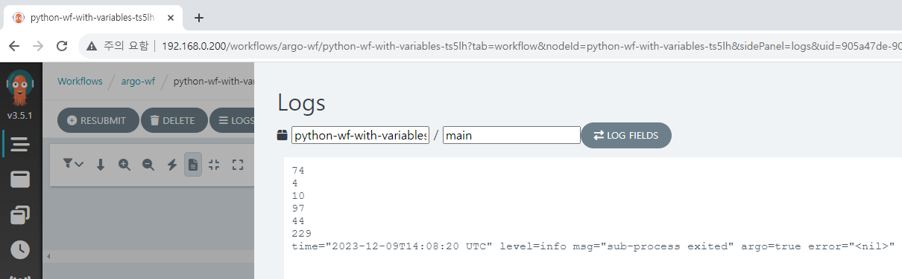

# 여러 가지 Workflow들

기본적인 Workflow 생성법을 알았으니, 주로 사용되는 여러 종류의 Workflow를 만들어 보겠습니다.

## Script

Workflow에 직접 script를 작성하여 실행시키는 것이 가능합니다.  
여기서는 Python 코드를 작성했는데, Shell script도 작성이 가능합니다.  
아래 코드는 랜덤으로 숫자를 10개 출력하고, 마지막에 그 합까지 출력합니다.

<!-- prettier-ignore -->
```yaml
apiVersion: argoproj.io/v1alpha1
kind: Workflow
metadata:
  name: python-script-workflow
spec:
  entrypoint: sum-random-ten
  templates:
    - name: sum-random-ten
      script:
        image: python:alpine3.8
        command: [python]
        source: |
            import random

            sum = 0
            for _ in range(10):
                i = random.randint(1, 100)
                print(i)
                sum += i
            print(sum)
```



## Workflow에서 변수 전달하기

개별 Step이 아닌 전체 Workflow에서 변수를 제어하고 싶거나, 기타 여러 상황에서 Workflow 변수를 Template로 전달할 수 있습니다.  
다음 Workflow는 Workflow 실행 전에 `count-from-workflow` 변수를 받고, `sum-random-n` Template에서 이를 받아 `count` 변수로 전달하여 script에서 사용합니다.

<!-- prettier-ignore -->
```yaml
apiVersion: argoproj.io/v1alpha1
kind: Workflow
metadata:
  name: python-wf-with-variables
spec:
  entrypoint: sum-random-n
  arguments:
    parameters:
    - name: count-from-workflow
  templates:
    - name: sum-random-n
      inputs:
        parameters:
          - name: count
            value: "{{workflow.parameters.count-from-workflow}}"
      script:
        image: python:alpine3.8
        command: [python]
        source: |
            import random

            sum = 0
            n = {{inputs.parameters.count}}
            for _ in range(n):
                i = random.randint(1, 100)
                print(i)
                sum += i
            print(sum)
```

아래는 변수를 5로 전달해 실행한 화면입니다.  
5개의 무작위 정수가 출력되고, 그 합이 출력되는 것을 확인할 수 있습니다.




## Suspend와 Step

Suspend는 Workflow의 실행을 잠시 멈추고, 다시 Workflow가 실행되기 위해서는 일정 시간이 지나거나 수동으로 명령을 전달해야 합니다. 단독으로는 특별한 기능이 없기 때문에, 주로 후술할 Step이나 DAG와 같이 사용됩니다.  
Step은 말 그대로 여러 단계로 나누어 Workflow를 구성할 수 있도록 해 줍니다. 서로 다른 역할을 구분하거나, 여러 source의 내용을 결합해서 Workflow를 구성해야 할 때 유용합니다.

다음은 간단히 Suspend와 Step을 사용한 예제입니다.  
`number-from-workflow` 라는 숫자를 입력받아 `suspend-sleep` 과 `echo-num` 이라는 개별 Template에 각각 전달합니다.  
예를 들어 20을 입력했다면 우선 20초를 기다리고, `echo` 명령어로 20을 출력합니다.

<!-- prettier-ignore -->
```yaml
apiVersion: argoproj.io/v1alpha1
kind: Workflow
metadata:
  name: shell-with-sleep
spec:
  entrypoint: total-wf
  arguments:
    parameters:
    - name: number-from-workflow
  templates:
  - name: total-wf
    steps:
    - - name: sleep
        template: suspend-sleep
        arguments:
          parameters:
          - name: sleep-time
            value: "{{workflow.parameters.number-from-workflow}}"
    - - name: echo
        template: echo-num
        arguments:
          parameters:
          - name: number
            value: "{{workflow.parameters.number-from-workflow}}"

  - name: suspend-sleep
    inputs:
      parameters:
      - name: sleep-time
    suspend:
      duration: "{{inputs.parameters.sleep-time}}s"

  - name: echo-num
    inputs:
      parameters:
      - name: number
    script:
      image: bash:latest
      command: [bash]
      source: |
        echo {{inputs.parameters.number}}
```

아래는 실제로 20을 입력하고 실행한 결과입니다.


## DAG

DAG란 Directed Acyclic Graph의 약자로, 주로 pipeline을 구성하는 데 많이 이용됩니다. Dependency를 설정하여 해당 Step이 구동되기 위해 필요한 조건을 지정할 수 있고, 여러 분기로 나누어 Workflow를 처리하거나, Dependency를 여러 개 설정하여 다시 여러 분기에서 작업된 결과를 하나로 통합하는 등 다양한 활용법이 있습니다.  
아래는 간단한 DAG를 구현한 예시입니다.

<!-- prettier-ignore -->
```yaml
apiVersion: argoproj.io/v1alpha1
kind: Workflow
metadata:
  name: dag-example
spec:
  entrypoint: total-wf
  templates:
  - name: total-wf
    dag:
      tasks:
      - name: stepA
        template: echo-sth
        arguments:
          parameters:
          - name: word
            value: "start"
      - name: stepB-1
        dependencies: [stepA]
        template: suspend-sleep
        arguments:
          parameters:
          - name: sleep-time
            value: "120"
      - name: stepB-2
        dependencies: [stepB-1]
        template: echo-sth
        arguments:
          parameters:
          - name: word
            value: "end of B"
      - name: stepC-1
        dependencies: [stepA]
        template: suspend-sleep
        arguments:
          parameters:
          - name: sleep-time
            value: "180"
      - name: stepC-2
        dependencies: [stepC-1]
        template: echo-sth
        arguments:
          parameters:
          - name: word
            value: "end of C"
      - name: stepD
        dependencies: [stepC-2, stepB-2]
        template: echo-sth
        arguments:
          parameters:
          - name: word
            value: "end of all workflow"

  - name: suspend-sleep
    inputs:
      parameters:
      - name: sleep-time
    suspend:
      duration: "{{inputs.parameters.sleep-time}}s"

  - name: echo-sth
    inputs:
      parameters:
      - name: word
    script:
      image: bash:latest
      command: [bash]
      source: |
        echo {{inputs.parameters.word}}
```

간단하게 설명하면 Step A에서 `start`를 출력하고, 2개의 분기로 나뉘어 Step B와 Step C를 수행합니다. 두 쪽이 모두 완료되었을 때 Step D에서 `end of all workflow` 를 출력하고 프로세스가 끝납니다.  
실제로 실행해보면 Suspend를 양쪽에서 각각 2분, 3분으로 설정했지만 동시에 작업이 진행되기 때문에, `bash` 세팅 시간을 포함해서 2 + 3 = 5분 이상이 아닌 3~4분 정도만 소요되는 것을 확인할 수 있습니다.


