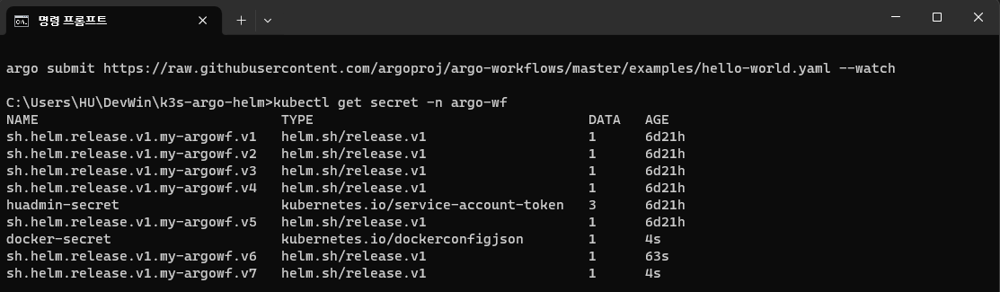
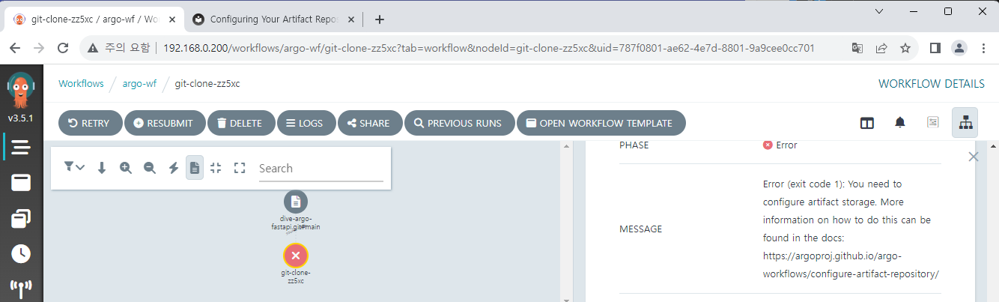
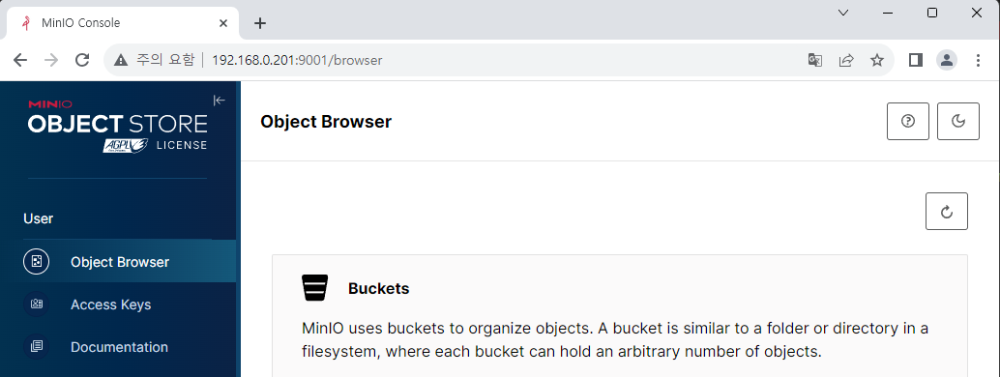
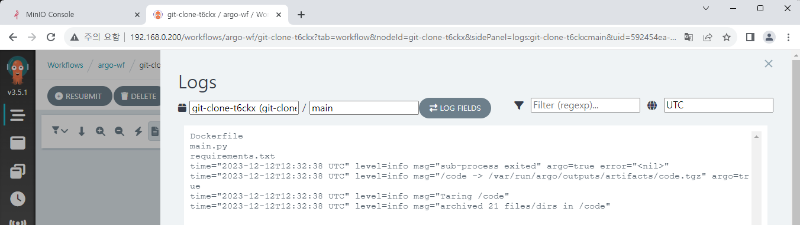
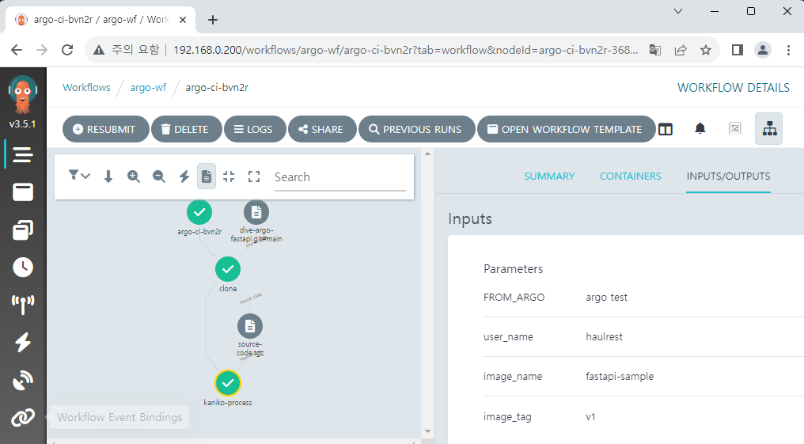
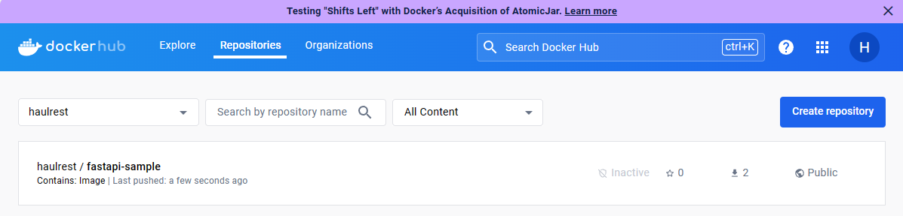
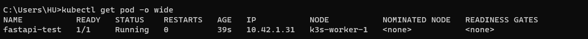
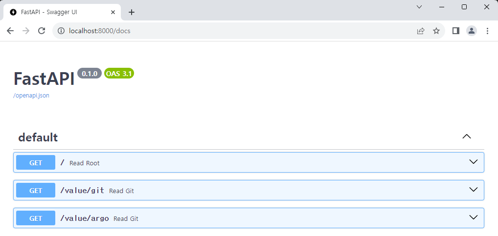
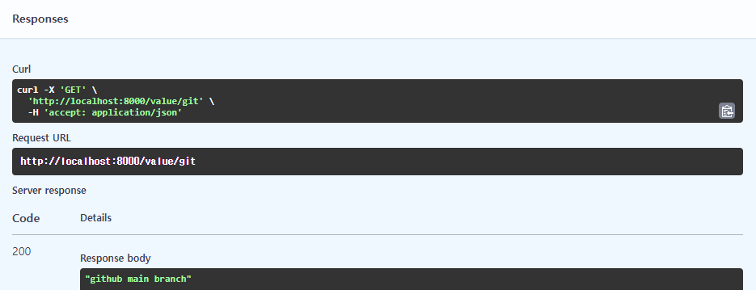
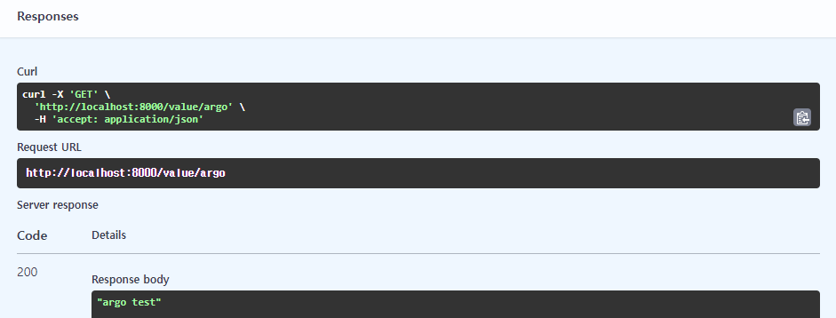

# CI Workflow 구축하기

기본적인 Workflow 구성법을 익혔으니, 실제 App에 대한 CI 과정을 구성해 보겠습니다.  
CI 과정에서는 보통 Code 작업, Build와 Test까지 포함되지만[^1] 여기서는 Build에 집중할 것이고 Code 작업과 Test에 대해서는 설명하지 않겠습니다.

최종적인 목표는 `git push` 를 하면 자동으로 Workflow를 감지하여 이미지를 빌드하고 업로드하는 것이지만, `git push` 감지는 Argo Workflows 외에 Argo Events라는 다른 앱이 필요합니다. 그러니 우선은 Workflow만 구성해 보겠습니다.

## Workflow Overview

0. Git 주소를 변수로 받습니다.
1. `git clone` 을 합니다.
2. 루트 폴더에서 `Dockerfile` 을 사용해 이미지를 빌드합니다. 여기서는 Kaniko를 사용합니다.
3. 만든 이미지를 Docker Hub에 Push합니다.  
   Harbor 등의 다른 Repository 서비스에 업로드도 가능하지만 논점을 벗어나므로 여기서는 다루지 않겠습니다.

[Kaniko][kaniko]는 Docker daemon을 사용하지 않기 때문에 Docker의 문제점 중 하나인 권한 문제를 해결하면서 빠르게 이미지를 빌드할 수 있습니다.

## Sample App 선정

테스트를 위해 간단한 Sample App과 `Dockerfile` 을 작성했습니다.  
꼭 이 소스를 사용할 필요는 없고, 이미지로 빌드하여 배포가 가능하다면 어떤 종류여도 상관없습니다.

[dive-argo-fastapi Repository][fastapi]

## Docker Secret 생성

Docker Hub에 이미지를 올리기 위해서 계정 정보가 포함된 Secret을 생성해야 합니다.  
[Kubernetes 공식 문서][ref1]에 수동으로 Secret을 생성하는 방법이 있는데, 여기서는 Helm chart로 Secret을 생성하기 위해 [Helm 공식 문서][ref2]를 추가로 참고하겠습니다. 이것이 꼭 정답이 아니기 때문에, 실무에서는 여러 요소를 고려해 Secret 관리 방법을 판단해 주세요. [Vault][vault] 등의 Secret 관리용 서드파티 도구를 사용할 수도 있습니다.

Argo Workflows Helm chart에서 다음 과정을 수행합니다.

1. `values.yaml` 파일에 다음과 같이 계정 정보를 추가합니다.

   ```yaml title="values.yaml" {3-7}
   (...)
   # Add this below
   imageCredentials:
     registry: https://index.docker.io/v1/ # for Docker Hub
     username: your-name
     password: your-pw
     email: your@mail.com
   ```

2. `_helpers.tpl` 파일에 다음과 같이 추가 템플릿을 설정합니다.

   ```tpl title="_helpers.tpl" {3-7}
   (...)
   # Add this below
   {{- define "imagePullSecret" }}
   {{- with .Values.imageCredentials }}
   {{- printf "{\"auths\":{\"%s\":{\"username\":\"%s\",\"password\":\"%s\",\"email\":\"%s\",\"auth\":\"%s\"}}}" .registry .username .password .email (printf "%s:%s" .username .password | b64enc) | b64enc }}
   {{- end }}
   {{- end }}
   ```

3. `templates` 폴더 아래에 다음과 같이 Secret 설정 파일을 작성합니다.

   <!-- prettier-ignore -->
   ```yaml title="docker-secret.yaml"
    apiVersion: v1
    kind: Secret
    metadata:
      name: docker-secret
      namespace: {{ .Release.Namespace | quote }}
    type: kubernetes.io/dockerconfigjson
    data:
      .dockerconfigjson: {{ template "imagePullSecret" . }}
   ```

설정이 완료되었으면 변경사항을 적용합니다.

```
helm upgrade my-argowf ./argo-workflows -n argo-wf
```

`kubectl` 명령어로 만들어진 Secret을 확인할 수 있습니다.



## Workflow 구성

모든 내용을 하나의 파일에 작성하면 너무 길어지기 때문에,  
편의상 각각의 Step을 WorkflowTemplate으로 작성하고 합치도록 하겠습니다.

### Git Clone

Git Clone은 Artifact 기능을 사용하여 구현할 수 있습니다.  
다음과 같이 Workflow Template을 생성하여 저장합니다.

<!-- prettier-ignore -->
```yaml title="git-clone.yaml"
apiVersion: argoproj.io/v1alpha1
kind: WorkflowTemplate
metadata:
  name: git-clone
spec:
  templates:
  - name: checkout
    inputs:
      parameters:
        - name: git-url
        - name: revision
          value: "main"
      artifacts:
      - name: source-code
        path: /code
        git:
          repo: "{{inputs.parameters.git-url}}"
          revision: "{{inputs.parameters.revision}}"
    outputs:
      artifacts:
      - name: source-code
        path: /code
    container:
      image: bash:latest
      command: [ls]
      args: ["/code"]
```

`inputs.artifacts` 에서 `git` 옵션을 사용해 clone을 하여 특정 경로에 저장을 할 수 있습니다. `repo` 와 `revision` 이라는 2가지 변수를 받는데, `repo` 에는 Git URL을 입력하시면 되고, `revision` 에는 해당 Repository에서 가져올 브랜치나 태그 이름 등을 입력합니다.  
추가로 Clone한 파일들은 이후에 이미지를 빌드할 때도 사용해야 하기 때문에 output으로 내보내고, 제대로 파일이 들어왔는지 확인을 위해 container 작업으로 `ls` 명령어를 통해 확인해 보겠습니다.



하지만 Workflow를 실행해 보면 Artifact Storage가 없어 실패했다는 메시지가 발생하게 됩니다.  
Artifact 기능을 사용하려면 Argo Workflows 외에 별도의 저장공간이 필요합니다. Argo Workflows는 이러한 Storage로 S3 계열 스토리지를 지원하는데, 저희는 이 중에 MinIO를 K8S 환경에 구성하여 사용해 보겠습니다.

### MinIO 설치

MinIO는 AWS S3 서비스와 호환이 가능한 오픈소스 Storage입니다.  
다음 Repository에서 Helm chart를 다운로드합니다.  
https://github.com/bitnami/charts/tree/main/bitnami/minio

다운로드받은 Helm chart에서 Load-Balancer 설정을 위해  
`values.yaml` 에서 `service.type`과 `service.loadBalancerIP` 를 설정해 줍니다.

사용할 MinIO는 Argo Workflows와 같은 Namespace에 배포하도록 하겠습니다.  
다른 Namespace에 배포하면 계정설정 secret를 공유하지 못해 따로 추가로 복사를 해야 하는 등 관리가 힘들어집니다.

다음 명령어로 MinIO를 배포합니다.

```
helm dependency update ./minio
helm install minio ./minio -n argo-wf
```

`<설정한-IP>:9000` 주소를 통해 MinIO 콘솔에 접속 가능합니다.  
계정 정보는 리눅스 터미널에서 다음 명령어로 확인할 수 있습니다.

```
export ROOT_USER=$(kubectl get secret --namespace argo-wf minio -o jsonpath="{.data.root-user}" | base64 -d)
export ROOT_PASSWORD=$(kubectl get secret --namespace argo-wf minio -o jsonpath="{.data.root-password}" | base64 -d)
```



로그인에 성공했다면 `argo-bucket` 이라는 이름으로 Bucket을 하나 생성합니다.  
이제 생성한 Bucket을 사용할 수 있도록 Argo Workflows Helm chart를 변경해 주어야 합니다.

```yaml title="values.yaml" {9-18}
artifactRepository:
  # -- Archive the main container logs as an artifact
  archiveLogs: false
  # -- Store artifact in a S3-compliant object store
  # @default -- See [values.yaml]
  s3:
    # # Note the `key` attribute is not the actual secret, it's the PATH to
    # # the contents in the associated secret, as defined by the `name` attribute.
    accessKeySecret:
      name: minio
      key: root-user
    secretKeySecret:
      name: minio
      key: root-password
    # insecure will disable TLS. Primarily used for minio installs not configured with TLS
    insecure: true
    bucket: argo-bucket
    endpoint: minio:9000
```

MinIO에 액세스할 수 있도록 계정 정보가 담긴 Secret을 연결하고, 주소와 Bucket 이름도 지정합니다.  
현재 TLS가 적용되지 않았기 때문에 `insecure` 옵션도 활성화시킵니다.

### 새로운 권한 설정하기

MinIO와 함께 추가로 설정해야 할 내용이 있습니다. 기존에 우리가 로그를 보기 위해 설정했던 `pod-reader` Role에는 Pod를 조회하는 내용만 포함되어 있었습니다. 하지만 이제 CI 작업을 위해서는 추가로 Pod를 제어할 수 있도록 `patch` 권한이 필요합니다.  
이를 위해 기존 Role 이름을 `pod-controller` 로 변경하고, `patch` 권한을 추가하겠습니다.

<!-- prettier-ignore -->
```yaml title="pod-controller.yaml" {5,9}
apiVersion: rbac.authorization.k8s.io/v1
kind: Role
metadata:
  namespace: {{ .Release.Namespace | quote }}
  name: pod-controller
rules:
  - apiGroups: [""] # "" indicates the core API group
    resources: ["pods", "pods/log"]
    verbs: ["get", "watch", "list", "patch"]
```

<!-- prettier-ignore -->
```yaml title="rb-admin-pod.yaml" {11}
apiVersion: rbac.authorization.k8s.io/v1
kind: RoleBinding
metadata:
  name: huadmin-pod-rb
  namespace: {{ .Release.Namespace | quote }}
subjects:
  - kind: ServiceAccount
    name: huadmin
roleRef:
  kind: Role
  name: pod-controller
  apiGroup: rbac.authorization.k8s.io
```

설정이 완료되었으면 변경사항을 적용합니다.  
여기서 주의해야 할 점이 있습니다. 위에서 `roleRef` 의 내용을 변경했는데, 이 값은 한 번 생성된 후 immutable하게 유지됩니다. 따라서 변경사항을 적용하기 위해서는 기존의 RoleBinding을 삭제 후 재생성해 주어야 합니다.

```
kubectl delete rolebinding huadmin-pod-rb -n argo-wf
helm upgrade my-argowf ./argo-workflows -n argo-wf
```

<br/>

추가로 Workflow도 수정이 필요합니다. Workflow는 ServiceAccount를 명시하지 않을 경우 기본으로 생성되는 `default` ServiceAccount를 사용해 작업을 수행하는데, 충분한 권한을 가지고 있지 않기 때문에 직접 ServiceAccount를 설정해 명시해 주는 것이 좋습니다. 앞에서는 간단한 Workflow를 실행한 것이기 때문에 별도의 설정 없이도 잘 작동했지만, 이제부터는 직접 ServiceAccount를 명시하도록 하겠습니다.

<!-- prettier-ignore -->
```yaml title="git-clone.yaml" {6}
apiVersion: argoproj.io/v1alpha1
kind: WorkflowTemplate
metadata:
  name: git-clone
spec:
  serviceAccountName: huadmin
  templates:
  - name: checkout
    inputs:
      parameters:
        - name: git-url
        - name: revision
          value: "main"
      artifacts:
      - name: source-code
        path: /code
        git:
          repo: "{{inputs.parameters.git-url}}"
          revision: "{{inputs.parameters.revision}}"
    outputs:
      artifacts:
      - name: source-code
        path: /code
    container:
      image: bash:latest
      command: [ls]
      args: ["/code"]
```

이제 Workflow를 실행하면 로그에 정상적으로 파일 목록이 출력되는 것을 확인할 수 있습니다.



### Kaniko build

위에서도 설명했듯이, Kaniko는 docker daemon 없이 안정적이고 빠르게 이미지를 빌드할 수 있는 도구입니다. Kaniko 외에도 Buildah나 Buildkit 같은 다른 도구들이 비슷한 기능을 수행할 수 있지만, 가장 범용적으로 사용하기 좋다고 판단하여 선택하게 되었습니다.

이미지 빌드 부분에 대한 Workflow Template는 다음과 같습니다.

<!-- prettier-ignore -->
```yaml title="image-build.yaml"
apiVersion: argoproj.io/v1alpha1
kind: WorkflowTemplate
metadata:
  name: image-build
spec:
  serviceAccountName: huadmin
  templates:
  - name: build-push
    inputs:
      parameters:
        - name: FROM_ARGO
        - name: user_name
          value: haulrest
        - name: image_name
        - name: image_tag
      artifacts:
      - name: source-code
        path: /code
    container:
      name: kaniko
      image: gcr.io/kaniko-project/executor:debug
      command: ["/kaniko/executor"]
      workingDir: '{{ inputs.artifacts.source-code.path }}'
      args:
      - "--dockerfile=Dockerfile"
      - "--context=."
      - "--destination={{inputs.parameters.user_name}}/{{inputs.parameters.image_name}}:{{inputs.parameters.image_tag}}"
      - "--build-arg=FROM_ARGO={{inputs.parameters.FROM_ARGO}}"
      volumeMounts:
      - name: kaniko-secret
        mountPath: /kaniko/.docker/
    volumes:
    - name: kaniko-secret
      secret:
        secretName: docker-secret
        items:
          - key: .dockerconfigjson
            path: config.json
```

input parameter에서 다른 변수들은 계정이나 이미지 이름, 태그를 설정하는 변수입니다. 나머지 `FROM_ARGO` 변수에 대해 의문을 가지실 수 있는데 이 부분은 샘플로 만든 FastAPI 앱에 전달할 변수로 이후에 설명하겠습니다.  
Kaniko로 이미지를 빌드하고 Docker Hub로 푸시하기 위해 실행할 명령어와 Argument들을 지정해 주어야 합니다.
주요 내용을 살펴보면 다음과 같습니다.

- 이전에 Git Clone한 Artifact를 사용하기 위해 추가 input으로 받습니다.
- `workingDir` 옵션으로 작업할 폴더를 지정해 줍니다.
- `--dockerfile` 옵션과 함께 `Dockerfile` 경로를 지정해 줍니다. 이미 `workingDir` 옵션이 설정되어 있기 때문에 남은 경로만 입력해 주면 됩니다.
- `--context` 옵션은 빌드할 때 참조하게 될 폴더를 지정하는데 역시 `workingDir` 옵션을 설정했기 때문에 그냥 root 폴더를 지정하기 위해 `.` 를 입력하면 됩니다.
- `--destination` 옵션은 Docker Hub에 저장할 목적지를 설정하는 부분입니다. 현재 개인 Docker Repository를 대상으로 하고 있기 때문에 `user_name` 은 사용자 계정 이름으로 고정이고, 이름과 태그는 자유롭게 설정하시면 됩니다.
- Docker Hub 접근을 위해 앞에서 생성했던 Secret 정보를 Kaniko에 마운트해 줍니다.

### 실제 Workflow 구성하기

이제 Git Clone과 Kaniko build-push, 2개의 Template이 준비되었습니다. 이 둘을 합쳐 실제로 실행할 Workflow를 구성합니다.

<!-- prettier-ignore -->
```yaml title="argo-ci.yaml"
apiVersion: argoproj.io/v1alpha1
kind: Workflow
metadata:
  name: argo-ci
spec:
  serviceAccountName: huadmin
  entrypoint: total-wf
  arguments:
    parameters:
    - name: git-url
    - name: FROM_ARGO
    - name: image_name
      value: fastapi-sample
    - name: image_tag
      value: v1
  templates:
  - name: total-wf
    dag:
      tasks:
      - name: clone
        arguments:
          parameters:
            - name: git-url
              value: "{{workflow.parameters.git-url}}"
        templateRef:
          name: git-clone
          template: checkout
      - name: kaniko-process
        dependencies: [clone]
        arguments:
          parameters:
            - name: FROM_ARGO
              value: "{{workflow.parameters.FROM_ARGO}}"
            - name: image_name
              value: "{{workflow.parameters.image_name}}"
            - name: image_tag
              value: "{{workflow.parameters.image_tag}}"
          artifacts:
          - name: source-code
            from: "{{tasks.clone.outputs.artifacts.source-code}}"
        templateRef:
          name: image-build
          template: build-push
```

기존에 필요한 변수들은 모두 Argument로 값을 받아 Template에 넘기도록 했고,  
Kaniko에서 사용할 Artifact는 Git Clone에서 생성된 output을 넘겨서 사용할 수 있도록 하였습니다.

관련된 예시 코드는 아래 링크에서 확인 가능합니다.  
https://github.com/argoproj/argo-workflows/blob/main/examples/artifact-passing.yaml

## Workflow 실행 결과

만들어진 Workflow를 사용하면 다음과 같이 실행되고, Docker Hub에 만들어진 이미지가 업로드된 것을 확인할 수 있습니다.




실제 생성된 이미지 확인을 위해 테스트용 Pod를 생성해 보겠습니다.

```yaml
apiVersion: v1
kind: Pod
metadata:
  name: fastapi-test
  labels:
    env: test
spec:
  containers:
    - name: fastapi
      image: haulrest/fastapi-sample:v1
      imagePullPolicy: Always
  nodeSelector:
    kubernetes.io/hostname: k3s-worker-1
```

`kubectl` 로 Pod를 생성하고, 서비스를 노출합니다.  
짧은 확인을 위해 `kubectl port-forward` 명령어를 사용하겠습니다. 이후에 CD pipeline까지 연결한 이후에는 Ingress에 연결하여 Update를 관찰할 것입니다.

```
kubectl apply -f fastapi-sample.yaml

kubectl expose pod fastapi-test --name=lb-fastapi --port=8000

kubectl port-forward svc/lb-fastapi 8000:8000
```



결과를 확인하기 전에, 샘플 FastAPI 앱의 구조를 잠시 살펴 보겠습니다.

```py title="main.py"
import os
from fastapi import FastAPI
from fastapi.responses import RedirectResponse

app = FastAPI()

git_value = "github main branch"
outer_value = os.environ.get("FROM_ARGO", "Not from Argo")

@app.get("/")
def read_root():
    return RedirectResponse("/docs")


@app.get("/value/git")
def read_git():
    return git_value


@app.get("/value/argo")
def read_git():
    return outer_value
```

정말 간단하게 2개의 API를 구성해 두었습니다.

- `GET /value/git` API는 `git_value`로 정의되어 있는 변수를 반환합니다.  
  이 값은 지금은 고정이지만, 나중에 Argo CD와 Argo Events를 도입한 다음 해당 변수를 바꾸어 가면서 Push 후 결과를 확인할 것입니다.
- `GET /value/argo` API는 `outer_value`로 정의되어 있는 변수를 반환합니다.  
  현재 샘플 앱에는 별도의 기본 환경변수 설정이 없기 때문에 아무 설정 없이 배포한다면 변수의 값은 `Not from Argo` 입니다.  
  하지만 이미지를 빌드하면서 환경변수를 주입하여 값을 변경할 수 있고, 그래서 위의 Kaniko build 과정에서 `FROM_ARGO` 값을 받아 환경 변수로 설정합니다.

<br/>

이제 FastAPI에 할당된 주소로 접속해 보겠습니다.



그냥 IP 주소로 접속해도 Redirect 설정을 해 두었기 때문에 자동으로 Swagger Docs로 이동합니다.



`GET /value/git` API를 호출했을 때는 코드에 있는 그대로 값이 출력됩니다.



`GET /value/argo` API를 호출했을 때는 기본값이 아닌,  
Argo Workflows에서 변수로 전달했던 `argo test` 가 출력되는 것을 확인할 수 있습니다.

<br/>

[kaniko]: https://github.com/GoogleContainerTools/kaniko
[fastapi]: https://github.com/BeaverHouse/dive-argo-fastapi
[ref1]: https://kubernetes.io/ko/docs/tasks/configure-pod-container/pull-image-private-registry/
[ref2]: https://helm.sh/docs/howto/charts_tips_and_tricks/#creating-image-pull-secrets
[vault]: https://www.vaultproject.io

[^1]: https://about.gitlab.com/topics/ci-cd/
