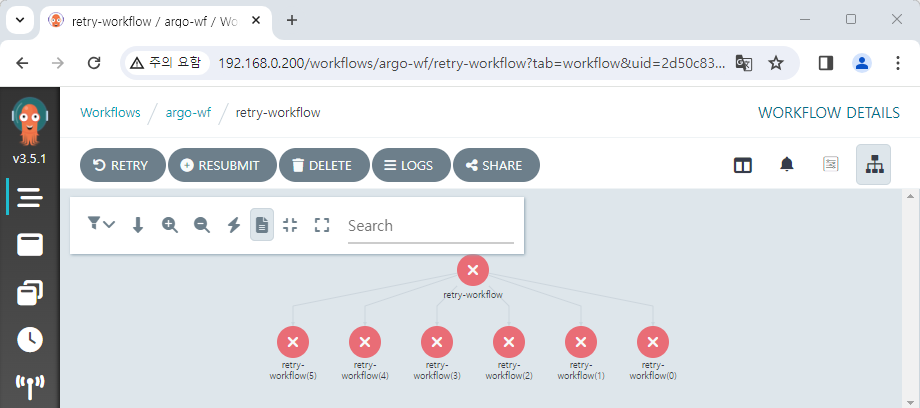

# 그 외 기능들

## Workflow 삭제 조건 설정하기

별도의 설정을 하지 않는다면 Workflow 실행 내역은 계속해서 쌓이게 됩니다.  
사용량이 많다면, 그만큼 관리가 힘들어질 것입니다.


그래서 Argo Workflows에서는 크게 3가지의 옵션을 제공합니다.

- `retentionPolicy` : 동일한 Workflow를 상태에 따라 일정 개수만 저장합니다.
- `ttlStrategy` : 지정한 조건을 만족하고 일정 시간이 지나면 리소스가 삭제됩니다.
- `podGC` : Pod 또는 Workflow의 상태 조건이 만족되면 리소스가 삭제됩니다.

```yaml title="values.yaml" {4-7}
(...)
controller:
  (...)
  workflowDefaults:
    spec:
      ttlStrategy:
        secondsAfterCompletion: 5
(...)
```

위 예시는 `ttlStrategy` 를 적용한 모습입니다.  
`values.yaml` 파일을 다음과 같이 설정할 경우 실행 완료 후 5초 뒤 Workflow 내역이 삭제됩니다.

## Retry 설정하기

상황에 따라 Workflow를 재시도하도록 할 수 있습니다.

아래 예제는 최대 5번까지 재시도를 하도록 설정된 Workflow입니다.  
Python 코드로 존재하지 않는 `console.log()` 함수를 실행하고 있어 무조건 5+1 = 6번이 실행됩니다.

```yaml
apiVersion: argoproj.io/v1alpha1
kind: Workflow
metadata:
  name: retry-workflow
spec:
  entrypoint: must-fail
  templates:
    - name: must-fail
      retryStrategy:
        limit: "5"
      script:
        image: python:alpine3.8
        command: [python]
        source: |
          console.log(app)
```



`retryStrategy` 는 Template에서 전역으로 적용할 수도 있고[^1], 따로 설정할 수도 있습니다.  
Retry 조건도 변경이 가능합니다.[^2]

## Archive 설정하기

Workflow를 실행하면 기본적으로는 K8S Object로 남습니다.  
이를 별도의 RDBMS에 저장하는 Archive 기능을 활성화할 수 있습니다.

`values.yaml` 파일에서 옵션을 활성화하고, DB 정보를 같이 입력해 주면 됩니다.  
자세한 내용은 아래 링크를 참고해 주세요.  
https://argo-workflows.readthedocs.io/en/latest/workflow-archive/

[^1]: https://github.com/argoproj/argo-workflows/blob/main/examples/template-defaults.yaml
[^2]: https://argo-workflows.readthedocs.io/en/latest/retries/#retry-policies
