# Workflow 기본

Workflow UI를 둘러보고, 간단한 Workflow를 직접 생성하고 실행해 봅시다.

## Workflow 리스트 보기

Argo Workflows에 로그인하면 첫 페이지에서 Workflow 리스트를 확인할 수 있습니다.  
그런데 default로 설정되어 있을 수 있는 `undefined` 를 포함하여 `argo-wf` 외의 다른 Namespace가 선택되어 있으면 다음처럼 오류가 발생합니다.

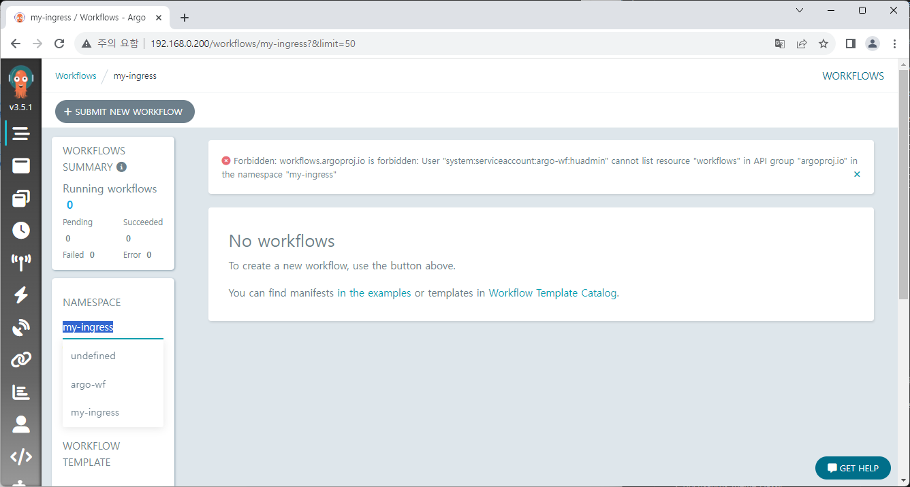

이는 설정한 ServiceAccount가 `argo-wf` Namespace에 만들어져 해당 Namespace 내에서만 권한을 가지고 있기 때문입니다.

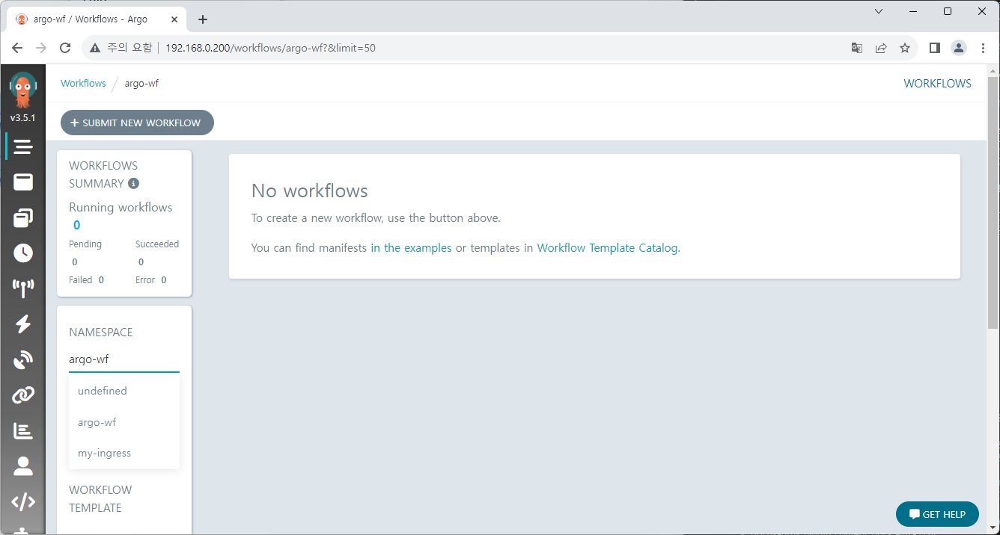

Namespace를 `argo-wf` 로 설정하면 에러가 사라집니다.  

:::info  
Argo Workflow가 이렇게 동작하는 것은 기본적으로 클러스터 내의 모든 Namespace를 모니터링하도록 설정이 되어 있기 때문입니다. 하지만 ServiceAccount의 권한이 모두 다르기 때문에 이렇게 권한에 따른 액세스 문제가 발생할 수 있습니다.  
Argo가 설치된 Namespace에서만 Workflow를 실행할 수 있도록 설정을 변경할 수 있고, helm chart에서는 `singleNamespace` 옵션으로 이를 제어할 수 있습니다. 또한 Workflow를 실행할 Namespace를 지정할 수 있는 Managed Namespace 옵션도 존재합니다.  
자세한 내용은 아래 링크를 참조해 주세요.  

https://argoproj.github.io/argo-workflows/installation/#installation-options
:::


## 첫 Workflow 작성하기

이제 가장 기본적인 Workflow를 작성해 보겠습니다.  

### Workflow Template 저장하기

Workflow Template로 Workflow의 일부 또는 전체를 저장할 수 있습니다.  
먼저 template로 일부를 저장하고 이를 reference로 호출하여 사용해 보겠습니다.

Workflow Template 메뉴에서 **CREATE NEW WORKFLOW TEMPLATE**를 누릅니다.

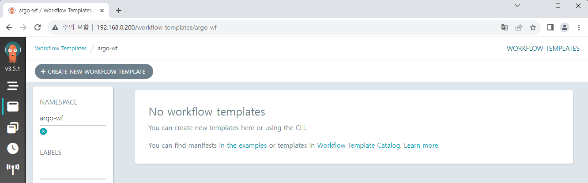

Argo 문서의 샘플을 약간 수정해서 사용하겠습니다.  
기존의 데이터를 지우고 아래 내용을 붙여넣습니다.

```yaml
apiVersion: argoproj.io/v1alpha1
kind: WorkflowTemplate
metadata:
  name: whalesay-template
spec:
  templates:
    - name: whalesay
      inputs:
        parameters:
          - name: message
            value: "hello world"
      container:
        image: docker/whalesay
        command: [cowsay]
        args: ["{{inputs.parameters.message}}"]
```

**CREATE**를 누르면 Workflow Template이 만들어집니다.

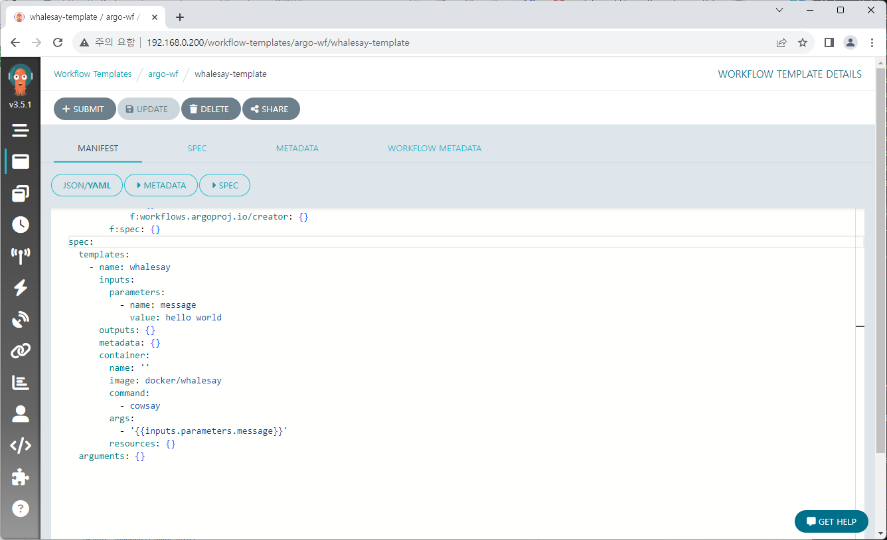

`kubectl` 로도 생성된 Template을 확인할 수 있습니다.

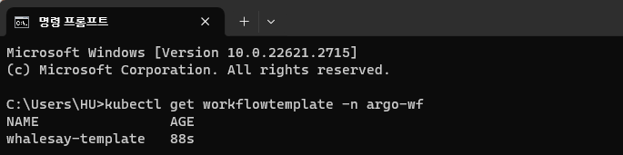

### Workflow 생성하기

Workflow도 생성해 보도록 하겠습니다.  
Workflows 메뉴로 돌아가 **SUBMIT NEW WORKFLOW** 버튼을 누릅니다.

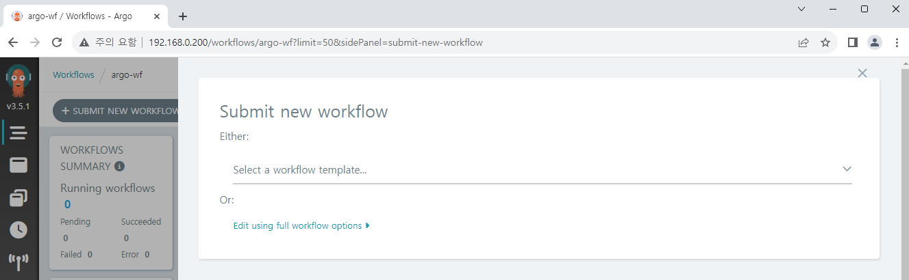

Edit using full workflow options를 선택하고 아래 내용을 붙여넣습니다.

```yaml
apiVersion: argoproj.io/v1alpha1
kind: Workflow
metadata:
  generateName: whalesay-workflow-
spec:
  entrypoint: whalesay
  templates:
    - name: whalesay
      steps:
        - - name: ref-template
            templateRef:
              name: whalesay-template
              template: whalesay
```

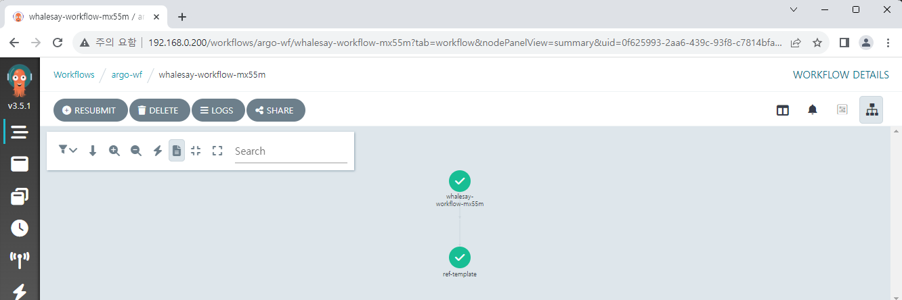

**CREATE** 버튼을 누르고 기다리면 Workflow가 실행되는 것을 확인할 수 있습니다.

### Workflow 로그 확인하기

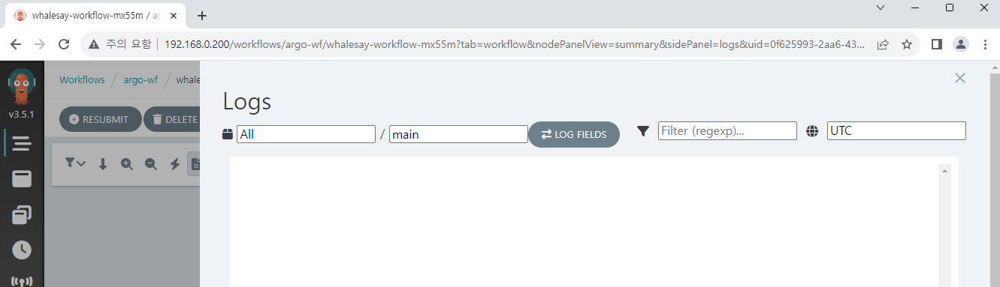

그런데 실행 확인을 위해 Logs를 클릭해 보면 아무 내용이 나오지 않습니다.  
Workflow가 제대로 작동하지 않은 걸까요?

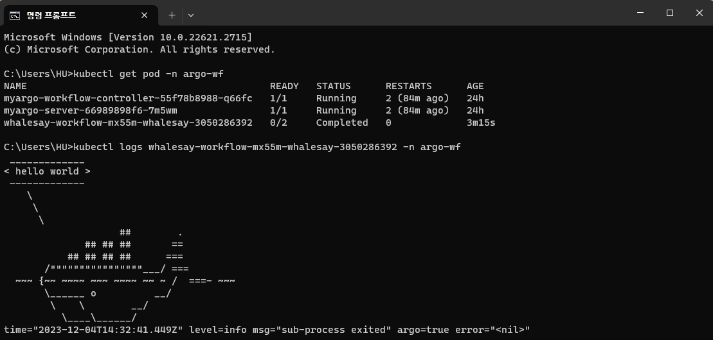

`kubectl` 로 확인해 보면 정상적으로 실행이 되었습니다.  
실제로 개발자 도구로 확인 시 로그를 불러오는 API가 403 Forbidden을 반환하는 것이 문제임을 확인할 수 있습니다.

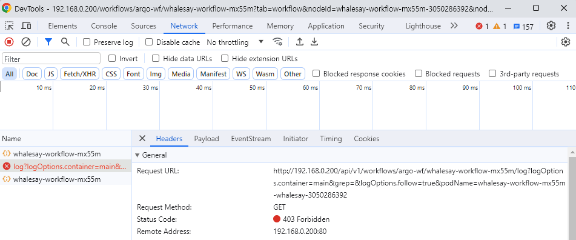

이는 현재 접속중인 ServiceAccount가 Pod에 관련된 권한을 가지고 있지 않기 때문입니다.  
권한을 부여하기 위해 Role과 RoleBinding을 추가로 작성해 주어야 합니다.

```yaml title="pod-reader.yaml"
apiVersion: rbac.authorization.k8s.io/v1
kind: Role
metadata:
  namespace: {{ .Release.Namespace | quote }}
  name: pod-reader
rules:
  - apiGroups: [""] # "" indicates the core API group
    resources: ["pods", "pods/log"]
    verbs: ["get", "watch", "list"]
```

```yaml title="rb-admin-pod.yaml"
apiVersion: rbac.authorization.k8s.io/v1
kind: RoleBinding
metadata:
  name: huadmin-pod-rb
  namespace: {{ .Release.Namespace | quote }}
subjects:
  - kind: ServiceAccount
    name: huadmin
roleRef:
  kind: Role
  name: pod-reader
  apiGroup: rbac.authorization.k8s.io
```

`helm upgrade` 등으로 변경사항을 반영합니다.  
다시 Workflow를 만들어 실행하고 로그를 확인하면 이번에는 정상적으로 출력됩니다.

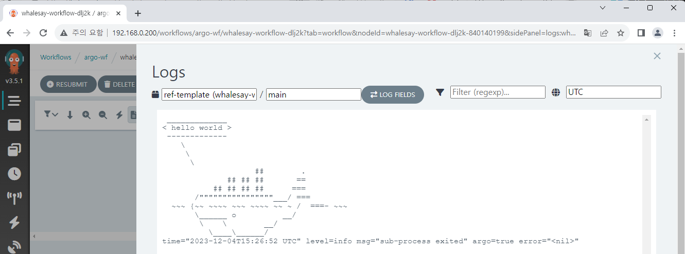

### Workflow 저장하여 생성하기

부분 template 뿐만 아니라 전체 Workflow도 저장을 할 수 있습니다.  
Workflow Template 메뉴에서 **CREATE NEW WORKFLOW TEMPLATE**를 누르고,  
이번에는 위에서 사용했던 Workflow의 내용을 붙여넣고 저장합니다.

:::info  
여기서는 위 내용을 그대로 복사해 Workflow 형식으로 저장했는데,  
당연히 WorkflowTemplate 형식으로 저장해도 동일하게 작동합니다.
:::

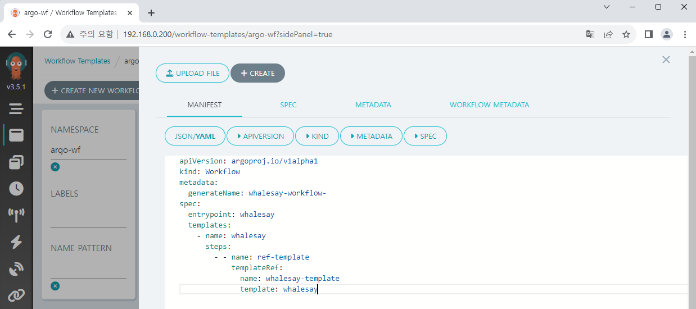

:::info
`metadata.generateName` 대신 `metadata.name` 을 사용하여 고정된 이름으로 저장할 수 있습니다.  
실행할 때는 비슷하게 뒤에 random tag가 붙습니다.
:::

만들어진 Workflow는 **SUBMIT** 버튼을 통해 간편하게 실행할 수 있습니다.

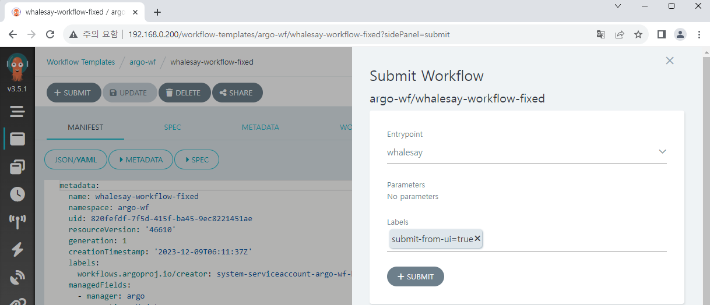

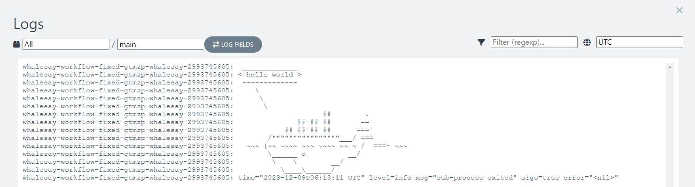