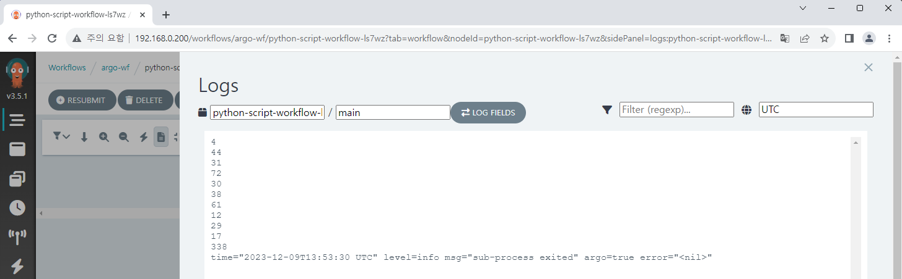
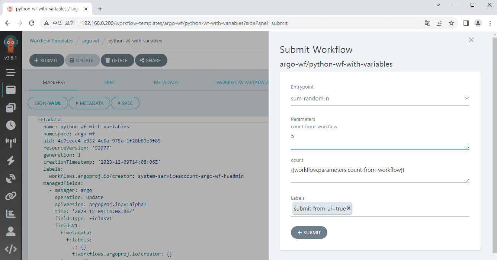
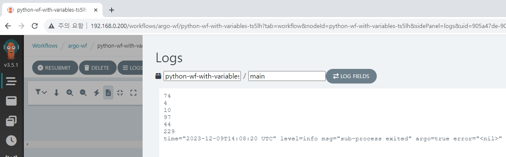
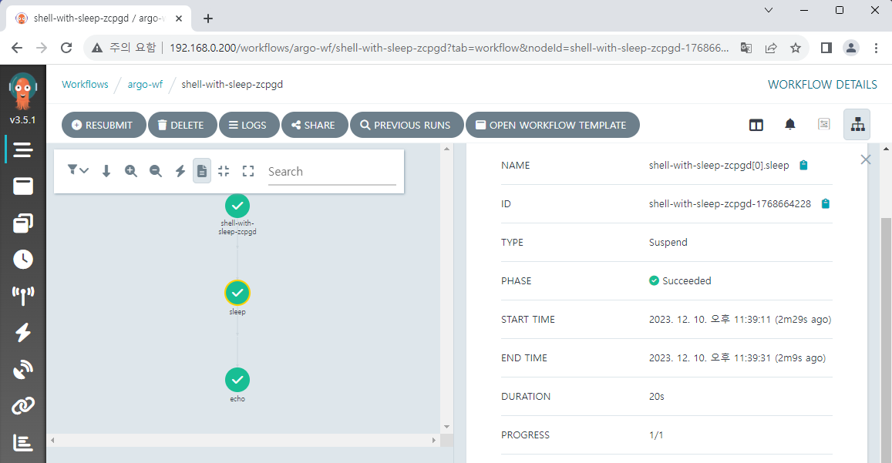
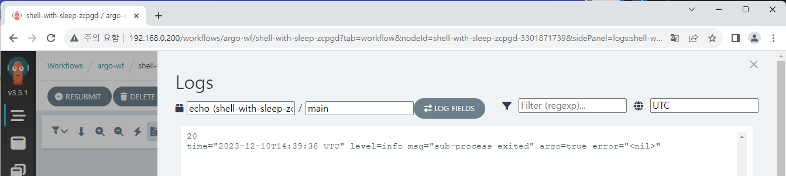
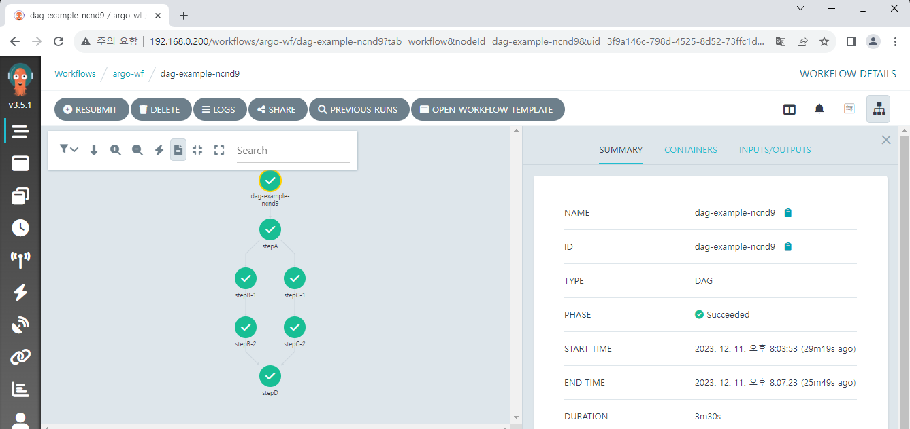
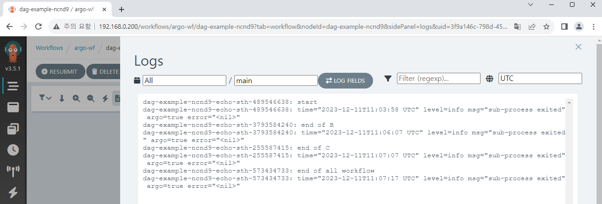

# Workflow 응용

기본적인 Workflow 생성법을 알았으니, 여러 가지 Workflow를 만들어 보겠습니다.  

```yaml
apiVersion: argoproj.io/v1alpha1
kind: Workflow
metadata:
  name: python-script-workflow
spec:
  entrypoint: sum-random-ten
  templates:
    - name: sum-random-ten
      script:
        image: python:alpine3.8
        command: [python]
        source: |
            import random

            sum = 0
            for _ in range(10):
                i = random.randint(1, 100)
                print(i)
                sum += i
            print(sum)
```



```yaml
apiVersion: argoproj.io/v1alpha1
kind: Workflow
metadata:
  name: python-wf-with-variables
spec:
  entrypoint: sum-random-n
  arguments:
    parameters:
    - name: count-from-workflow
  templates:
    - name: sum-random-n
      inputs:
        parameters:
          - name: count
            value: "{{workflow.parameters.count-from-workflow}}"
      script:
        image: python:alpine3.8
        command: [python]
        source: |
            import random

            sum = 0
            n = {{inputs.parameters.count}}
            for _ in range(n):
                i = random.randint(1, 100)
                print(i)
                sum += i
            print(sum)
```






```yaml
apiVersion: argoproj.io/v1alpha1
kind: Workflow
metadata:
  name: shell-with-sleep
spec:
  entrypoint: total-wf
  arguments:
    parameters:
    - name: number-from-workflow
  templates:
  - name: total-wf
    steps:
    - - name: sleep
        template: suspend-sleep
        arguments:
          parameters:
          - name: sleep-time
            value: "{{workflow.parameters.number-from-workflow}}"
    - - name: echo
        template: echo-num
        arguments:
          parameters:
          - name: number
            value: "{{workflow.parameters.number-from-workflow}}"

  - name: suspend-sleep
    inputs:
      parameters:
      - name: sleep-time
    suspend:
      duration: "{{inputs.parameters.sleep-time}}s"

  - name: echo-num
    inputs:
      parameters:
      - name: number
    script:
      image: bash:latest
      command: [bash]
      source: |
        echo {{inputs.parameters.number}}
```





```yaml
apiVersion: argoproj.io/v1alpha1
kind: Workflow
metadata:
  name: dag-example
spec:
  entrypoint: total-wf
  templates:
  - name: total-wf
    dag:
      tasks:
      - name: stepA
        template: echo-sth
        arguments:
          parameters:
          - name: word
            value: "start"
      - name: stepB-1
        dependencies: [stepA]
        template: suspend-sleep
        arguments:
          parameters:
          - name: sleep-time
            value: "120"
      - name: stepB-2
        dependencies: [stepB-1]
        template: echo-sth
        arguments:
          parameters:
          - name: word
            value: "end of B"
      - name: stepC-1
        dependencies: [stepA]
        template: suspend-sleep
        arguments:
          parameters:
          - name: sleep-time
            value: "180"
      - name: stepC-2
        dependencies: [stepC-1]
        template: echo-sth
        arguments:
          parameters:
          - name: word
            value: "end of C"
      - name: stepD
        dependencies: [stepC-2, stepB-2]
        template: echo-sth
        arguments:
          parameters:
          - name: word
            value: "end of all workflow"

  - name: suspend-sleep
    inputs:
      parameters:
      - name: sleep-time
    suspend:
      duration: "{{inputs.parameters.sleep-time}}s"

  - name: echo-sth
    inputs:
      parameters:
      - name: word
    script:
      image: bash:latest
      command: [bash]
      source: |
        echo {{inputs.parameters.word}}
```


