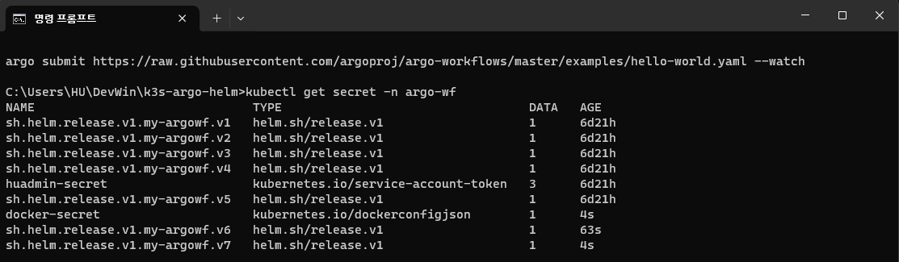
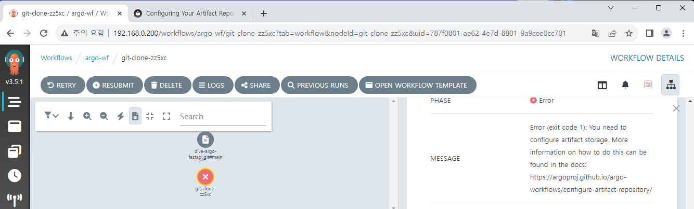
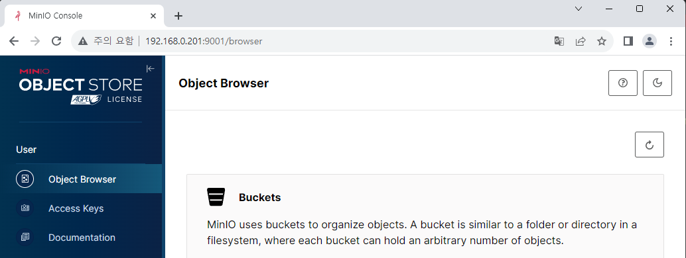
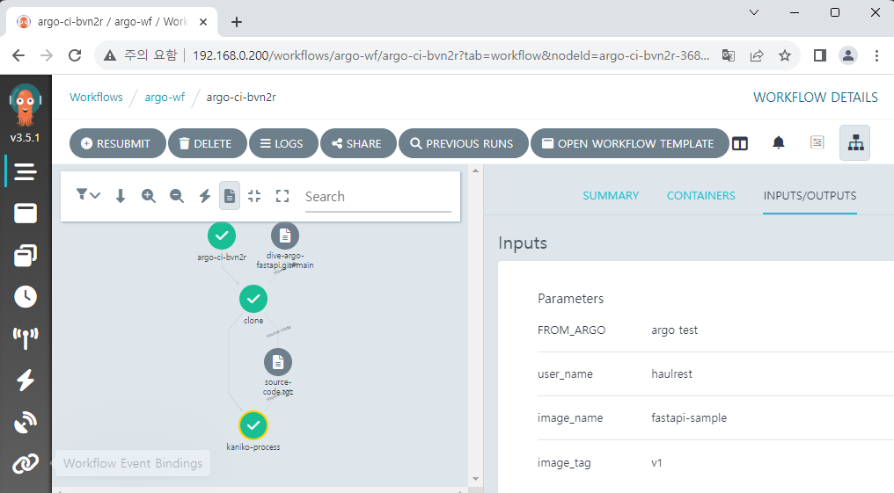
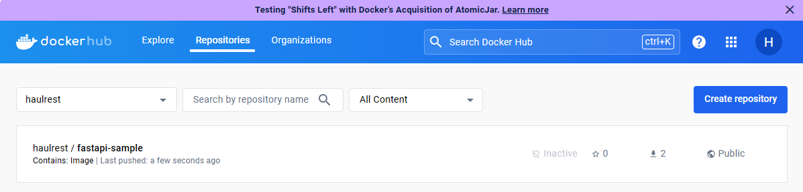
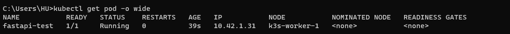
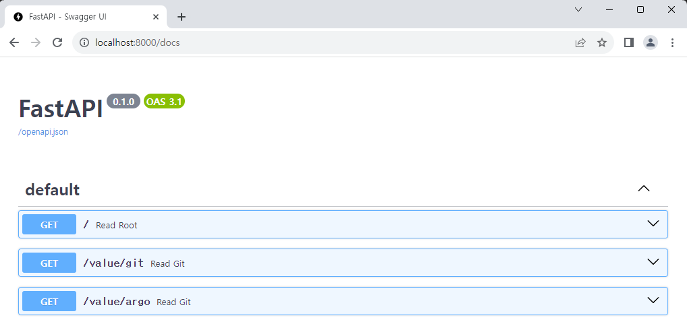
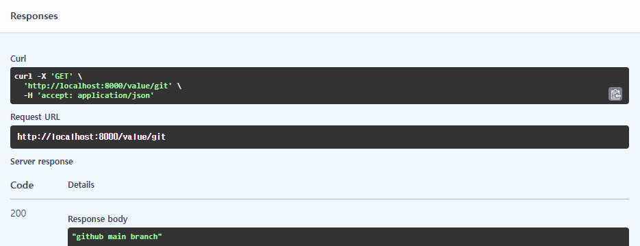
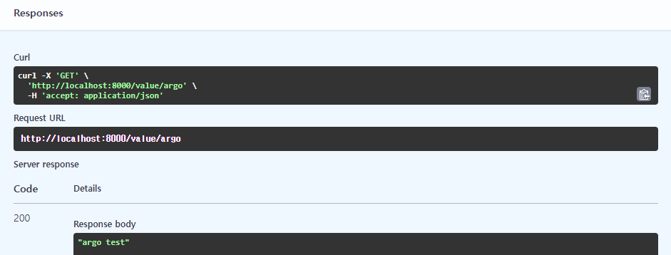

# CI Workflow 구축하기

기본적인 Workflow 구성법을 익혔으니, 실제 App에 대한 CI 과정을 구성해 보겠습니다.
CI 과정에서는 보통 Code 작업, Build와 Test까지 포함되지만[^1] 여기서는 Build에 집중할 것이고 Code 작업과 Test에 대해서는 설명하지 않겠습니다.

최종적인 목표는 `git push` 를 하면 자동으로 Workflow를 감지하여 이미지를 빌드하고 업로드하는 것이지만, `git push` 감지는 Argo Workflows 외에 Argo Events라는 다른 앱이 필요합니다. 그러니 우선은 Workflow만 우선 구성해 보겠습니다. 


## Workflow Overview
0. Git 주소를 변수로 받습니다.
1. `git clone` 을 합니다.
2. 루트 폴더에서 `Dockerfile` 을 사용해 이미지를 빌드합니다. 여기서는 Kaniko를 사용합니다.
3. 만든 이미지를 Docker Hub에 Push합니다.  
Harbor 등의 다른 Repository에 업로드도 가능하지만 논점을 벗어나므로 여기서는 다루지 않겠습니다.

Kaniko는 Docker daemon을 사용하지 않기 때문에 여러 이점이 있습니다.

## Sample App 선정

Sample App을 구축했습니다.  
꼭 이 소스를 사용할 필요는 없고, 빌드하여 배포가 가능하면 뭐든 상관없습니다.

https://github.com/BeaverHouse/dive-argo-fastapi

## Workflow 구성

각각의 Step을 WorkflowTemplate으로 작성하고 합치겠습니다.

## Docker Secret 생성

https://helm.sh/docs/howto/charts_tips_and_tricks/#creating-image-pull-secrets

https://kubernetes.io/ko/docs/tasks/configure-pod-container/pull-image-private-registry/

```yaml title="values.yaml"
(...)
# Add this below
imageCredentials:
  registry: https://index.docker.io/v1/ # for Docker Hub
  username: your-name
  password: your-pw
  email: your@mail.com
```

```tpl title="_helpers.tpl"
{{- define "imagePullSecret" }}
{{- with .Values.imageCredentials }}
{{- printf "{\"auths\":{\"%s\":{\"username\":\"%s\",\"password\":\"%s\",\"email\":\"%s\",\"auth\":\"%s\"}}}" .registry .username .password .email (printf "%s:%s" .username .password | b64enc) | b64enc }}
{{- end }}
{{- end }}
```

```yaml title="docker-secret.yaml"
apiVersion: v1
kind: Secret
metadata:
  name: docker-secret
  namespace: {{ .Release.Namespace | quote }}
type: kubernetes.io/dockerconfigjson
data:
  .dockerconfigjson: {{ template "imagePullSecret" . }}
```



### Git Clone

```yaml title="git-clone.yaml"
apiVersion: argoproj.io/v1alpha1
kind: WorkflowTemplate
metadata:
  name: git-clone
spec:
  templates:
  - name: checkout
    inputs:
      parameters:
        - name: git-url
        - name: revision
          value: "main"
      artifacts:
      - name: source-code
        path: /code
        git:
          repo: "{{inputs.parameters.git-url}}"
          revision: "{{inputs.parameters.revision}}"
    outputs:
      artifacts:
      - name: source-code
        path: /code
    container:
      image: bash:latest
      command: [ls]
      args: ["/code"]
```



### MinIO 설치

https://github.com/bitnami/charts/tree/main/bitnami/minio

values에서 service.type과 service.loadBalancerIP 설정

minIO는 argowf와 같은 namespace에 배포하는 것이 좋습니다.  
다른 namespace에 배포하면 계정설정 secret를 공유하지 못해 따로 추가로 복사를 해야 하는 등 관리가 힘들어집니다.

```
helm dependency update ./minio
helm install minio ./minio -n argo-wf
```

`<SOME-IP>:9000`으로 접속 가능

계정 정보
```
   export ROOT_USER=$(kubectl get secret --namespace argo-wf minio -o jsonpath="{.data.root-user}" | base64 -d)
   export ROOT_PASSWORD=$(kubectl get secret --namespace argo-wf minio -o jsonpath="{.data.root-password}" | base64 -d)
```



argo-bucket 이라는 이름으로 bucket 하나 생성

```yaml
artifactRepository:
  # -- Archive the main container logs as an artifact
  archiveLogs: false
  # -- Store artifact in a S3-compliant object store
  # @default -- See [values.yaml]
  s3:
    # # Note the `key` attribute is not the actual secret, it's the PATH to
    # # the contents in the associated secret, as defined by the `name` attribute.
    accessKeySecret:
      name: minio
      key: root-user
    secretKeySecret:
      name: minio
      key: root-password
    # insecure will disable TLS. Primarily used for minio installs not configured with TLS
    insecure: true
    bucket: argo-bucket
    endpoint: minio:9000
```

helm upgrade my-argowf ./argo-workflows -n argo-wf

```yaml {5,9}
apiVersion: rbac.authorization.k8s.io/v1
kind: Role
metadata:
  namespace: {{ .Release.Namespace | quote }}
  name: pod-controller
rules:
  - apiGroups: [""] # "" indicates the core API group
    resources: ["pods", "pods/log"]
    verbs: ["get", "watch", "list", "patch"]
```

```yaml {11}
apiVersion: rbac.authorization.k8s.io/v1
kind: RoleBinding
metadata:
  name: huadmin-pod-rb
  namespace: {{ .Release.Namespace | quote }}
subjects:
  - kind: ServiceAccount
    name: huadmin
roleRef:
  kind: Role
  name: pod-controller
  apiGroup: rbac.authorization.k8s.io
```

kubectl delete rolebinding huadmin-pod-rb -n argo-wf
helm upgrade my-argowf ./argo-workflows -n argo-wf

```yaml title="git-clone.yaml"
apiVersion: argoproj.io/v1alpha1
kind: WorkflowTemplate
metadata:
  name: git-clone
spec:
  serviceAccountName: huadmin
  templates:
  - name: checkout
    inputs:
      parameters:
        - name: git-url
        - name: revision
          value: "main"
      artifacts:
      - name: source-code
        path: /code
        git:
          repo: "{{inputs.parameters.git-url}}"
          revision: "{{inputs.parameters.revision}}"
    outputs:
      artifacts:
      - name: source-code
        path: /code
    container:
      image: bash:latest
      command: [ls]
      args: ["/code"]
```

## Kaniko build

```yaml title="image-build.yaml"
apiVersion: argoproj.io/v1alpha1
kind: WorkflowTemplate
metadata:
  name: image-build
spec:
  serviceAccountName: huadmin
  templates:
  - name: build-push
    inputs:
      parameters:
        - name: FROM_ARGO
        - name: user_name
          value: haulrest
        - name: image_name
        - name: image_tag
      artifacts:
      - name: source-code
        path: /code
    container:
      name: kaniko
      image: gcr.io/kaniko-project/executor:debug
      command: ["/kaniko/executor"]
      workingDir: '{{ inputs.artifacts.source-code.path }}'
      args:
      - "--dockerfile=Dockerfile"
      - "--context=."
      - "--destination={{inputs.parameters.user_name}}/{{inputs.parameters.image_name}}:{{inputs.parameters.image_tag}}"
      - "--build-arg=FROM_ARGO={{inputs.parameters.FROM_ARGO}}"
      volumeMounts:
      - name: kaniko-secret
        mountPath: /kaniko/.docker/
    volumes:
    - name: kaniko-secret
      secret:
        secretName: docker-secret
        items:
          - key: .dockerconfigjson
            path: config.json
```

context : 빌드할 때 참조하는 폴더인데 우리는 workingDir를 지정했으니 그냥 root 폴더로 하면 된다.


```yaml title="argo-ci.yaml"
apiVersion: argoproj.io/v1alpha1
kind: Workflow
metadata:
  name: argo-ci
spec:
  serviceAccountName: huadmin
  entrypoint: total-wf
  arguments:
    parameters:
    - name: git-url
    - name: FROM_ARGO
    - name: image_name
      value: fastapi-sample
    - name: image_tag
      value: v1
  templates:
  - name: total-wf
    dag:
      tasks:
      - name: clone
        arguments:
          parameters:
            - name: git-url
              value: "{{workflow.parameters.git-url}}"
        templateRef:
          name: git-clone
          template: checkout
      - name: kaniko-process
        dependencies: [clone]
        arguments:
          parameters:
            - name: FROM_ARGO
              value: "{{workflow.parameters.FROM_ARGO}}"
            - name: image_name
              value: "{{workflow.parameters.image_name}}"
            - name: image_tag
              value: "{{workflow.parameters.image_tag}}"
          artifacts:
          - name: source-code
            from: "{{tasks.clone.outputs.artifacts.source-code}}"
        templateRef:
          name: image-build
          template: build-push
```

https://github.com/argoproj/argo-workflows/blob/main/examples/artifact-passing.yaml




```yaml
apiVersion: v1
kind: Pod
metadata:
  name: fastapi-test
  labels:
    env: test
spec:
  containers:
    - name: fastapi
      image: haulrest/fastapi-sample:v1
      imagePullPolicy: Always
  nodeSelector:
    kubernetes.io/hostname: k3s-worker-1
```

```py title="main.py"
import os
from fastapi import FastAPI
from fastapi.responses import RedirectResponse

app = FastAPI()

git_value = "github main branch"
outer_value = os.environ.get("FROM_ARGO", "not from argo")

@app.get("/")
def read_root():
    return RedirectResponse("/docs")


@app.get("/value/git")
def read_git():
    return git_value


@app.get("/value/argo")
def read_git():
    return outer_value
```

```
kubectl apply -f fastapi-sample.yaml

kubectl expose pod fastapi-test --name=lb-fastapi --port=8000  

kubectl port-forward svc/lb-fastapi 8000:8000
```






[^1]: https://about.gitlab.com/topics/ci-cd/