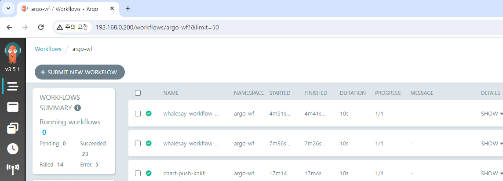

# 기타 편의기능

## Workflow 삭제 조건 설정하기

`retentionPolicy`, `ttlStrategy`, `podGC`



```yaml {3-6}
controller:
  (...)
  workflowDefaults:
    spec:
      ttlStrategy:
        secondsAfterCompletion: 5
```

이렇게 설정하면 실행 완료 후 5초 뒤에 Workflow 내역이 삭제됩니다.
