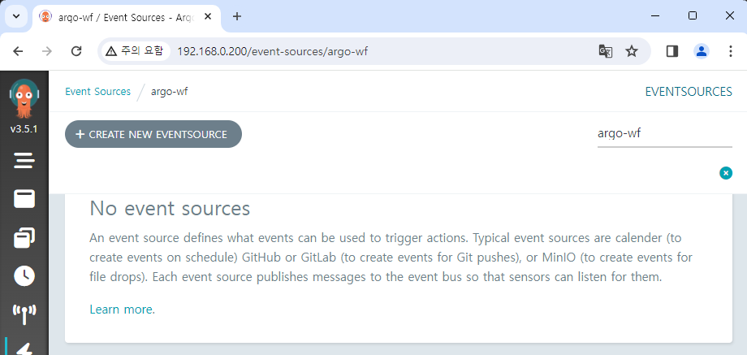

# Argo Events 배포하기

이 문서에서는 Argo Events를 배포하고, UI를 통해 제어할 수 있도록 설정해 보겠습니다.

아직 Helm chart를 다운로드받지 않았다면 다음 Repository에서 다운로드합니다.  
https://github.com/argoproj/argo-helm

## Argo Workflows와 Argo Events

Argo Workflows v3.0 이상일 경우 UI에서 Argo Events도 함께 제어 가능합니다.[^1]  
이후에 Argo Workflows와 연동해서 사용도 할 것이기 때문에, 편의상 Argo Events도 같은 `argo-wf` Namespace에 설치하겠습니다.

Argo Events의 `fullnameOverride` 항목도 Argo Workflows와 같게 통일하겠습니다.  
여기서는 동일하게 `myargo` 로 설정했습니다.

## ServiceAccount에 추가 권한 부여하기

ServiceAccount를 분리할 수도 있겠지만, 하나의 계정으로 모든 UI를 제어하는 것이 간편할 것입니다.  
따라서 원래 사용중이던 ServiceAccount에 Argo Events를 제어할 수 있는 추가 권한을 설정하겠습니다.

아래와 같이 Argo Events 관련 Role을 생성합니다.  
여기서는 모든 권한을 부여했는데, 필요에 따라 조정해도 무방합니다.

<!-- prettier-ignore -->
```yaml title="event-admin.yaml"
apiVersion: rbac.authorization.k8s.io/v1
kind: Role
metadata:
  name: event-admin
  namespace: {{ .Release.Namespace | quote }}
rules:
- apiGroups:
  - argoproj.io
  resources:
  - sensors
  - sensors/finalizers
  - sensors/status
  - eventsources
  - eventsources/finalizers
  - eventsources/status
  - eventbus
  - eventbus/finalizers
  - eventbus/status
  verbs:
  - create
  - delete
  - deletecollection
  - get
  - list
  - patch
  - update
  - watch
```

그리고 추가 Role 부여를 위해 RoleBinding도 생성합니다.

<!-- prettier-ignore -->
```yaml title="rb-admin-event.yaml"
apiVersion: rbac.authorization.k8s.io/v1
kind: RoleBinding
metadata:
  name: huadmin-event-rb
  namespace: {{ .Release.Namespace | quote }}
subjects:
  - kind: ServiceAccount
    name: huadmin
roleRef:
  kind: Role
  name: event-admin
  apiGroup: rbac.authorization.k8s.io
```

설정이 완료되었다면 Helm을 통해 chart를 반영합니다.

```
helm upgrade my-argowf ./argo-workflows -n argo-wf

helm install my-argoevents ./argo-events -n argo-wf
```

<br/>

이제 UI에서 Argo Events를 제어할 수 있습니다.



<br/>

[^1]: https://blog.argoproj.io/argo-workflows-v3-0-4d0b69f15a6e
