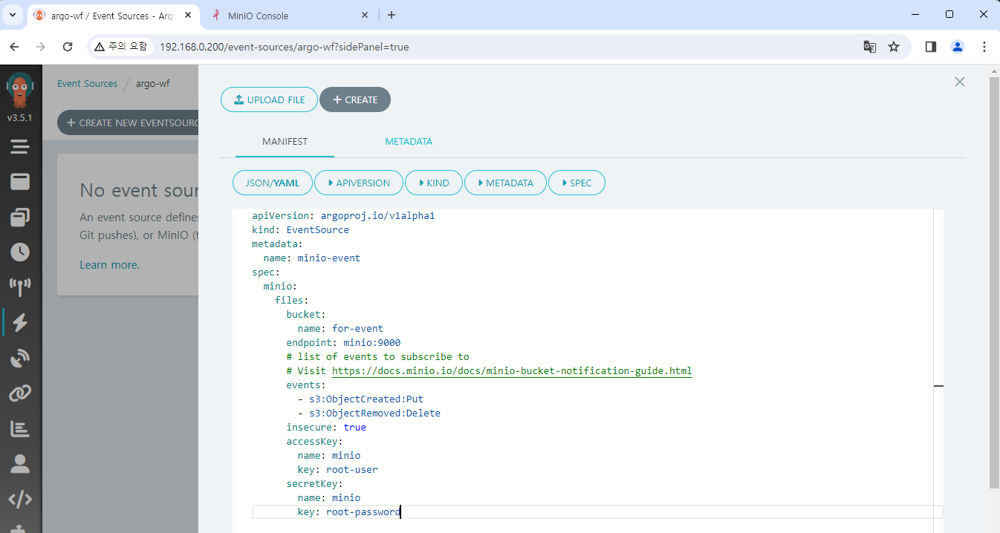

# Event로 Workflow 실행하기

이 문서에서는 특정 이벤트를 감지하여 자동으로 Workflow를 실행하도록 Event Flow를 구성해 보겠습니다.

Argo Events는 여러 이벤트 소스를 지원하지만, 여기서는 MinIO를 예시로 하겠습니다.

:::info
Argo Events가 지원하는 이벤트 소스와 예제는 아래 링크들을 통해 확인 가능합니다.

https://argoproj.github.io/argo-events/concepts/event_source/  
https://github.com/argoproj/argo-events/tree/master/examples/event-sources
:::

## MinIO 설정

편의상 Argo Events와 Argo Workflows에 사용되는 Bucket을 서로 분리하겠습니다.  
이벤트를 위한 새로운 Bucket `for-event` 를 생성합니다.


## EventBus 생성하기

EventBus는 Argo Events의 객체들을 연결해 주는 Transport layer 역할을 수행합니다.  
설정하지 않는다면 Argo Events가 제대로 작동하지 않습니다.

[NATS][nats], [JetStream][jetstream], [Kafka][kafka] 3종류를 지원하며, 여기서는 간단한 설정을 위해 JetStream을 사용하겠습니다.

다음 파일을 Argo Events Helm chart에 추가합니다.

```yaml title="eventbus-jetstream.yaml"
apiVersion: argoproj.io/v1alpha1
kind: EventBus
metadata:
  name: eventbus-jetstream
  namespace:
spec:
  jetstream:
    version: "latest"
```

이후 `helm upgrade` 명령어로 변경사항을 반영합니다.

:::note 개인적인 의견
지원되는 EventBus 중 NATS는 곧 Deprecated될 예정이고,  
JetStream도 상대적으로 문서와 정보를 찾기 힘들었습니다.

개인적으로 실제 환경에 활용 시에는 Kafka 사용을 추천드립니다.
:::

## EventSource 생성하기

본격적으로 Event Flow를 구성해 보겠습니다.

우선 Event를 감지할 EventSource를 생성합니다.  
**Event Sources** 메뉴에서 **CREATE NEW EVENTSOURCE**를 클릭하고 아래 내용을 붙여넣습니다.

```yaml title="minio-event-source.yaml"
apiVersion: argoproj.io/v1alpha1
kind: EventSource
metadata:
  name: minio-event
spec:
  eventBusName: eventbus-jetstream
  minio:
    files:
      bucket:
        name: for-event
      endpoint: minio:9000
      # list of events to subscribe to
      # Visit https://docs.minio.io/docs/minio-bucket-notification-guide.html
      events:
        - s3:ObjectCreated:Put
        - s3:ObjectRemoved:Delete
      insecure: true
      accessKey:
        name: minio
        key: root-user
      secretKey:
        name: minio
        key: root-password
```

`eventBusName` 속성으로 위에서 생성한 EventBus를 지정해 줍니다.  
나머지는 MinIO 관련 정보들을 넣으면 되고, 이벤트는 파일 추가/삭제 이벤트를 감지하도록 하였습니다.[^1]



**CREATE** 버튼을 누르면 EventSource가 생성됩니다.  
아직 이벤트를 받은 뒤의 행동을 설정하지 않았기 때문에, 이것만으로는 아무 변화가 없습니다.

## Sensor 생성하기

Sensor 객체에서는 실제로 어떤 이벤트를 받아서, 어떤 작업을 실행할지를 정의합니다.

**Sensors** 메뉴에서 **CREATE NEW SENSOR**를 클릭하고 아래 내용을 붙여넣습니다.

<!-- prettier-ignore -->
```yaml {41-46}
apiVersion: argoproj.io/v1alpha1
kind: Sensor
metadata:
  name: minio-sensor
spec:
  eventBusName: eventbus-jetstream
  template:
    serviceAccountName: huadmin
  dependencies:
    - name: minio-input
      eventSourceName: minio-event
      eventName: files
  triggers:
    - template:
        name: minio-workflow-trigger
        k8s:
          operation: create
          source:
            resource:
              apiVersion: argoproj.io/v1alpha1
              kind: Workflow
              metadata:
                generateName: trigger-test-
              spec:
                entrypoint: whalesay
                arguments:
                  parameters:
                    - name: message
                      # the value will get overridden by event payload from test-dep
                      value: THIS_WILL_BE_REPLACED
                templates:
                  - name: whalesay
                    inputs:
                      parameters:
                        - name: message
                    container:
                      command:
                        - cowsay
                      image: docker/whalesay:latest
                      args: ["{{inputs.parameters.message}}"]
          # The container args from the workflow are overridden by the s3 notification key
          parameters:
            - src:
                dependencyName: minio-input
                dataKey: notification.0.s3.object.key
              dest: spec.arguments.parameters.0.value
      retryStrategy:
        steps: 3
```

위에서 생성한 EventBus와 EventSource를 각각 `eventBusName` 과 `dependencies` 항목에 설정했습니다.  
`triggers` 항목에는 실제로 실행할 작업을 설정하는데, 여기서는 새로운 Workflow를 생성하여 실행하도록 하였습니다.

Workflow 형식은 이전 챕터의 Workflow와 동일합니다.  
단, 위의 강조된 부분이 다른 부분인데 이벤트 정보의 일부를 Workflow의 parameter로 입력하는 내용이 있습니다. 여기서는 MinIO에서 감지한 파일의 이름을 `message` 변수로 설정합니다.

**CREATE** 버튼을 누르면 Sensor가 생성됩니다.  
그 뒤에 **Event Flow** 메뉴로 이동하면 Sensor와 EventSource가 링크된 것을 확인할 수 있습니다.


(사진의 Workflow는 테스트입니다)

## Event Flow 테스트

이제 실제로 이벤트를 발생시켜 보겠습니다.  
`2.txt` 라는 파일을 `for-event` Bucket에 업로드해 보겠습니다.


그러면 아래와 같이 Event를 감지하여 새로운 Workflow가 실행됩니다.


로그를 확인해 보면 우리가 업로드한 파일 이름 `2.txt` 가 출력되는 것을 확인할 수 있습니다.


<br/>

[^1]: https://github.com/minio/minio/blob/master/docs/bucket/notifications/README.md

[nats]: https://nats.io/
[jetstream]: https://docs.nats.io/nats-concepts/jetstream
[kafka]: https://kafka.apache.org/
