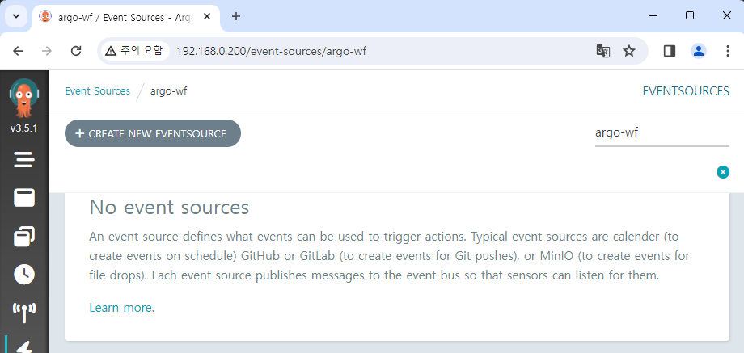

# Argo Events 설치, 권한 설정

Argo Workflows v3.0 이상일 경우 UI에서 Argo Events를 제어 가능합니다.  
https://blog.argoproj.io/argo-workflows-v3-0-4d0b69f15a6e

동일한 ServiceAccount를 사용하기 위해 Argo Events도 같은 `argo-wf` Namespace에 설치하겠습니다.  
그리고 기존 ServiceAccount에는 Argo Events를 제어할 수 있는 추가 권한을 부여하겠습니다.

argo-events
fullnameOverride: "myargo" 통일

```yaml title="event-admin.yaml"
apiVersion: rbac.authorization.k8s.io/v1
kind: Role
metadata:
  name: event-admin
  namespace: {{ .Release.Namespace | quote }}
rules:
- apiGroups:
  - argoproj.io
  resources:
  - sensors
  - sensors/finalizers
  - sensors/status
  - eventsources
  - eventsources/finalizers
  - eventsources/status
  - eventbus
  - eventbus/finalizers
  - eventbus/status
  verbs:
  - create
  - delete
  - deletecollection
  - get
  - list
  - patch
  - update
  - watch
```

Argo Workflows

```yaml title="rb-admin-events.yaml"
apiVersion: rbac.authorization.k8s.io/v1
kind: RoleBinding
metadata:
  name: huadmin-event-rb
  namespace: {{ .Release.Namespace | quote }}
subjects:
  - kind: ServiceAccount
    name: huadmin
roleRef:
  kind: Role
  name: event-admin
  apiGroup: rbac.authorization.k8s.io
```

```
helm upgrade my-argowf ./argo-workflows -n argo-wf

helm install my-argoevents ./argo-events -n argo-wf
```

이제 UI에서 Argo Events를 제어 가능합니다.

