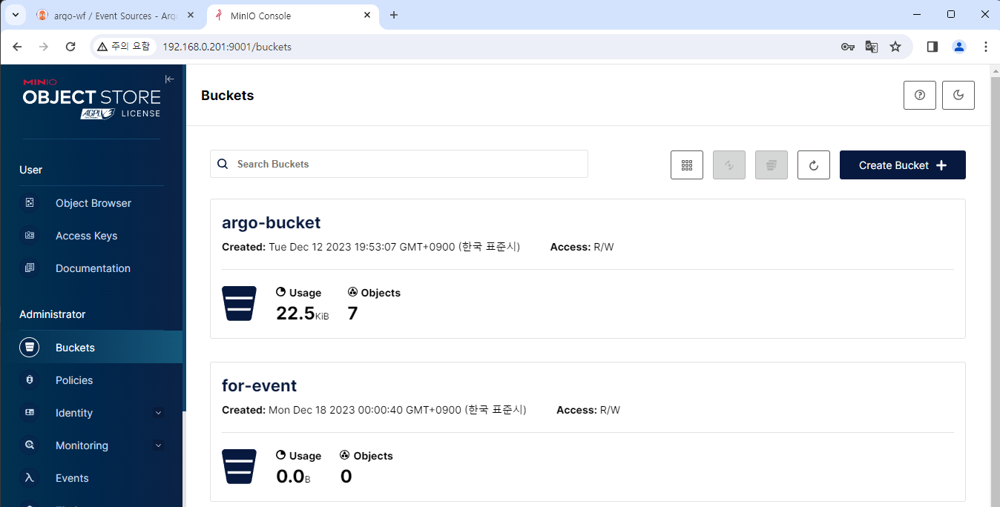
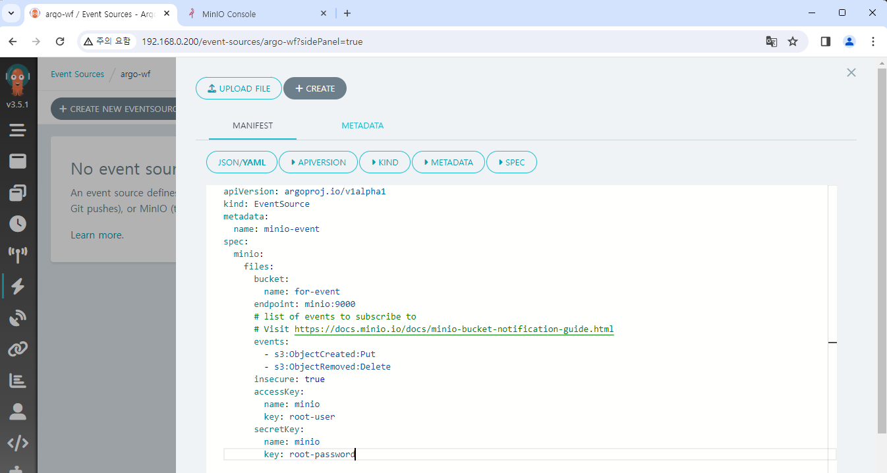
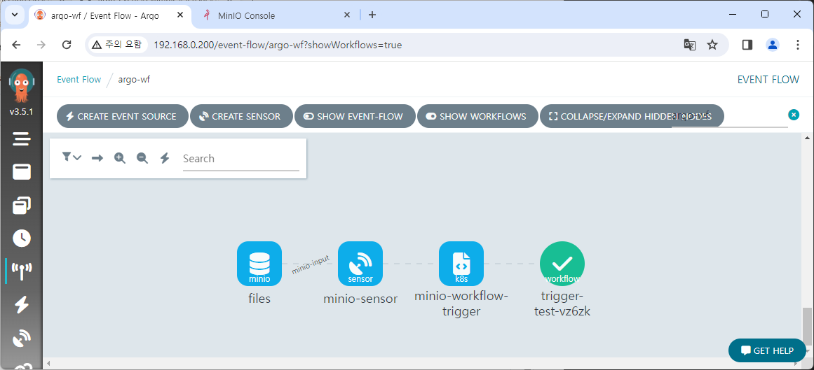
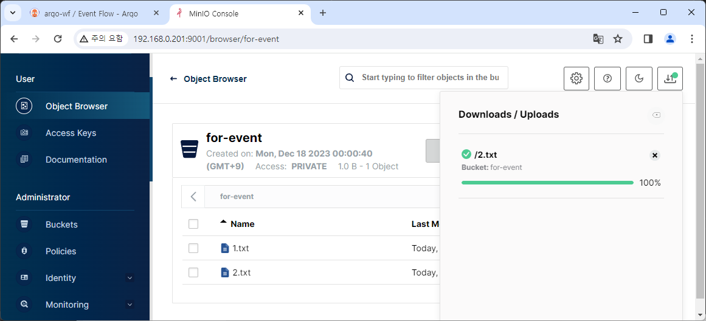
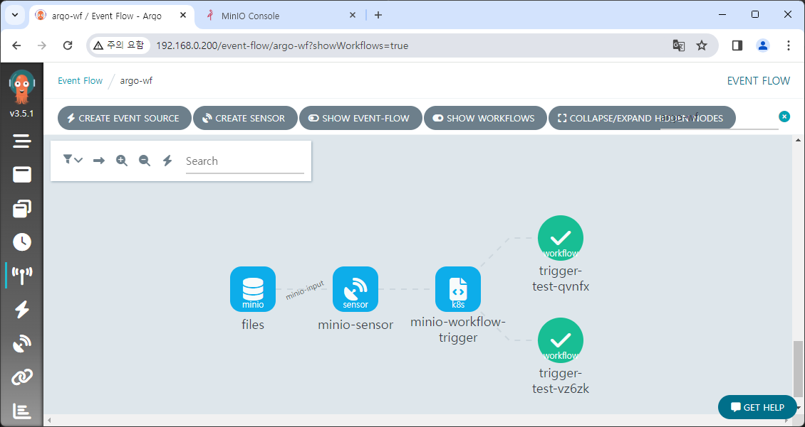
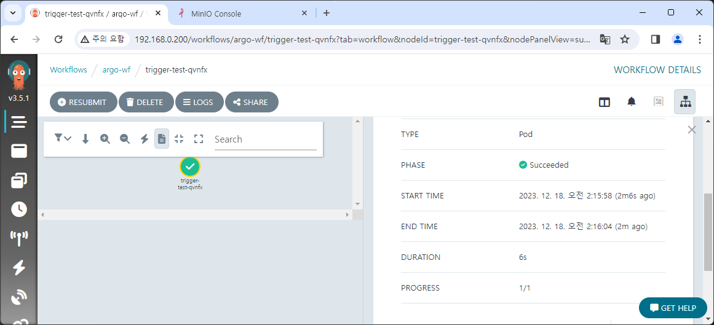
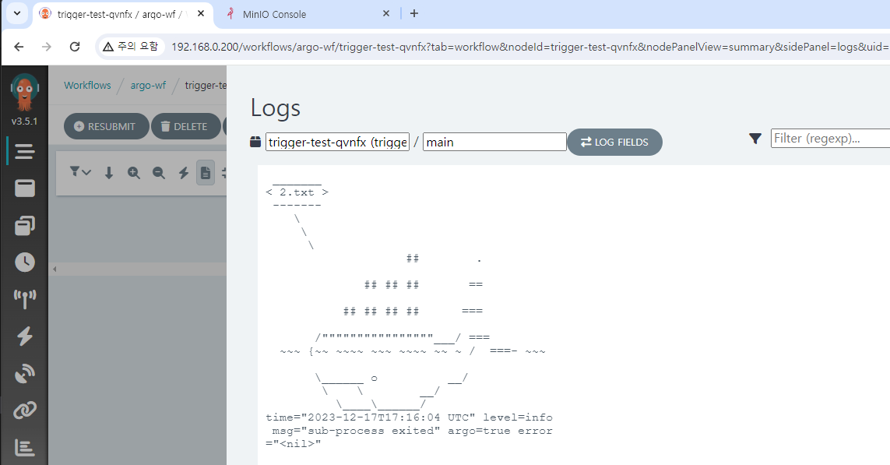

# Event로 Workflow 실행하기

여러 소스가 있지만 MinIO로 설명함  
Github 등의 외부 서비스 Event를 받으려면 Event를 받을 서비스를 공개 IP 등으로 개방해야 하는데 보안 문제가 있으므로 하지 않고
MinIO에 파일을 추가하는 것으로 수동 Event를 발생시키겠음

https://argoproj.github.io/argo-events/concepts/event_source/  
https://github.com/argoproj/argo-events/tree/master/examples/event-sources




```yaml
apiVersion: argoproj.io/v1alpha1
kind: EventBus
metadata:
  name: eventbus-jetstream
  namespace: 
spec:
  jetstream:
    version: "latest"
```

없으면 Event Flow가 작동하지 않음

helm upgrade  
Docs가 부실하고 버전 명시도 안 되어 있어 나중에는 Kafka 쓰는 게 좋아 보임


```yaml title="minio-event-source.yaml"
apiVersion: argoproj.io/v1alpha1
kind: EventSource
metadata:
  name: minio-event
spec:
  eventBusName: eventbus-jetstream
  minio:
    files:
      bucket:
        name: for-event
      endpoint: minio:9000
      # list of events to subscribe to
      # Visit https://docs.minio.io/docs/minio-bucket-notification-guide.html
      events:
        - s3:ObjectCreated:Put
        - s3:ObjectRemoved:Delete
      insecure: true
      accessKey:
        name: minio
        key: root-user
      secretKey:
        name: minio
        key: root-password
```

Event Sources - CREATE NEW EVENTSOURCE



이것만으로는 아무 변화가 없음

```yaml
apiVersion: argoproj.io/v1alpha1
kind: Sensor
metadata:
  name: minio-sensor
spec:
  eventBusName: eventbus-jetstream
  template:
    serviceAccountName: huadmin
  dependencies:
    - name: minio-input
      eventSourceName: minio-event
      eventName: files
  triggers:
    - template:
        name: minio-workflow-trigger
        k8s:
          operation: create
          source:
            resource:
              apiVersion: argoproj.io/v1alpha1
              kind: Workflow
              metadata:
                generateName: trigger-test-
              spec:
                entrypoint: whalesay
                arguments:
                  parameters:
                    - name: message
                      # the value will get overridden by event payload from test-dep
                      value: THIS_WILL_BE_REPLACED
                templates:
                  - name: whalesay
                    inputs:
                      parameters:
                        - name: message
                    container:
                      command:
                        - cowsay
                      image: docker/whalesay:latest
                      args: ["{{inputs.parameters.message}}"]
          # The container args from the workflow are overridden by the s3 notification key
          parameters:
            - src:
                dependencyName: minio-input
                dataKey: notification.0.s3.object.key
              dest: spec.arguments.parameters.0.value
      retryStrategy:
        steps: 3
```







https://github.com/minio/minio/blob/master/docs/bucket/notifications/README.md