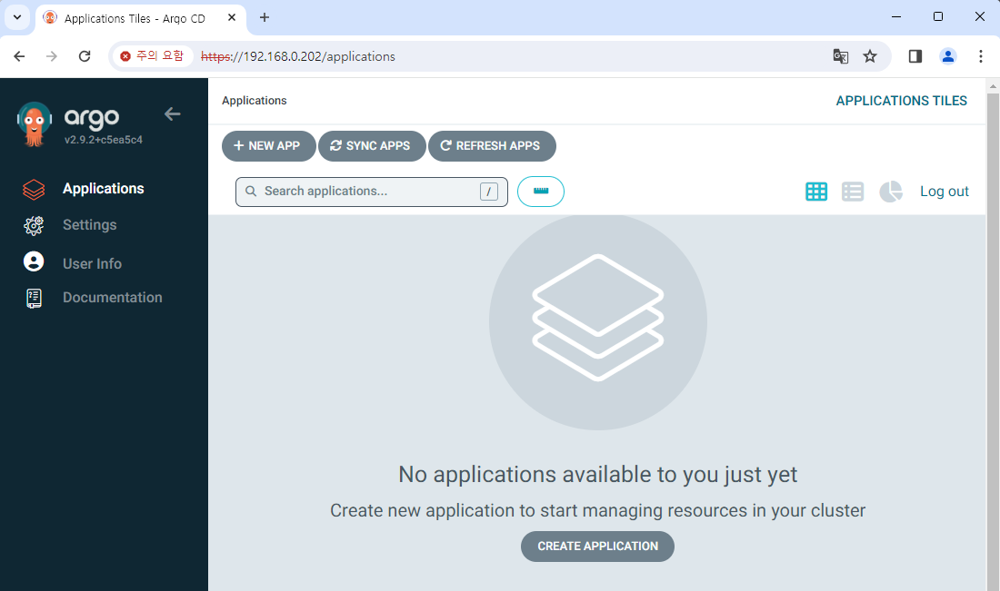

# Argo CD 배포하기

이 문서에서는 Argo CD를 배포하고 로그인해 보겠습니다.

아직 Helm chart를 다운로드받지 않았다면 다음 Repository에서 다운로드합니다.  
https://github.com/argoproj/argo-helm

## Helm chart 수정

역시 간단하게 chart를 수정해 보겠습니다.

1. `fullnameOverride` 값을 원하는 이름으로 변경합니다.  
   여기서는 `myargocd` 로 설정하겠습니다.

2. 접근을 위한 Load-Balancer 설정을 위해 다음과 같이 `values.yaml` 파일을 수정합니다.

   ```yaml title="values.yaml" {11,27}
   (...)
   server:
     (...)
     ## Server service configuration
     service:
       # -- Server service annotations
       annotations: {}
       # -- Server service labels
       labels: {}
       # -- Server service type
       type: LoadBalancer
       # -- Server service http port for NodePort service type (only if `server.service.type` is set to "NodePort")
       nodePortHttp: 30080
       # -- Server service https port for NodePort service type (only if `server.service.type` is set to "NodePort")
       nodePortHttps: 30443
       # -- Server service http port
       servicePortHttp: 80
       # -- Server service https port
       servicePortHttps: 443
       # -- Server service http port name, can be used to route traffic via istio
       servicePortHttpName: http
       # -- Server service https port name, can be used to route traffic via istio
       servicePortHttpsName: https
       # -- Server service https port appProtocol. (should be upper case - i.e. HTTPS)
       # servicePortHttpsAppProtocol: HTTPS
       # -- LoadBalancer will get created with the IP specified in this field
       loadBalancerIP: "192.168.0.202"
       # -- Source IP ranges to allow access to service from
       loadBalancerSourceRanges: []
       # -- Server service external IPs
       externalIPs: []
       # -- Denotes if this Service desires to route external traffic to node-local or cluster-wide endpoints
       externalTrafficPolicy: ""
       # -- Used to maintain session affinity. Supports `ClientIP` and `None`
       sessionAffinity: ""
   ```

3. Argo CD chart는 Dependency가 있는데, 다운로드받으면 보통 `.tgz` 파일로 내려받습니다.  
   `.helmignore` 파일에 `/*.tgz` 항목이 있는 경우 삭제합니다.

## 배포 & 로그인하기

Argo CD는 UI도 분리되어 있고, 다른 Argo 앱들과 독립된 사용이 가능합니다.  
여기서도 별도의 Namespace에 배포하도록 하겠습니다.

다음 명령어로 Argo CD를 배포합니다.

```
helm dependency update ./argo-cd

helm install my-argocd ./argo-cd -n argo-cd --create-namespace
```

이제 로그인을 위한 정보가 필요합니다.  
Argo CD는 로그인에 ID와 비밀번호를 요구합니다.  
기본 ID는 `admin` 이고, 비밀번호는 아래 명령어로 확인할 수 있습니다.

```
kubectl -n argo-cd get secret argocd-initial-admin-secret -o jsonpath="{.data.password}" | base64 -d
```

Argo CD에 할당된 IP 주소로 접속하여 로그인하면 다음과 같은 화면을 확인할 수 있습니다.


