# Workflow를 Argo CD로 제어하기

Argo CD에서는 Git 소스를 연결하여 설정을 동기화하고 K8S 리소스를 배포할 수 있습니다.  
하나의 예시로, Argo Workflows에서 사용하는 Workflow 파일을 Argo CD로 제어해 보겠습니다.

다음과 같은 파일을 Git에 올려서 Argo CD에 연결할 것입니다.  
처음 Argo Workflows를 배울 때 접했던, 간단한 Workflow입니다.

```yaml title="sample-wf.yaml"
apiVersion: argoproj.io/v1alpha1
kind: WorkflowTemplate
metadata:
  name: remote-template-sample
spec:
  templates:
    - name: whalesay
      inputs:
        parameters:
          - name: message
            value: "it is from Github"
      container:
        image: docker/whalesay
        command: [cowsay]
        args: ["{{inputs.parameters.message}}"]
```

## Project 생성하기

우선 Project를 하나 생성하겠습니다.  
Project는 뒤에 생성할 Application의 그룹 개념이고 공통으로 사용할 설정과 권한을 관리할 수 있습니다.

**Settings/Projects** 탭에 들어가 `argo-test` 라는 Project를 생성하겠습니다.

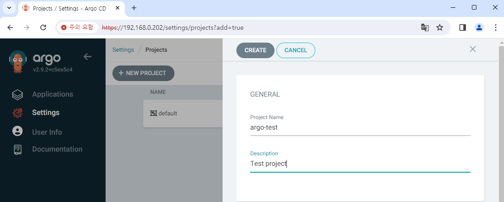

생성한 Project에서는 사용할 수 있는 Git Repository, 배포 가능한 Destination 등의 범위를 지정할 수 있습니다.  
여기서는 해당 클러스터의 `argo-wf` Namespace를 Destination에 추가하고,  
Repository는 제한을 두지 않도록 `*` 으로 설정하겠습니다.

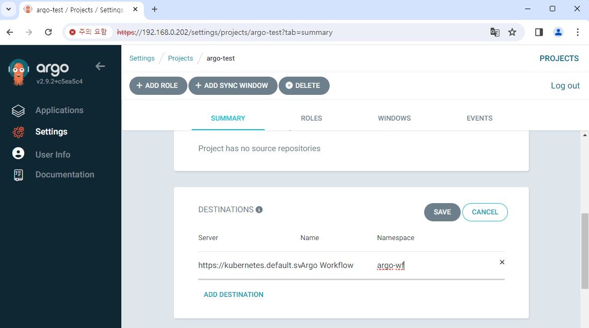

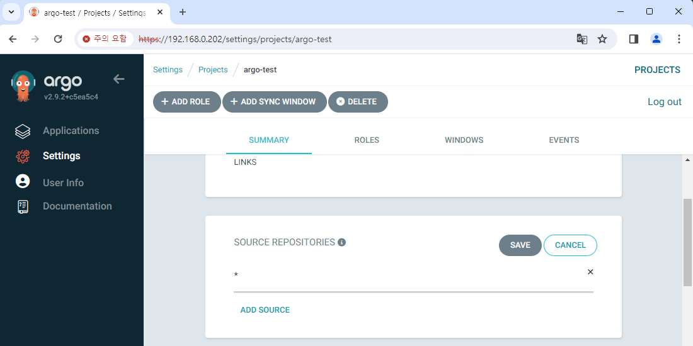

## Application 생성하기

이제 실제 Application을 생성하겠습니다.

**Applications** 탭에서 **NEW APP** 을 누르고 다음과 같이 Application을 작성합니다.  
**EDIT AS YAML** 버튼을 누르고 아래 내용을 붙여넣으면 됩니다.

```yaml {7-9,11-13,17}
apiVersion: argoproj.io/v1alpha1
kind: Application
metadata:
  name: sample-workflow
spec:
  destination:
    name: ""
    namespace: argo-wf
    server: "https://kubernetes.default.svc"
  source:
    path: step5-3
    repoURL: "<your-git-address>"
    targetRevision: main
  sources: []
  project: argo-test
  syncPolicy:
    automated: null
    syncOptions: []
```

간단히 요약하면 `main` 브랜치의 `step5-3` 폴더 아래 파일들을 참조해서,  
`argo-wf` Namespace에 배포할 것이라는 내용을 담고 있습니다.  
일부러 `automated: null` 로 설정하여 자동 동기화는 비활성화했습니다.

이대로 Application을 생성해 보겠습니다.

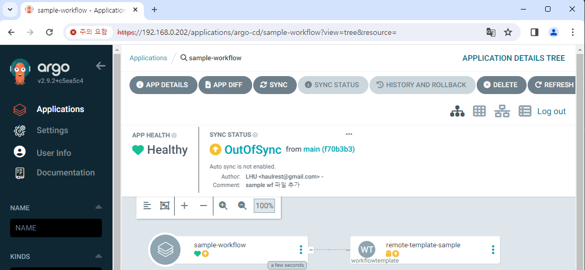

자동 동기화가 비활성화되어 있기 때문에 OutOfSync 상태로 표시되고,  
Workflow도 당연히 생성되지 않았습니다.

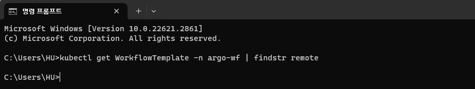

이제 수동으로 동기화를 시켜 보겠습니다.  
**Sync** 버튼을 눌러 직접 동기화를 진행합니다.

그러면 정상적으로 동기화가 되고, Workflow도 생성이 된 것을 확인할 수 있습니다.

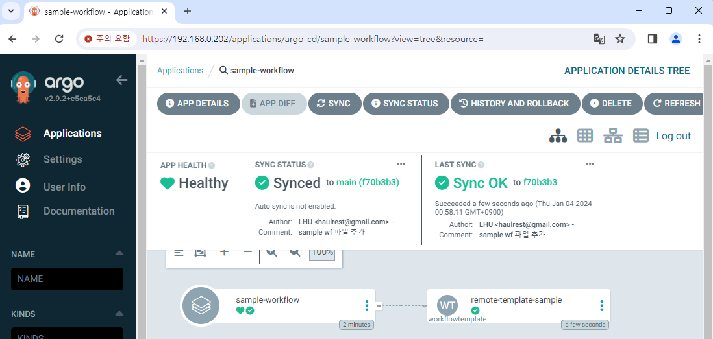

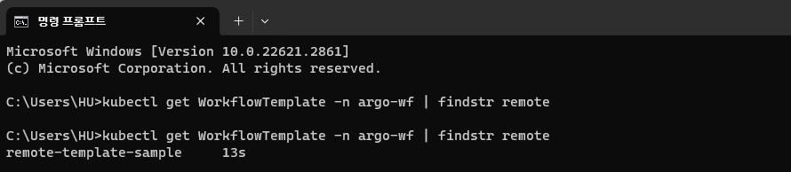

Argo Workflows 화면에서도 생성된 Workflow를 확인할 수 있습니다.  
실제로 실행해 보면 정상적으로 메시지가 출력됩니다.

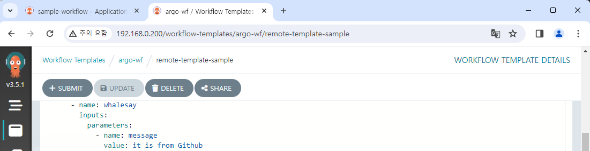

## 변경사항 반영하기

Git에 있는 Workflow 파일을 Argo CD에 연결해 실제로 리소스를 생성했습니다.  
그렇다면 Git의 파일을 변경시키면 어떻게 될까요?

변수의 값을 바꾸어 Push해 보겠습니다.

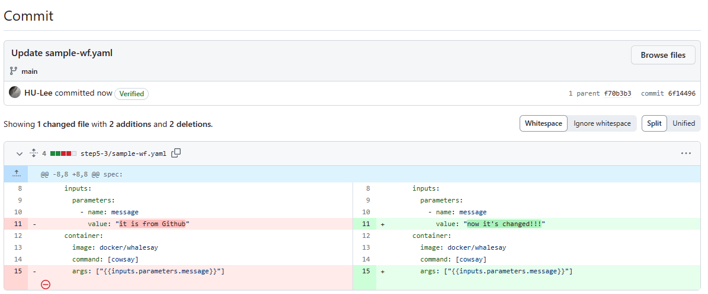

Argo CD를 확인해 보면 다시 OutOfSync 상태가 되었습니다.  
Git의 설정과 현재 리소스의 설정이 다르기 때문입니다.

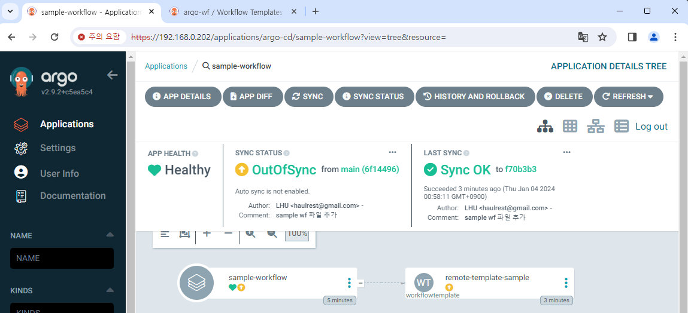

이제 다시 동기화를 하면 다시 Synced 상태가 되고,  
Workflow에 변경된 값이 반영되는 것을 확인할 수 있습니다.


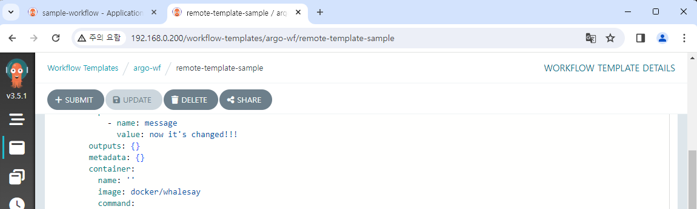
