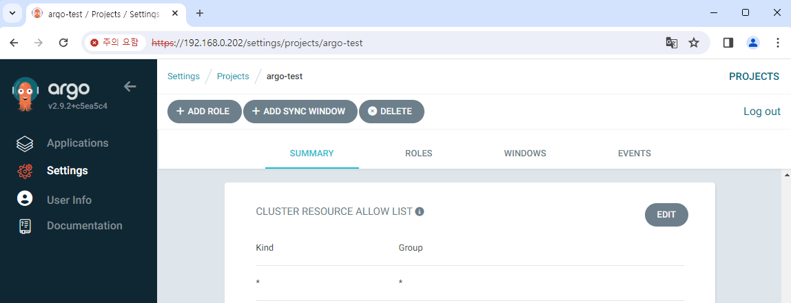
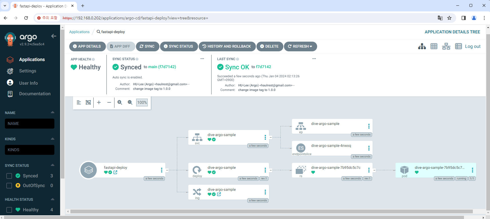
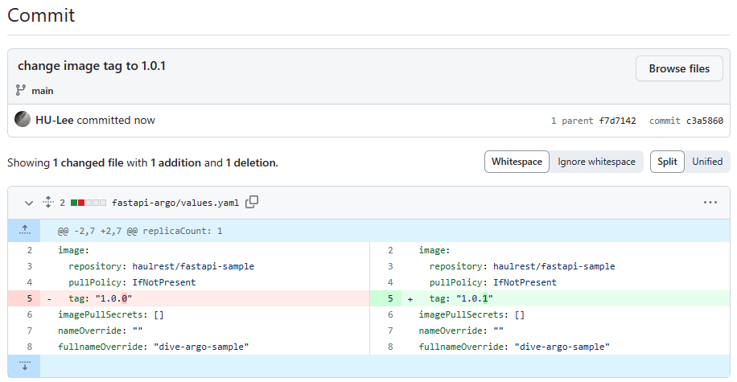
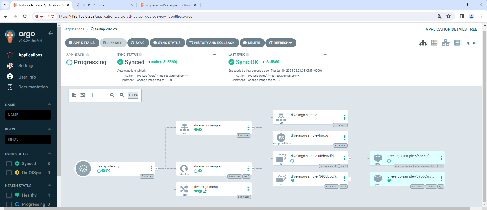

# CI/CD pipeline 완성하기

이 문서에서는 앞에서 구축한 CI pipeline에 Argo CD를 연결하여  
최종적인 CI/CD pipeline을 완성시켜 보겠습니다.

## 프로젝트 추가 설정하기

앞에서 FastAPI 샘플 앱을 이미지로 만드는 과정까지 진행했습니다.  
이제 이 앱을 Argo CD를 통해 `fastapi` Namespace에 배포할 것입니다.

프로젝트의 Destination에 `fastapi` Namespace를 추가합니다.


Argo CD로 Application을 생성하면 Namespace를 시작으로 하여  
Deployment, Service 등의 Object가 생성될 것입니다.  
이를 위한 권한을 부여하기 위해 Cluster Resource Allow List를 설정해 줍니다.  
여기서는 모든 리소스에 대한 권한을 부여하겠습니다.



## Helm chart 연결하기

Helm chart로 구성된 리소스도 Argo CD로 제어할 수 있습니다.  
https://argo-cd.readthedocs.io/en/stable/user-guide/helm/

아래와 같이 Application 정보를 입력하고 생성하겠습니다.

```yaml {19-23}
apiVersion: argoproj.io/v1alpha1
kind: Application
metadata:
  name: fastapi-deploy
  namespace: argo-cd
spec:
  destination:
    namespace: fastapi
    server: "https://kubernetes.default.svc"
  source:
    path: fastapi-argo
    repoURL: "https://github.com/BeaverHouse/dive-argo-fastapi-helm.git"
    targetRevision: main
    helm:
      releaseName: dive-argo-fastapi
  sources: []
  project: argo-test
  syncPolicy:
    automated:
      prune: false
      selfHeal: false
    syncOptions:
      - CreateNamespace=true
```

역시 `main` 브랜치의 `fastapi-argo` 폴더 아래 파일들을 참조해서,  
`fastapi` Namespace에 배포할 것이라는 내용을 담고 있습니다.

그리고 Namespace 자동 생성을 위해 `CreateNamespace=true` 옵션을 주고,  
자동 동기화도 활성화하였습니다. 그 외 옵션은 설정하지 않았습니다.



생성을 하고 기다리면 Helm chart에 설정한 대로 리소스가 생성됩니다.  
Helm chart에 Ingress를 설정해 두었기 때문에, Ingress NGINX Controller의 IP 주소인 `192.168.0.222` 로 접속해 보면 FastAPI 앱을 확인할 수 있습니다.


## 변경사항 자동 업데이트하기

이제 기존 FastAPI 앱을 수정해 보겠습니다.  
다음과 같이 간단한 API 하나를 추가하고, `1.0.1` 태그를 붙였습니다.


앞선 챕터에서 Github에서 직접 이벤트를 받는 대신, MinIO에서 수동으로 이벤트를 발생시켰습니다.  
이번에도 MinIO에 파일을 추가하거나 삭제해 이벤트를 발생시킵니다.


그러면 이벤트를 감지하여 CI pipeline이 실행됩니다.

<br/>




이미지가 빌드되어 Docker Hub에 업데이트되었고, Helm chart의 태그도 변경되었습니다.  
다시 Argo CD로 돌아와 보면 자동으로 리소스를 Rolling Update하는 것을 확인할 수 있습니다.



모든 과정이 끝나고 FastAPI 앱에 다시 접속하면, 새로운 API를 확인할 수 있습니다.


