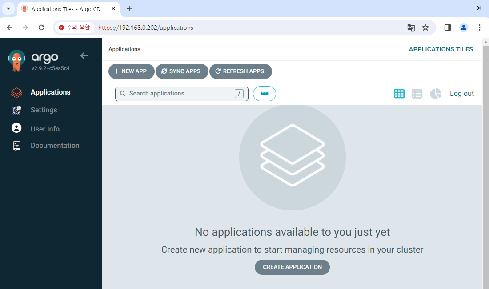

# Argo CD 배포하기

fullnameOverride: "myargocd"

```yaml {11,29}
(...)
server:
  (...)
  ## Server service configuration
  service:
    # -- Server service annotations
    annotations: {}
    # -- Server service labels
    labels: {}
    # -- Server service type
    type: LoadBalancer
    # -- Server service http port for NodePort service type (only if `server.service.type` is set to "NodePort")
    nodePortHttp: 30080
    # -- Server service https port for NodePort service type (only if `server.service.type` is set to "NodePort")
    nodePortHttps: 30443
    # -- Server service http port
    servicePortHttp: 80
    # -- Server service https port
    servicePortHttps: 443
    # -- Server service http port name, can be used to route traffic via istio
    servicePortHttpName: http
    # -- Server service https port name, can be used to route traffic via istio
    servicePortHttpsName: https
    # -- Server service https port appProtocol. (should be upper case - i.e. HTTPS)
    # servicePortHttpsAppProtocol: HTTPS
    # -- LoadBalancer will get created with the IP specified in this field
    loadBalancerIP: "192.168.0.202"
    # -- Source IP ranges to allow access to service from
    loadBalancerSourceRanges: []
    # -- Server service external IPs
    externalIPs: []
    # -- Denotes if this Service desires to route external traffic to node-local or cluster-wide endpoints
    externalTrafficPolicy: ""
    # -- Used to maintain session affinity. Supports `ClientIP` and `None`
    sessionAffinity: ""
```

helmignore에서 tgz 삭제

```
helm dependency update ./argo-cd

helm install my-argocd ./argo-cd -n argo-cd --create-namespace
```

username: admin

```
kubectl -n argo-cd get secret argocd-initial-admin-secret -o jsonpath="{.data.password}" | base64 -d
```


