# Workflow를 Argo CD로 제어하기

```yaml title="sample-wf.yaml"
apiVersion: argoproj.io/v1alpha1
kind: WorkflowTemplate
metadata:
  name: remote-template-sample
spec:
  templates:
    - name: whalesay
      inputs:
        parameters:
          - name: message
            value: "it is from Github"
      container:
        image: docker/whalesay
        command: [cowsay]
        args: ["{{inputs.parameters.message}}"]
```

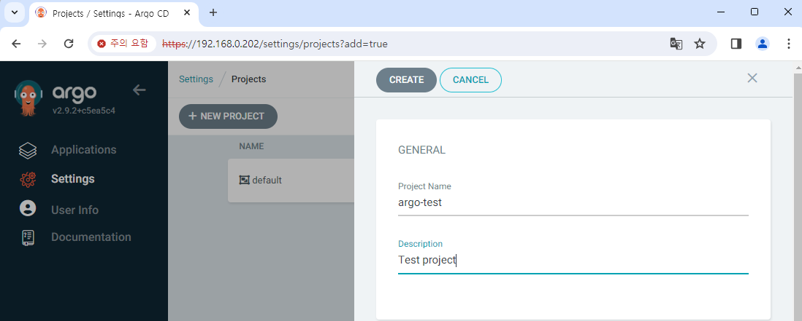

새 프로젝트 생성

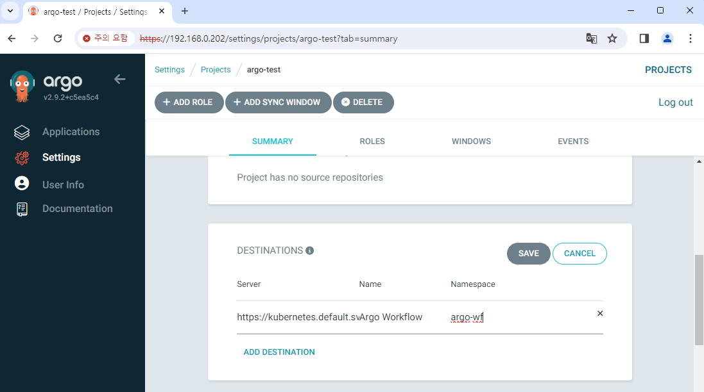

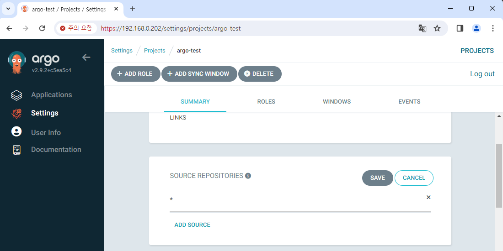

설정

```yaml
apiVersion: argoproj.io/v1alpha1
kind: Application
metadata:
  name: sample-workflow
spec:
  destination:
    name: ""
    namespace: argo-wf
    server: "https://kubernetes.default.svc"
  source:
    path: step5-3
    repoURL: "https://github.com/BeaverHouse/dive-argo-practice-files.git"
    targetRevision: main
  sources: []
  project: argo-test
  syncPolicy:
    automated: null
    syncOptions: []
```

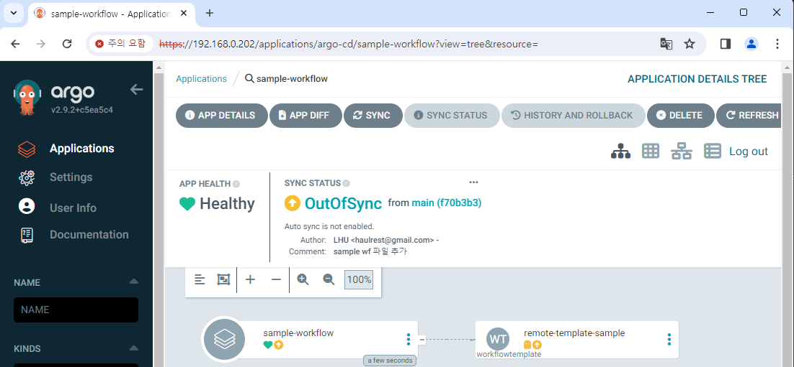

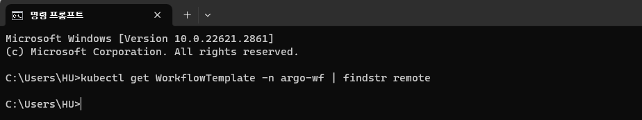

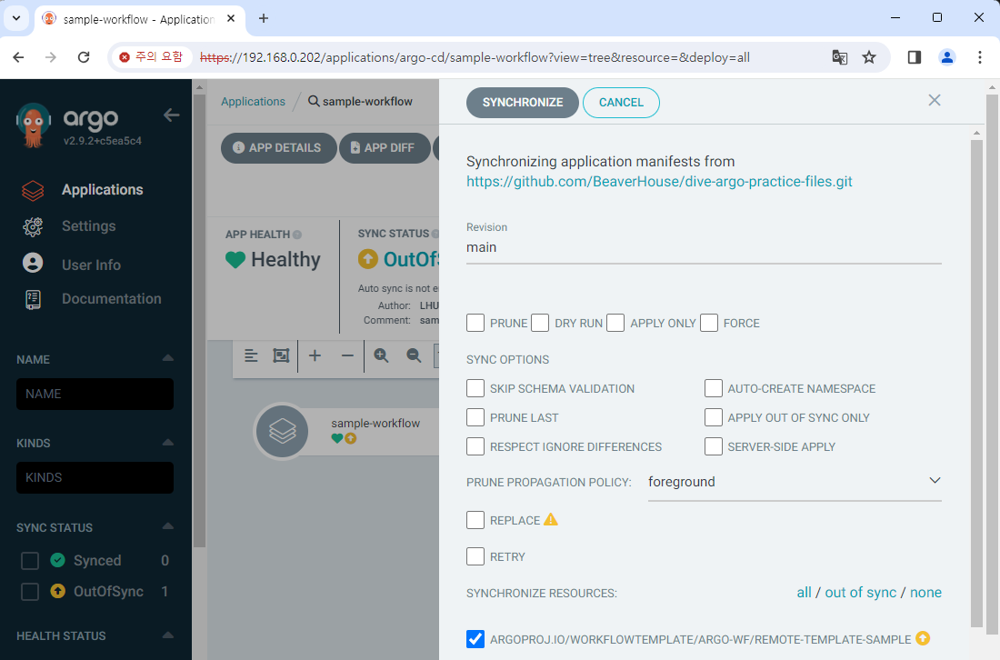

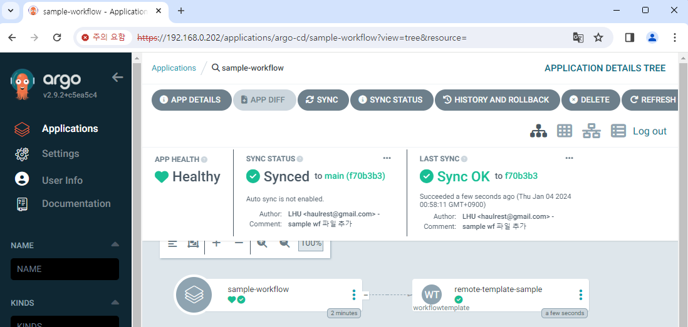

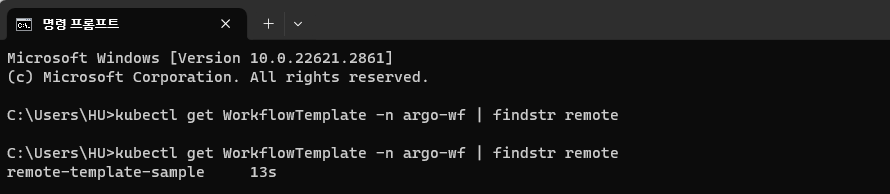

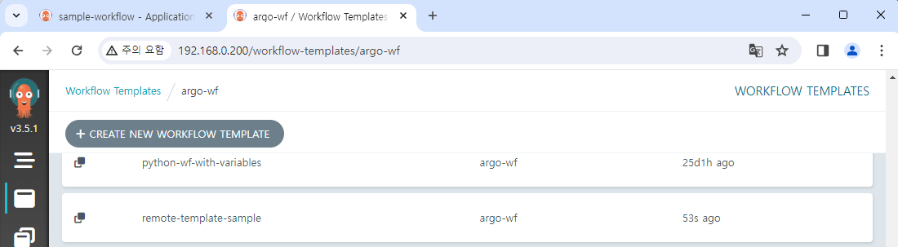

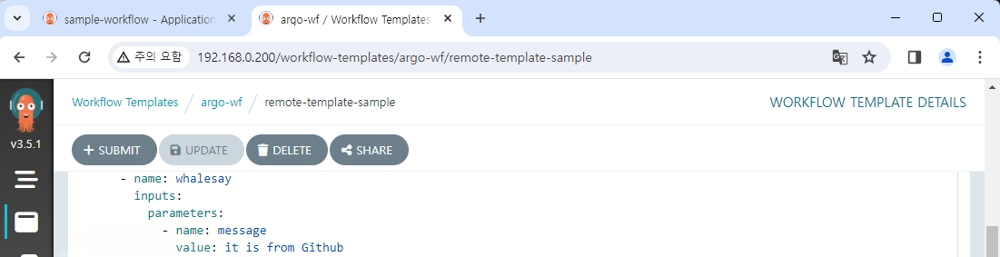

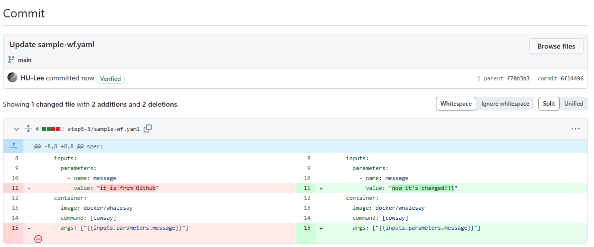

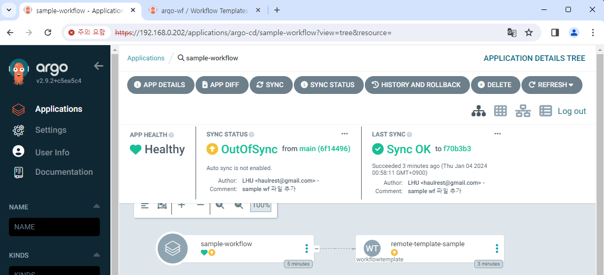

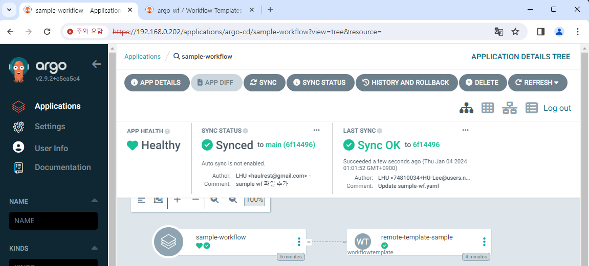

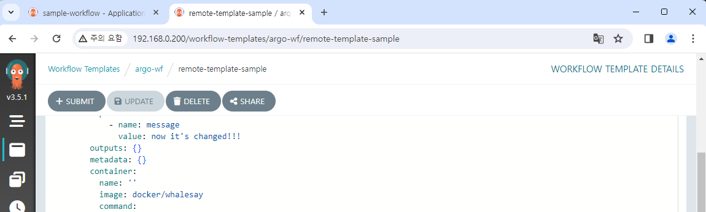
