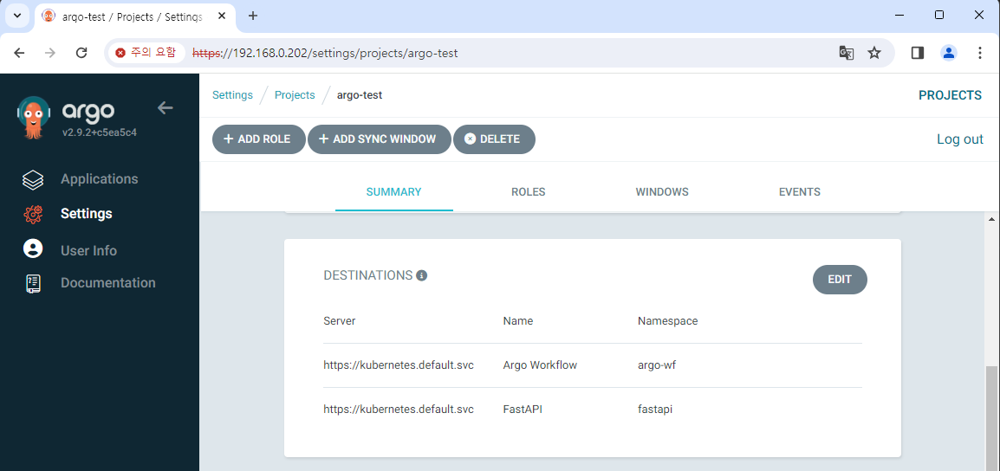
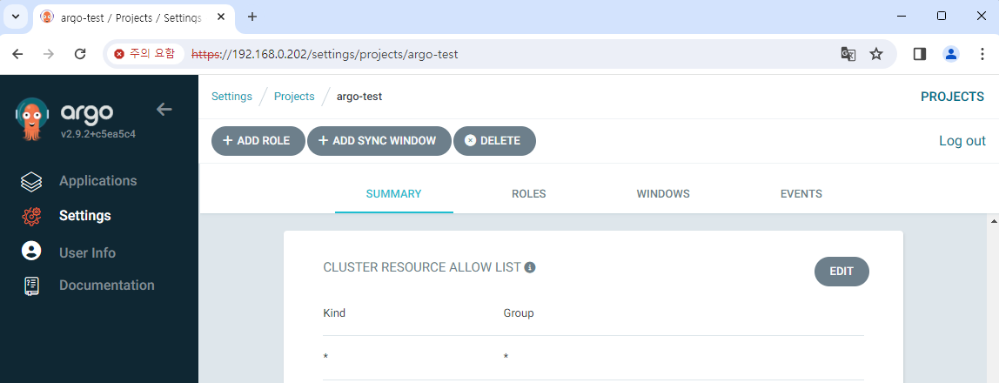
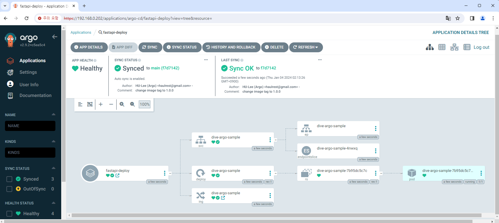
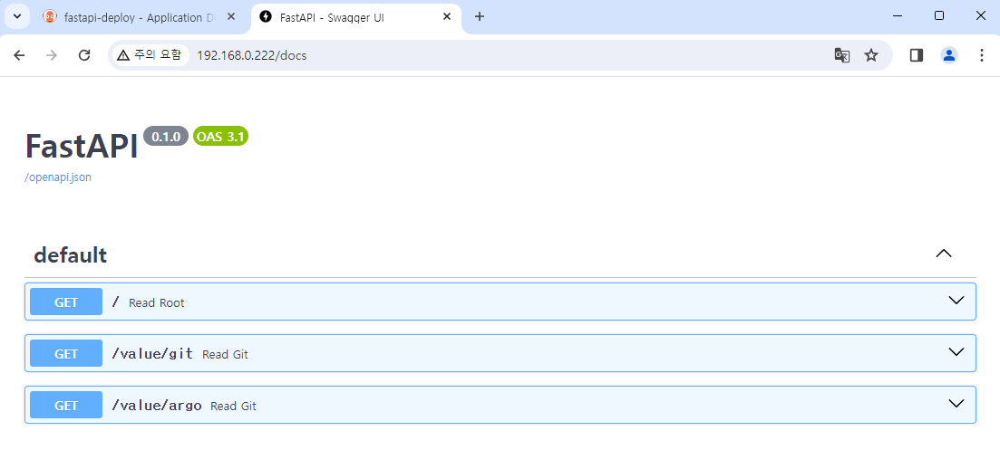
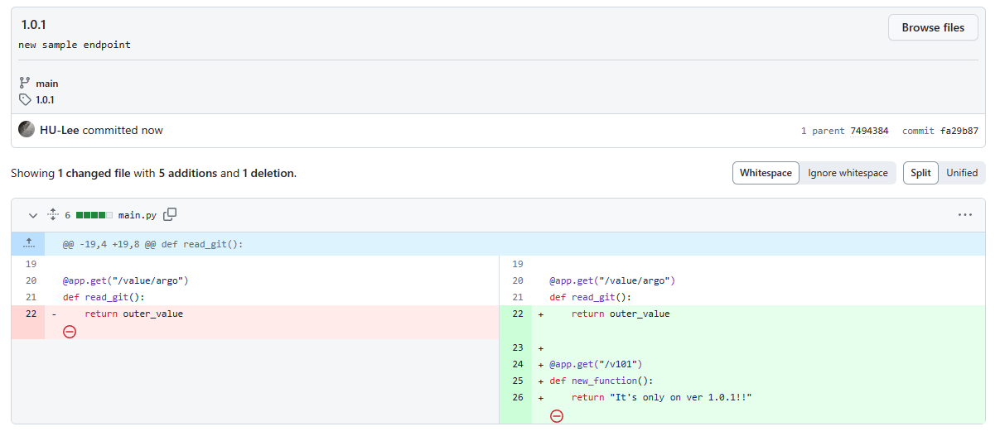
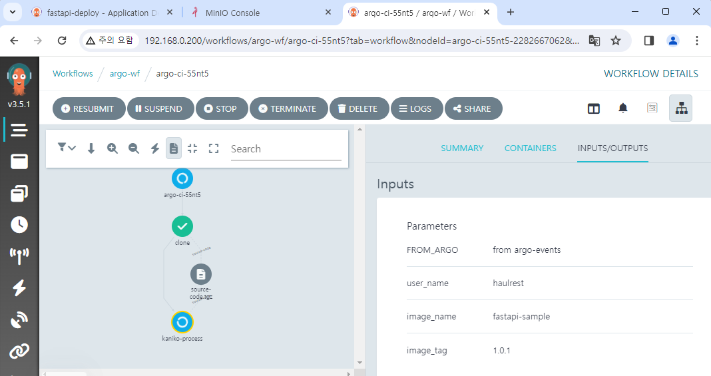
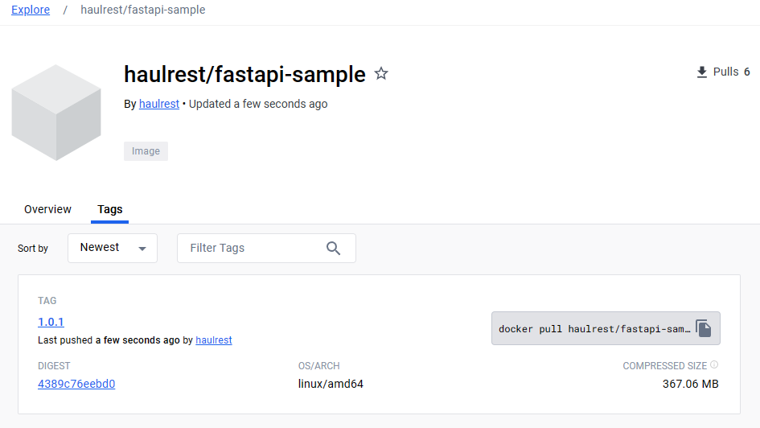
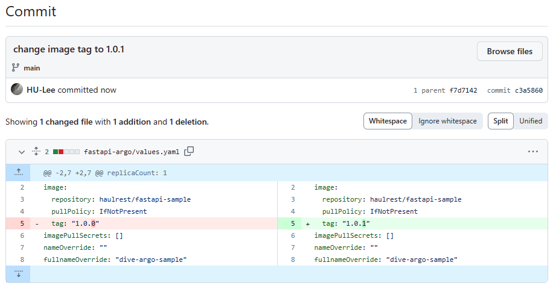
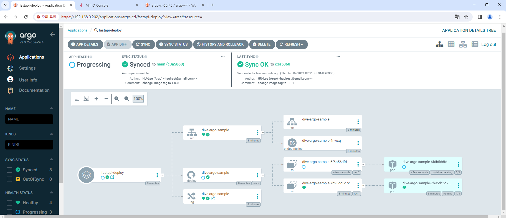
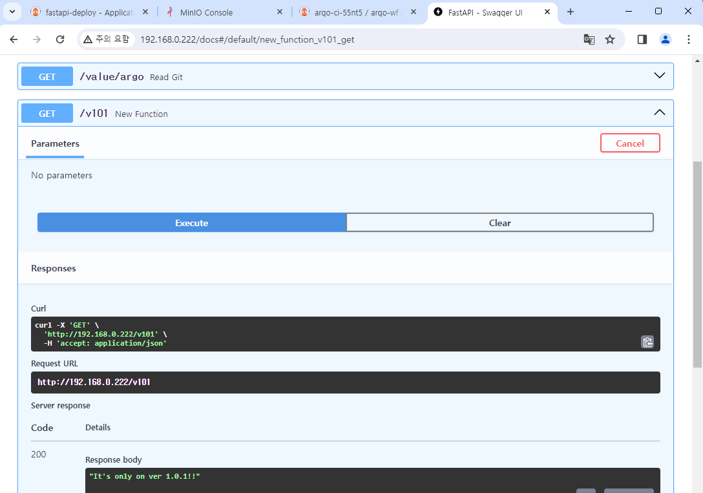

# CI/CD pipeline 완성하기





이제 Helm chart 연결

https://argo-cd.readthedocs.io/en/stable/user-guide/helm/

```yaml
apiVersion: argoproj.io/v1alpha1
kind: Application
metadata:
  name: fastapi-deploy
  namespace: argo-cd
spec:
  destination:
    namespace: fastapi
    server: "https://kubernetes.default.svc"
  source:
    path: fastapi-argo
    repoURL: "https://github.com/BeaverHouse/dive-argo-fastapi-helm.git"
    targetRevision: main
    helm:
      releaseName: dive-argo-fastapi
  sources: []
  project: argo-test
  syncPolicy:
    automated:
      prune: false
      selfHeal: false
    syncOptions:
      - CreateNamespace=true
```







MinIO에서 이벤트 발생










