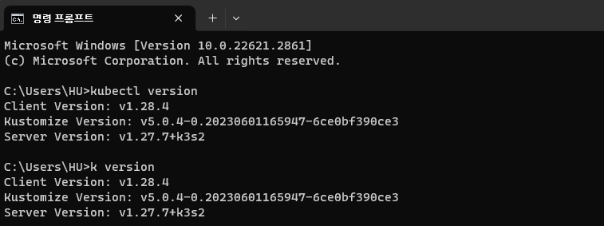
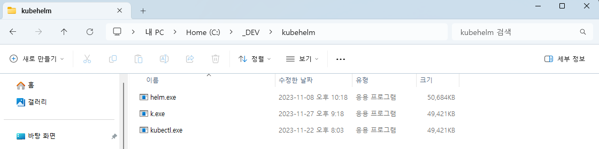

# kubectl Alias

`kubectl`, Helm 등을 다루며 모든 명령어를 입력하는 것은 너무나도 불편합니다.  
이 명령어들을 Alias를 통해 간소화할 수 있습니다. 

여기서는 `kubectl`을 예시로 설명하겠습니다.



## 단순히 kubectl만 줄이고 싶다면

import Tabs from "@theme/Tabs";
import TabItem from "@theme/TabItem";

```mdx-code-block
<Tabs groupId="operating-systems">
  <TabItem value="win" label="Windows">
```



`kubectl` 만 줄여서 사용하고 싶다면 `.exe` 파일 이름을 바꿔 버리면 됩니다.  
가장 무식하지만, 가장 간단합니다.

```mdx-code-block
  </TabItem>
  <TabItem value="linux" label="Linux">
```

`~/.bashrc` 파일을 열고 다음 내용을 추가합니다.  
macOS의 `zsh`도 `~/.zshrc` 파일을 열고 동일하게 하면 됩니다.

```
alias k=kubectl
```

```mdx-code-block
  </TabItem>
</Tabs>
```

## 더 많은 Alias를 원한다면

위 내용은 굉장히 간단하지만, 이에 만족하지 못할 수도 있습니다.  
더 많은 Alias를 원할 수도 있고, 특히 Windows에서 사용한 방법은 일반적이지 않습니다.

하지만 여러 Alias를 수동으로 추가하는 것도 꽤나 힘든 일입니다.  
이러한 분들을 위해 수백 가지의 Alias들을 생성해 주는 스크립트를 Github에서 공유하고 있습니다.  
아래 Repository를 참고하셔서 설정을 진행해 보시기 바랍니다.

[Alias for Linux][linux-alias]   
[Alias for PowerShell][powershell-alias]

[linux-alias]: https://github.com/ahmetb/kubectl-aliases
[powershell-alias]: https://github.com/shanoor/kubectl-aliases-powershell
