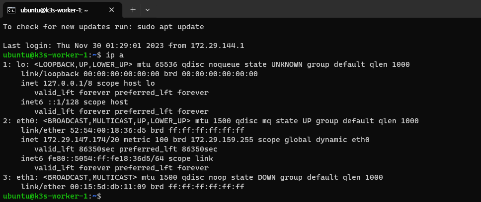
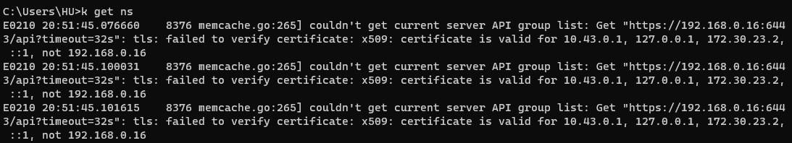

# VM 고정 IP 설정하기

Multipass의 VM은 따로 설정하지 않을 경우 재기동하거나, 호스트 컴퓨터를 재부팅했을 때 새로운 IP 주소가 할당됩니다. 이로 인해 호스트의 `kubectl` 에서 VM 환경에 접근이 되지 않을 수도 있고, Multi-node 클러스터의 경우 노드 간의 연결이 끊길 수도 있습니다.

고정 IP를 구성하지 않는다면 이러한 문제를 해결하기 위해 매번 설정을 업데이트하거나 새로 구성해야 하는 번거로움이 생깁니다. 항상 VM을 켜진 상태로 유지할 수 없다면, 고정 IP를 할당해 두는 것이 좋습니다.

Multipass에서 고정 IP와 관련된 [공식 가이드][ref1]을 제공하고 있습니다.  
해당 과정을 간단히 설명하면 다음과 같습니다.

1. 고정 IP를 위한 Switch 또는 Bridge를 생성합니다.  
   이는 OS마다 방법이 다르기 때문에 생략하겠습니다.
2. VM에 생성한 Switch/Bridge를 연결하여 실행합니다.

   :::info
   Windows의 경우 1~2번에 관련된 내용을 찾기가 힘든데, [Netmarble 기술 블로그][ref2]에 이에 대한 친절한 글이 있으니 참고하시면 좋을 것 같습니다.  
   단, 해당 포스트는 이전 버전의 Multipass를 사용하고 있기 때문에, Hyper-V 관리자 설정 부분까지만 참고해 주세요.
   :::

3. Multipass VM Shell에 접속합니다.  
   Shell에서 `ip a` 명령어로 새로 생성된 MAC 주소를 확인할 수 있습니다.  
   (아래의 경우, `eth1` 항목으로 생성되었습니다.)

   

4. 다음 명령어를 실행합니다.

   ```
   sudo vi /etc/netplan/50-cloud-init.yaml
   ```

   `/etc/netplan` 폴더 아래에 새로 `yaml` 파일을 만들어도 무방합니다.  
   이 경우 Multipass 가이드를 참고해서 작성하시면 됩니다.  
   여기서는 기존에 존재하는 파일을 수정하겠습니다.

   ```yaml title="/etc/netplan/50-cloud-init.yaml" {13-17}
   # This file is generated from information provided by the datasource.  Changes
   # to it will not persist across an instance reboot.  To disable cloud-init's
   # network configuration capabilities, write a file
   # /etc/cloud/cloud.cfg.d/99-disable-network-config.cfg with the following:
   # network: {config: disabled}
   network:
     ethernets:
       eth0:
         dhcp4: true
         match:
           macaddress: 52:54:00:18:36:d5
         set-name: eth0
       eth1:
         dhcp4: no
         match:
           macaddress: "00:15:5d:db:11:09"
         addresses: [192.168.0.4/24]
     version: 2
   ```

5. 호스트에서 다음 명령어로 설정을 적용합니다.

   ```
   multipass exec -n <vm-name> -- sudo netplan apply
   ```

6. 이후 `ping` 명령어 등으로 IP 주소를 테스트합니다.

7. 추가로 고정 IP를 할당할 VM에 대해 2 ~ 6의 과정을 반복합니다.

<br />

```cmd {4,6,8}
C:\Users\HU>multipass list
Name                    State             IPv4             Image
k3s-master              Running           172.29.147.34    Ubuntu 22.04 LTS
                                          192.168.0.2
k3s-worker-1            Running           172.29.146.255   Ubuntu 22.04 LTS
                                          192.168.0.4
k3s-worker-2            Running           172.29.154.49    Ubuntu 22.04 LTS
                                          192.168.0.8
```

이렇게 할당된 고정 IP는 VM을 재기동시켜도 변하지 않습니다.

:::caution
Multi-node 클러스터에서 고정 IP로 노드끼리 통신하기 위해서는 연결할 노드들이 모두 같은 Switch/Bridge의 고정 IP를 가지고 있어야 합니다.
:::

:::info
고정 IP 설정 후 호스트에서 VM 환경에 접근하려 할 때 다음과 같은 오류가 발생할 수 있습니다.

```
couldn't get current server API group list: Get "https://<your-ip>:6443/api?timeout=32s":
tls: failed to verify certificate: x509: certificate is valid for ..., not <your-ip>
```



이 경우 K3S를 다음 명령어로 재설치합니다.[^1]

```
curl -sfL https://get.k3s.io | INSTALL_K3S_EXEC="--tls-san <your-ip>" sh -s -
```

:::

[ref1]: https://multipass.run/docs/configure-static-ips
[ref2]: https://netmarble.engineering/multipass-ubuntu-static-ip-configuration-on-hyper-v/

[^1]: https://github.com/k3s-io/k3s/issues/1381

<!--Re-edited on 240117-->
