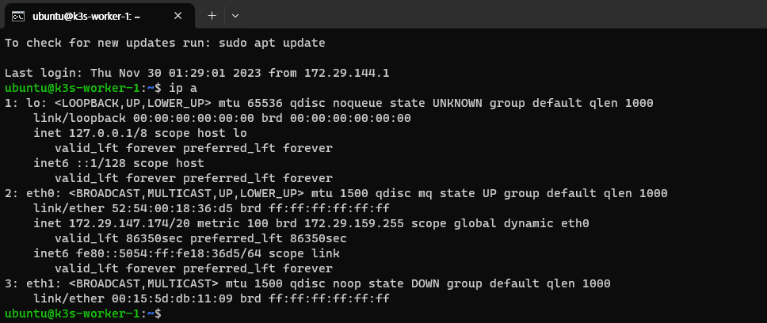

# VM 고정 IP 설정하기

Multipass의 VM은 따로 설정하지 않을 경우 재기동하거나, 호스트 컴퓨터를 재부팅했을 때 IP 주소가 새롭게 할당됩니다. 이로 인해 `kubectl` 의 `context` 에 접근이 되지 않을 수도 있고, Multi-node를 구성했을 경우 Master node의 IP가 변경되면서 Worker node의 연결이 끊길 수도 있습니다.

고정 IP를 구성하지 않는다면 `kubectl` 설정 파일의 IP를 계속 변경해 주고, node도 재부팅 시마다 `k3s`를 새로 설정해야 합니다. 삭제 후 재설치를 하는 등 일련의 과정이 다시 필요합니다.  
이 과정을 없애기 위해 VM에 고정 IP를 할당할 수 있습니다.

Multipass에서는 이와 관련된 [공식 가이드][ref1]을 제공하고 있습니다.  
해당 과정을 간단히 설명하면 다음과 같습니다.

1. 고정 IP를 위한 Switch 또는 Bridge를 생성합니다.  
   이는 OS마다 방법이 다르기 때문에 모두 설명하지 않겠습니다.
2. 이후 VM에 생성한 Switch/Bridge를 연결하여 실행합니다.

   :::info
   Windows의 경우 1~2번에 관련된 내용을 찾기가 힘든데, [Netmarble 기술 블로그][ref2]에서 이에 대한 친절한 포스트를 작성해 놓았으니 참고하시면 좋을 것 같습니다.  
    단, 해당 포스트는 이전 버전의 Multipass를 기준으로 하고 있기 때문에, Hyper-v 관리자 설정 부분까지만 참고해 주세요.
   :::

3. Multipass VM Shell에 접속합니다.  
   Shell에서 `ip a` 명령어를 입력하면 새로 생성된 mac 주소를 확인할 수 있습니다.  
   (제 Window의 경우, `eth1`로 생성되었습니다.)

   

4. 다음 명령어를 입력합니다.

   ```
   sudo vi /etc/netplan/50-cloud-init.yaml
   ```

   아니면 `/etc/netplan` 폴더 아래에 새로 `yaml` 파일을 만들어도 무방합니다.  
   이 경우 Multipass 가이드를 참고해서 작성하시면 됩니다.  
   여기서는 파일을 수정하는 기준으로 다음과 같이 변경하였습니다.

   ```yaml title="/etc/netplan/50-cloud-init.yaml" {13-17}
   # This file is generated from information provided by the datasource.  Changes
   # to it will not persist across an instance reboot.  To disable cloud-init's
   # network configuration capabilities, write a file
   # /etc/cloud/cloud.cfg.d/99-disable-network-config.cfg with the following:
   # network: {config: disabled}
   network:
     ethernets:
       eth0:
         dhcp4: true
         match:
           macaddress: 52:54:00:18:36:d5
         set-name: eth0
       etc1:
         dhcp4: no
         match:
           macaddress: "00:15:5d:db:11:09"
         addresses: [192.168.0.4/24]
     version: 2
   ```

5. 호스트에서 다음 명령어로 설정을 적용합니다.

   ```
   multipass exec -n <vm-name> -- sudo netplan apply
   ```

6. 이후 `ping` 등의 명령어를 활용하여 연결을 테스트합니다.

7. 추가로 고정 IP를 할당할 VM에 대해서 2 ~ 6의 과정을 반복합니다.

<br />

```cmd {4,6,8}
C:\Users\HU>multipass list
Name                    State             IPv4             Image
k3s-master              Running           172.29.147.34    Ubuntu 22.04 LTS
                                          192.168.0.2
k3s-worker-1            Running           172.29.146.255   Ubuntu 22.04 LTS
                                          192.168.0.4
k3s-worker-2            Running           172.29.154.49    Ubuntu 22.04 LTS
                                          192.168.0.8
```

이렇게 설정한 고정 IP는 VM을 재기동시켜도 변하지 않습니다.

:::warning 주의
고정 IP로 노드끼리 통신하기 위해서는 연결할 노드들이 모두 같은 Switch/Bridge의 고정 IP를 가지고 있어야 합니다.
:::

[ref1]: https://multipass.run/docs/configure-static-ips
[ref2]: https://netmarble.engineering/multipass-ubuntu-static-ip-configuration-on-hyper-v/
