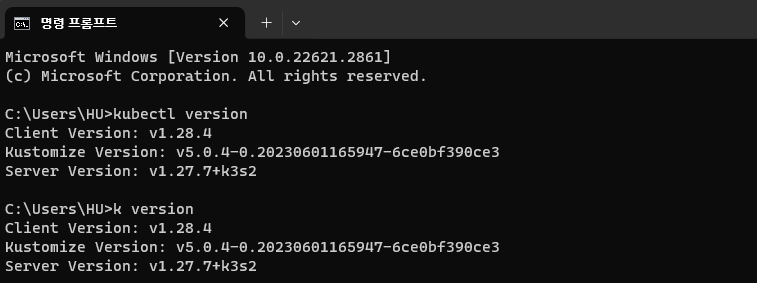
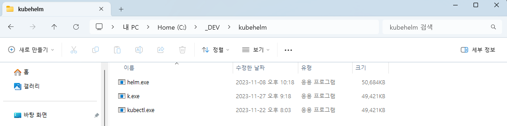

# kubectl alias

It's quite uncomfortable to type long `kubectl`, Helm command every time.    
We can simplify this commands with alias. 

We'll talk about `kubectl` for example in here.



## If you want JUST kubectl alias...

import Tabs from "@theme/Tabs";
import TabItem from "@theme/TabItem";

```mdx-code-block
<Tabs groupId="operating-systems">
  <TabItem value="win" label="Windows">
```



If you want alias just for `kubectl` only, just change `.exe` file to some name you want.  
The simplest, but also the most crude way.

```mdx-code-block
  </TabItem>
  <TabItem value="linux" label="Linux">
```

Open `~/.bashrc` file and add the content below.  
`zsh` on macOS is also same, using `~/.zshrc` file.

```
alias k=kubectl
```

```mdx-code-block
  </TabItem>
</Tabs>
```

## IF you want more aliases...

The method above is super simple, but you may not satisfy with it.  
You may want more aliases, and especially the method for Windows is quite abnormal.

However, adding lots of aliases with manual is actually a hard work.  
So there's a repository on Github that shares script to make various aliases.  
Please find more information from repos below.

[Alias for Linux][linux-alias]   
[Alias for PowerShell][powershell-alias]

[linux-alias]: https://github.com/ahmetb/kubectl-aliases
[powershell-alias]: https://github.com/shanoor/kubectl-aliases-powershell
