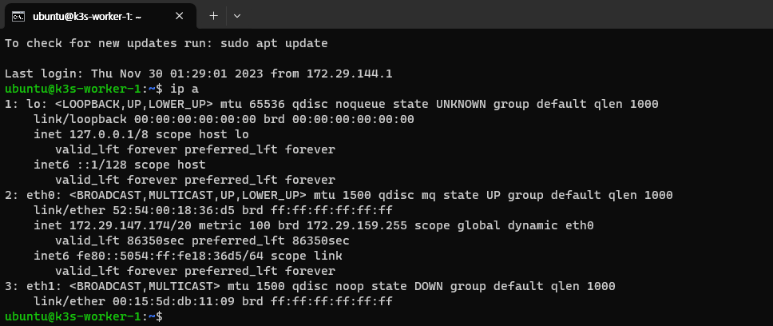
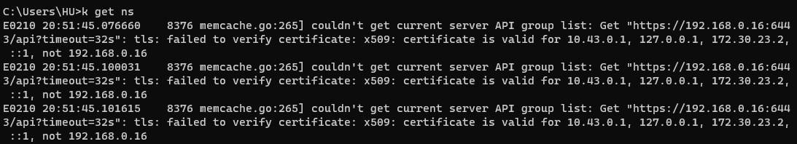

# Static IP for VM

Without any settings, Multipass's VM will be reallocated with a new IP address when VM is restarted or the host computer is rebooted. This may result in host `kubectl` being unable to access its VM environment. Also if you have configured multi-node cluster, the connection between the nodes might be disconnected due to a change in the IP address.

If you do not configure a static IP, you may need to change or re-configure the settings on each VM restart. If you're unable to maintain VM online all the time, it's better to assign a static IP.

Multipass provides an [official guide][ref1] related to static IP.  
To simply explain this process:

1. Create a switch or bridge for static IP.  
   Because the method varies depending on the OS, so we'll not discuss about it.
2. Connect the created switch/bridge to the VM, and run it.

   :::info
   In Windows, it is difficult to find information related to step 1~2, but there is a some nice post about it including [this link][ref2], so I think you can refer to it.  
   :::

3. Connect to the Multipass VM Shell.  
   You can check the newly created MAC address by `ip a` command.  
   In the following case, it was created under `eth1`.

   

4. Type the following command.

   ```
   sudo vi /etc/netplan/50-cloud-init.yaml
   ```

   Or you can create a new `yaml` file in the `/etc/netplan` folder as well.  
   Please refer to the Multipass guide to write it down.  
   For here we'll modify the existing file.

   ```yaml title="/etc/netplan/50-cloud-init.yaml" {13-17}
   # This file is generated from information provided by the datasource.  Changes
   # to it will not persist across an instance reboot.  To disable cloud-init's
   # network configuration capabilities, write a file
   # /etc/cloud/cloud.cfg.d/99-disable-network-config.cfg with the following:
   # network: {config: disabled}
   network:
     ethernets:
       eth0:
         dhcp4: true
         match:
           macaddress: 52:54:00:18:36:d5
         set-name: eth0
       eth1:
         dhcp4: no
         match:
           macaddress: "00:15:5d:db:11:09"
         addresses: [192.168.0.4/24]
     version: 2
   ```

5. Apply the settings with the following command in the host.

   ```
   multipass exec -n <vm-name> -- sudo netplan apply
   ```

6. Afterwards, use commands such as `ping` to test the IP address.

7. Repeat steps 2 through 6 for extra VM.

<br />

```cmd {4,6,8}
C:\Users\HU>multipass list
Name                    State             IPv4             Image
k3s-master              Running           172.29.147.34    Ubuntu 22.04 LTS
                                          192.168.0.2
k3s-worker-1            Running           172.29.146.255   Ubuntu 22.04 LTS
                                          192.168.0.4
k3s-worker-2            Running           172.29.154.49    Ubuntu 22.04 LTS
                                          192.168.0.8
```

The configured static IP does not change even if you restart the VM.

:::caution
In the multi-node cluster, to communicate between nodes using a static IP, all nodes must be configured with static IP with same bridge/switch.
:::

:::info
After static IP is set, certificate error can be occured when you try to control the VM's K8S on host.

```
couldn't get current server API group list: Get "https://<your-ip>:6443/api?timeout=32s":
tls: failed to verify certificate: x509: certificate is valid for ..., not <your-ip>
```



In this case, reinstall K3S by using following command.[^1]

```
curl -sfL https://get.k3s.io | INSTALL_K3S_EXEC="--tls-san <your-ip>" sh -s -
```

:::

[ref1]: https://multipass.run/docs/configure-static-ips
[ref2]: https://dev.to/madalinignisca/how-to-permanent-private-ip-on-multipass-on-windows-with-hyper-v-14k6

[^1]: https://github.com/k3s-io/k3s/issues/1381

<!--Re-edited on 240117-->
