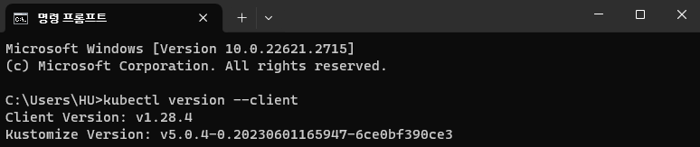

# Install Tools

In this section, we'll install `kubectl` and `helm` to control Kubernetes. Also, we'll install Multipass to setup some Ubuntu-based VM environment.

## Install kubectl

`kubectl` is the Kubernetes-specific command line tool(CLI) that lets you communicate and control Kubernetes clusters.

import Tabs from "@theme/Tabs";
import TabItem from "@theme/TabItem";

:::info
Follow the link below if you have problems with installation guide.  
https://kubernetes.io/docs/tasks/tools/#kubectl
:::

```mdx-code-block
<Tabs groupId="operating-systems">
  <TabItem value="win" label="Windows">
```

1. Download `kubectl` executable from following link:  
   https://dl.k8s.io/release/v1.28.4/bin/windows/amd64/kubectl.exe
2. Move downloaded `kubectl.exe` to the folder you want.
3. Add folder from Step 2 to your `PATH` environment variable.

```mdx-code-block
  </TabItem>
  <TabItem value="mac" label="macOS">
```

1. You can install `kubectl` easily with Homebrew.  
   `brew install kubectl`

```mdx-code-block
  </TabItem>
</Tabs>
```

<br />

Type `kubectl version --client` to check installation.



## Install Helm

`helm` is a package manager for Kubernetes.

:::info
Follow the link below if you have problems with installation guide.  
https://helm.sh/docs/intro/install/
:::

```mdx-code-block
<Tabs groupId="operating-systems">
  <TabItem value="win" label="Windows">
```

1. Download desired version of `helm` from following link:  
   https://github.com/helm/helm/releases
2. Unzip and move `helm` executable to the folder you want.
3. Add folder from Step 2 to your `PATH` environment variable.

```mdx-code-block
  </TabItem>
  <TabItem value="mac" label="macOS">
```

1. You can install `helm` easily with Homebrew.  
   `brew install helm`

```mdx-code-block
  </TabItem>
</Tabs>
```

<br />

Type `helm version` to check installation.


## Install Multipass

Multipass is a tool to generate cloud-style Ubuntu VMs quickly, made by Canonical.

:::info
Follow the link below if you have problems with installation guide.  
https://multipass.run/install
:::

```mdx-code-block
<Tabs groupId="operating-systems">
  <TabItem value="win" label="Windows">
```

1. Download installation file from following link and execute:  
   https://multipass.run/download/windows

```mdx-code-block
  </TabItem>
  <TabItem value="mac" label="macOS">
```

1. You can install Multipass easily with Homebrew.  
   `brew install --cask multipass`

```mdx-code-block
  </TabItem>
</Tabs>
```

<br />

Type `multipass version` to check installation.


