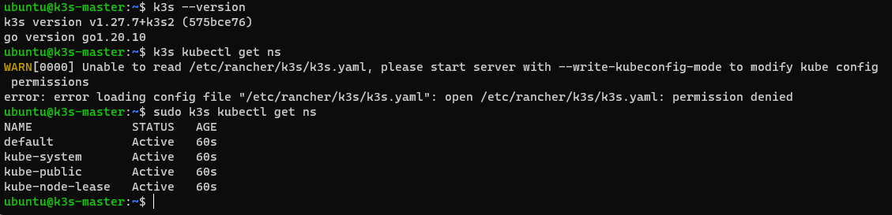

# Install K3S

In this document, we'll create VM with Multipass and install K3S on it.

## Create Ubuntu VM

Type following command to check installable Ubuntu image on Multipass.

```
> multipass find

Image                       Aliases           Version          Description
core                        core16            20200818         Ubuntu Core 16
core18                                        20211124         Ubuntu Core 18
core20                                        20230119         Ubuntu Core 20
core22                                        20230717         Ubuntu Core 22
20.04                       focal             20231124         Ubuntu 20.04 LTS
22.04                       jammy,lts         20231026         Ubuntu 22.04 LTS
23.04                       lunar             20231113         Ubuntu 23.04
...
```

We'll use Ubuntu 22.04 here.  
Create VM instance with following command:

```
# multipass launch [alias] --name [your-name]
  --memory [your-mem] --disk [your-disk] --cpus [your-cpu]

multipass launch jammy --name k3s-master --memory 2G --disk 10G --cpus 2
```

You can use `multipass list` command to list your instance.

```
> multipass list
Name                    State             IPv4             Image
k3s-master              Running           172.17.178.221   Ubuntu 22.04 LTS
```

<br/>

:::note How to modify an instance
To modify instance, try the following steps:

1. Stop target instance if it is running.

   ```
   multipass stop k3s-master
   ```

2. Change instance setting. You can check values with `multipass get` command, and change to new value using `multipass set` command.  
   For here we'll change all values: CPU, Memory & Disk.

   ```
   > multipass get local.k3s-master.cpus
   2

   > multipass get local.k3s-master.disk
   10.0GiB

   > multipass get local.k3s-master.memory
   2.0GiB

   > multipass set local.k3s-master.cpus=3
   > multipass set local.k3s-master.disk=50.0GiB
   > multipass set local.k3s-master.memory=4.0GiB
   ```

3. After change is complete, then restart your instance.

   ```
   multipass start k3s-master
   ```

:::

## Install K3S on VM

[K3S][k3s] is a lightweight Kubernetes distribution made by Rancher.  
It's useful for test environment because of it's simple setup and small resource requirements, and you can also use K3S on production environment too.

To install K3S, we need to access VM Shell.

```
multipass shell k3s-master
```


You can see the shell prompt of an instance.  
Now we can install K3S. We'll install with default install script[^1] now.

```
curl -sfL https://get.k3s.io | sh -
```

You can check installation with `k3s --version` command, and also you can use `kubectl` to check K8S environment.

```
# Get Namespace for example
sudo k3s kubectl get ns
```



## Control K8S environment on host computer

We successfully installed K3S, but it's able to access only inside the VM.  
It's pretty inconvenient, so let's configure settings to control the VM's K8S on host.

If you're logged out, access the VM Shell again.

```
multipass shell k3s-master
```

K3S config file is stored at `/etc/rancher/k3s/k3s.yaml`.[^2] Copy this file to host computer.

```cmd
ubuntu@k3s-master:~$ sudo chmod 777 /etc/rancher/k3s/k3s.yaml
ubuntu@k3s-master:~$
logout

# Ctrl + D to logout
# Now we're on host

> multipass copy-files k3s-master:/etc/rancher/k3s/k3s.yaml Downloads/k3s-master.yaml
```

You can find `k3s-master.yaml` file on your destination folder.  
This file should looks like this:

```yaml title="k3s-master.yaml" {5}
apiVersion: v1
clusters:
  - cluster:
      certificate-authority-data: (REDACTED...)
      server: https://127.0.0.1:6443
    name: default
contexts:
  - context:
      cluster: default
      user: default
    name: default
current-context: default
kind: Config
preferences: {}
users:
  - name: default
    user: (REDACTED...)
```

We need to change `127.0.0.1` value to our VM's IP address.  
You can check it from `multipass list` command.

```cmd {3}
C:\Users\HU>multipass list
Name                    State             IPv4             Image
k3s-master              Running           172.17.186.245   Ubuntu 22.04 LTS
                                          10.42.0.0
                                          10.42.0.1
```

Change some other namings like `cluster`, `user`, and `context` if you want. The result looks like:

```yaml title="k3s-master.yaml" {5-6,9-12,16}
apiVersion: v1
clusters:
  - cluster:
      certificate-authority-data: (REDACTED...)
      server: https://172.17.186.245:6443
    name: master-cluster
contexts:
  - context:
      cluster: master-cluster
      user: master-user
    name: master
current-context: master
kind: Config
preferences: {}
users:
  - name: master-user
    user: (REDACTED...)
```

Move the modified content to `${HOME}/.kube/config` file and restart terminal.  
(If you cannot find a file, then make a new one)

Now we can control VM Kubernetes with `kubectl` command on host.


<br/>

[k3s]: https://k3s.io

[^1]: https://docs.k3s.io/quick-start#install-script
[^2]: https://docs.k3s.io/cluster-access

<!--Re-edited on 231223-->
