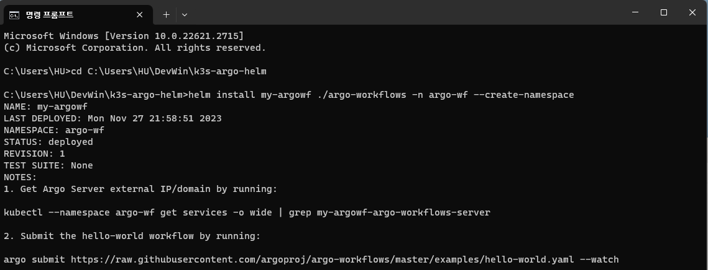
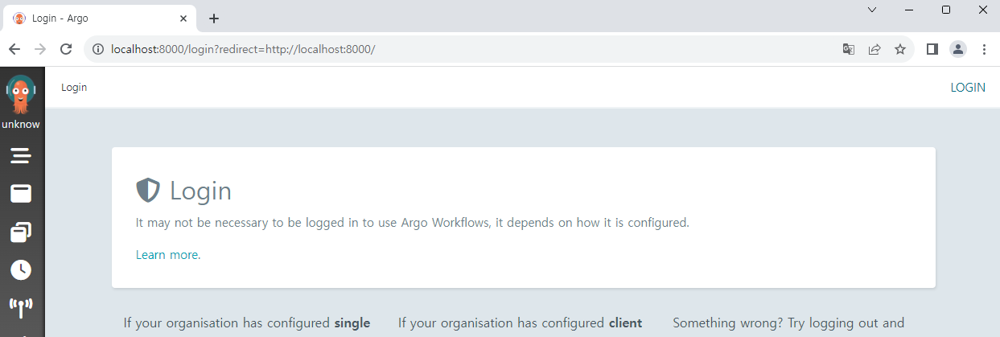

# Hello, Argo Workflows!

In this section, we'll deploy basic Argo Workflows application by using official Helm chart.

## Download Argo Helm chart

Download Helm chart from following link:  
https://github.com/argoproj/argo-helm

Move the chart to the folder you want. For example:

```
k3s-argo-helm
|- argo-cd
|- argo-events
|- argo-workflows
|- ...
```

## Install Helm chart

Now let's deploy Argo Workflows.  
Type the command below on the folder where chart exists.

```
helm install my-argowf ./argo-workflows -n argo-wf --create-namespace
```



It is installed successfully.  
Check K8S objects with `kubectl get all -n argo-wf` command.

```
C:\Users\HU\DevWin\k3s-argo-helm>kubectl get all -n argo-wf
NAME                                                               READY   STATUS    RESTARTS   AGE
pod/my-argowf-argo-workflows-workflow-controller-ffc5b5c4d-ctnwz   1/1     Running   0          2m21s
pod/my-argowf-argo-workflows-server-774d4bf6dd-thzwl               1/1     Running   0          2m21s

NAME                                      TYPE        CLUSTER-IP    EXTERNAL-IP   PORT(S)    AGE
service/my-argowf-argo-workflows-server   ClusterIP   10.43.13.95   <none>        2746/TCP   2m21s

NAME                                                           READY   UP-TO-DATE   AVAILABLE   AGE
deployment.apps/my-argowf-argo-workflows-workflow-controller   1/1     1            1           2m21s
deployment.apps/my-argowf-argo-workflows-server                1/1     1            1           2m21s

NAME                                                                     DESIRED   CURRENT   READY   AGE
replicaset.apps/my-argowf-argo-workflows-workflow-controller-ffc5b5c4d   1         1         1       2m21s
replicaset.apps/my-argowf-argo-workflows-server-774d4bf6dd               1         1         1       2m21s
```

Let's access to Argo Workflows application too.  
We'll use `kubectl port-forward` command this time for short check.

```
kubectl port-forward svc/my-argowf-argo-workflows-server -n argo-wf 8000:2746
```

Now open the browser and navigate to `localhost:8000`.



By now we cannot log in to Argo, but it works!  
To undeploy Argo, type the command below.

```
helm uninstall my-argowf -n argo-wf
```

<!--Re-edited on 240101-->
