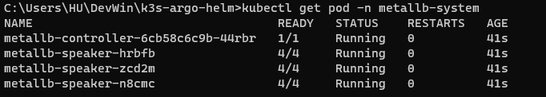
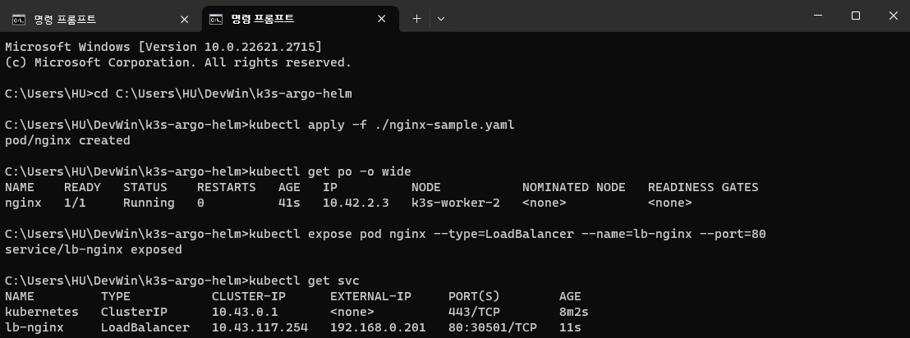
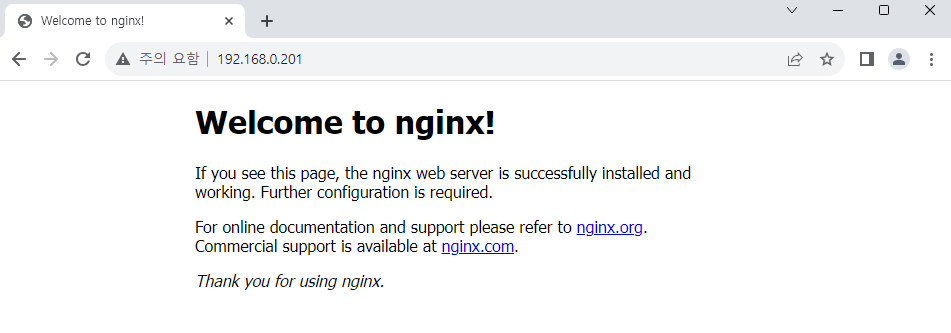

# Install MetalLB

MetalLB is a Load-Balancer for bare metal K8S cluster environments.  
We can expose our services with MetalLB, without support of other cloud providers like GCP, AWS, and so on.

## Download MetalLB Helm chart

Download Helm chart from following link:  
https://github.com/metallb/metallb

## Create namespace

MetalLB includes 2 types of pod. One is controller that setup and manage external IP, and another is speaker that helps to connect service with client traffic.

The speaker pod requires some elevated permission to perform its network functionalities. To give privileged permisson to speaker pod,[^1] we'll create some namespace config file like below:

```yaml title="metallb-ns.yaml"
apiVersion: v1
kind: Namespace
metadata:
  name: metallb-system
  labels:
    pod-security.kubernetes.io/enforce: privileged
    pod-security.kubernetes.io/audit: privileged
    pod-security.kubernetes.io/warn: privileged
```

After the file is ready, type following command to create namespace.

```
kubectl apply -f ./metallb-ns.yaml
```

## Install Helm chart

First we need to set version of MetalLB on Helm chart.  
As we see the chart, we need version tag for pulling controller and speaker images,  
and it uses `appVersion` on `Chart.yaml` as a default.  
Let's change this with `v0.13.12`, the recent version.

```yaml title="Chart.yaml" {17}
apiVersion: v2
name: metallb
description: A network load-balancer implementation for Kubernetes using standard

(...)

# This is the chart version. This version number should be incremented each time you make changes
# to the chart and its templates, including the app version.
# Versions are expected to follow Semantic Versioning (https://semver.org/)
# NOTE: this value is updated by the metallb release process
version: 1.0.0

# This is the version number of the application being deployed. This version number should be
# incremented each time you make changes to the application. Versions are not expected to
# follow Semantic Versioning. They should reflect the version the application is using.
# NOTE: this value is updated by the metallb release process
appVersion: v0.13.12
```

Now install MetalLB with Helm chart.

```
helm install metallb -n metallb-system ./metallb
```



Basically speaker is deployed by DaemonSet, targeted for all nodes.  
If we can see speaker pods with number equal to node count like above, we can confirm that MetalLB is installed successfully.

## Layer 2 Config

For next, we will set up Layer 2 config to setup some external IP on our service.

:::caution
Layer 2 mode in MetalLB selects one leader between speakers and allocate external IP. The traffic concentrates to one node so it cannot be "true" Load Balancing. When the leader node die, failover mechanism is fired and new leader node take over ownership of the IP address.  
If you need MetalLB as a "true" load-balancer, you need to configure BGP mode and additional router settings.  
Find more information at below:

https://metallb.universe.tf/concepts/layer2/
:::

Make a new config file according to the link below.  
You can configure IP range on your own, in available range.  
https://metallb.universe.tf/configuration/#layer-2-configuration

```yaml title="metallb-ipconfig.yaml"
apiVersion: metallb.io/v1beta1
kind: IPAddressPool
metadata:
  name: metallb-pool
  namespace: metallb-system
spec:
  addresses:
    - 192.168.0.200-192.168.0.250
---
apiVersion: metallb.io/v1beta1
kind: L2Advertisement
metadata:
  name: metallb-advertise
  namespace: metallb-system
```

After the file is ready, type following command to create objects.

```
kubectl apply -f ./metallb-ipconfig.yaml
```

## Check access with IP address

Let's make simple pod for testing.

```yaml title="nginx-sample.yaml"
apiVersion: v1
kind: Pod
metadata:
  name: nginx
  labels:
    env: test
spec:
  containers:
    - name: nginx
      image: nginx
      imagePullPolicy: IfNotPresent
  nodeSelector:
    kubernetes.io/hostname: k3s-worker-2
```

Create pod with `kubectl` and expose with port 80.

```
kubectl apply -f ./nginx-sample.yaml

kubectl expose pod nginx --type=LoadBalancer --name=lb-nginx --port=80

kubectl get svc
```



External IP is successfully allocated.  
When we navigate to the IP address on browser, we can see NGINX page.



[^1]: https://metallb.universe.tf/installation/#installation-with-helm
