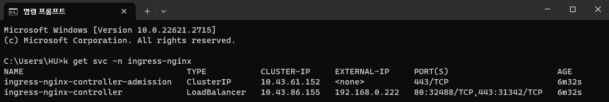
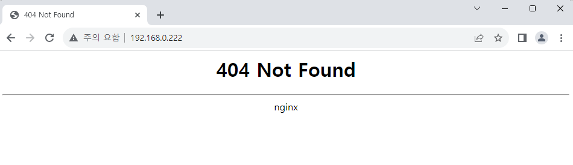
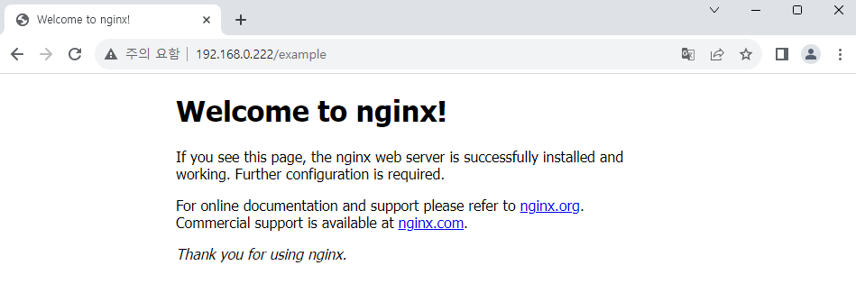

# Install Ingress NGINX Controller

In this section, we'll install Ingress NGINX Controller on our environment and test its functionality.  
Ingress NGINX Controller enable us to use NGINX as a reverse proxy and load-balancer on K8S environment. It can receive client's response and route to connected services stably so it's effective for building a Microservice Architecture(MSA).

## Download and install Helm chart

There's some other ingress controllers like [nginxinc/kubernetes-ingress][ref1] from NGINX Inc.,  
but for here we'll use official Helm chart by Kubernetes.

Download Helm chart from following link:  
https://github.com/kubernetes/ingress-nginx/

Then install chart with `helm install` command.

```
helm install ingress-nginx -n ingress-nginx ./ingress-nginx --create-namespaces
```

`ingress-nginx-controller` service is set to `LoadBalancer` type by default,  
so we can see that external IP is allocated when service is created.



:::note Configure static IP

In `values.yaml` if we configure `controller.service.loadBalancerIP` to the IP address that is in range of MetalLB configuration, we can fix our external IP. For example: `192.168.0.222`.

Then you can update the setting using `helm upgrade` command.

```
helm upgrade ingress-nginx -n ingress-nginx ./ingress-nginx
```

:::

## Testing ingress controller

We'll re-create and expose NGINX application for testing.  
However, there's some change: application is deployed on `example` namespace, and there's no `LoadBalancer` type on the service.

```yaml title="nginx-sample.yaml"
apiVersion: v1
kind: Pod
metadata:
  name: nginx
  labels:
    env: test
spec:
  containers:
    - name: nginx
      image: nginx
      imagePullPolicy: IfNotPresent
  nodeSelector:
    kubernetes.io/hostname: k3s-worker-2
```

```
kubectl create ns example

kubectl apply -f ./nginx-sample.yaml -n example

kubectl expose pod nginx -n example --name=lb-nginx --port=80
```

Currently `lb-nginx` service cannot be accessed from external client.  
Our goal is to allocate our service to `/example` endpoint.

To connect `lb-nginx` service on ingress controller, we need to write new config file for service & ingress.  
With `ExternalName` type we can connect service from other namespace.[^1]

```yaml title="custom-ingress.yaml" {17,19}
kind: Service
apiVersion: v1
metadata:
  name: example-svc
  namespace: my-ingress
spec:
  type: ExternalName
  externalName: lb-nginx.example.svc.cluster.local
  # service-name.namespace-name.svc.cluster.local
---
apiVersion: networking.k8s.io/v1
kind: Ingress
metadata:
  name: custom-ingress
  namespace: my-ingress
  annotations:
    nginx.ingress.kubernetes.io/rewrite-target: /
spec:
  ingressClassName: "nginx"
  rules:
    - http:
        paths:
          - path: /example
            pathType: Prefix
            backend:
              service:
                name: example-svc
                port:
                  number: 80
```

2 properties highlighted in ingress setting have to be configured correctly.  
We passed `nginx` to `spec.ingressClassName` because it is a default value for Ingress NGINX Controller.

```
> k get IngressClass --all-namespaces
NAME      CONTROLLER                      PARAMETERS   AGE
traefik   traefik.io/ingress-controller   <none>       77m
nginx     k8s.io/ingress-nginx            <none>       39m
```

Then create K8S objects with `kubectl`.

```
kubectl create ns my-ingress
kubectl apply -f ./custom-ingress.yaml
```

<br />

Navigate to external IP allocated to `ingress-nginx-controller` service.  
It can be accessed basically, but returns 404 Not Found because we didn't configure any service on the root.



Now when we navigate to `/example` endpoint, we can see NGINX page like before.



<br />

[ref1]: https://github.com/nginxinc/kubernetes-ingress

[^1]: https://stackoverflow.com/a/59845018
