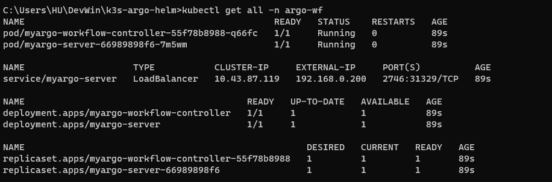
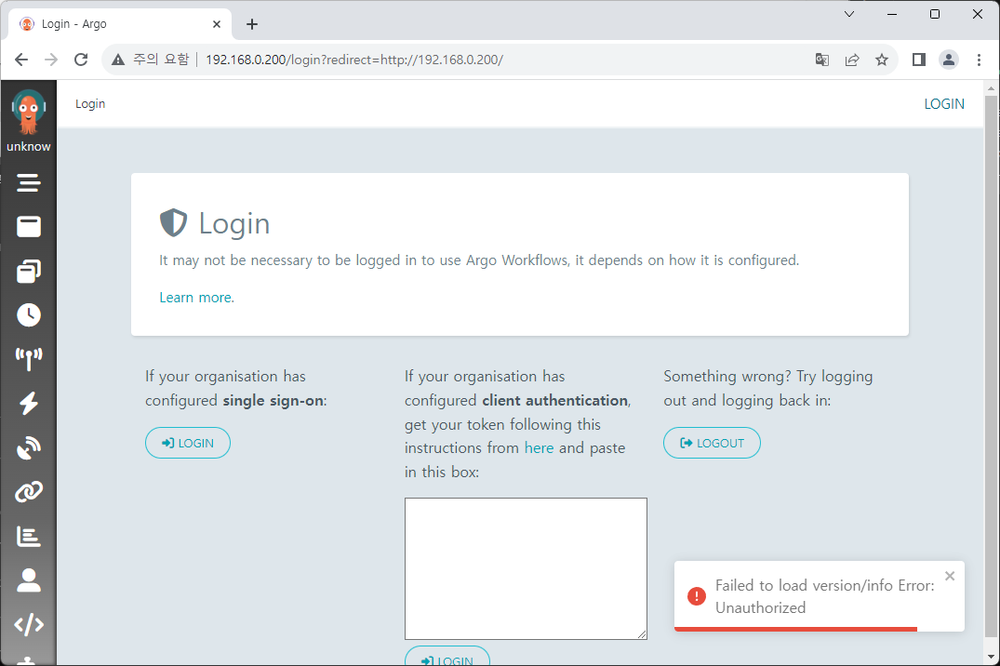
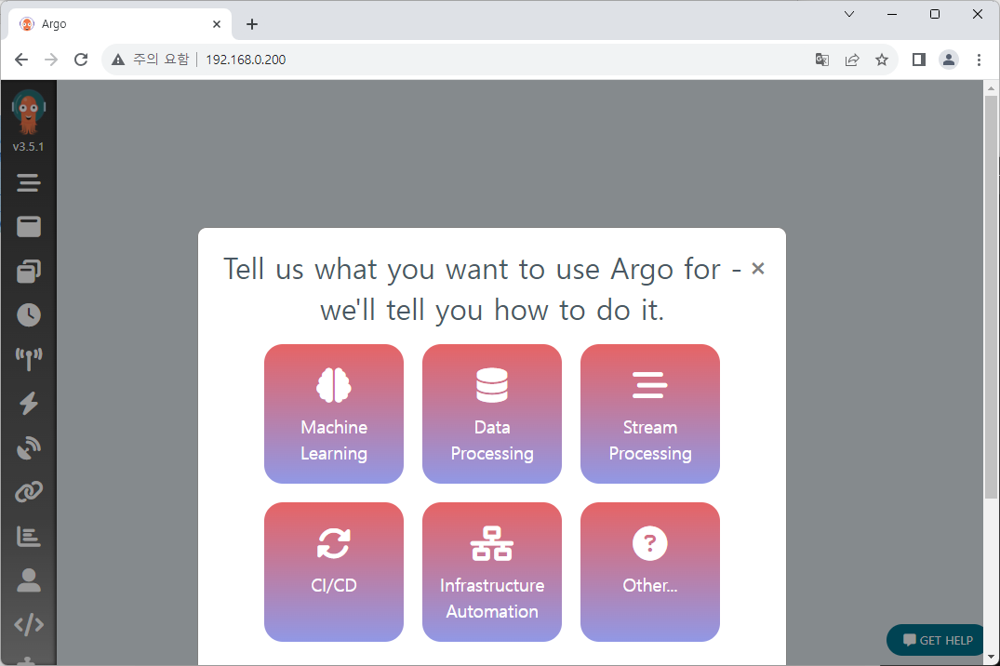

# Re-deploy and login to Argo Workflows

We successfully configured our K8S environment.  
Now let's configure and re-deploy our Argo Workflows, then try to login to application too.

## Modify Helm chart

In previous chapters we deployed Helm chart with default setting.  
For now we'll change some properties in the chart.

1. Change `fullnameOverride` to the name what you want.  
   For example: `myargo`.

2. To deploy application to master node, we need to change `nodeSelector` options.  
   Add following option to `controller.nodeSelector` and `server.nodeSelector`.

   - `node-role.kubernetes.io/master: "true"`

   You can change with other settings if you want.  
   Configured node labels can be checked by following command:

   ```
   kubectl get nodes --show-labels
   ```

   We'll not discuss about labeling on here.

3. To set up load-balancer, modify `values.yaml` like below:

   ```yaml title="values.yaml" {5,7,11,28}
   (...)
   server:
     (...)
     # -- Service type for server pods
     serviceType: LoadBalancer
     # -- Service port for server
     servicePort: 80
     # -- Service node port
     serviceNodePort: # 32746
     # -- Service port name
     servicePortName: "http" # http

     serviceAccount:
       # -- Create a service account for the server
       create: true
       # -- Service account name
       name: ""
       # -- Labels applied to created service account
       labels: {}
       # -- Annotations applied to created service account
       annotations: {}

     # -- Annotations to be applied to the UI Service
     serviceAnnotations: {}
     # -- Optional labels to add to the UI Service
     serviceLabels: {}
     # -- Static IP address to assign to loadBalancer service type `LoadBalancer`
     loadBalancerIP: "192.168.0.200"
   (...)
   ```

## Configure ServiceAccount for authentication

We can attach SSO with other OAuth services for authentication,  
but we'll configure basic access token[^1] instead.

We'll get access token with new ServiceAccount(SA).  
(You may be able to get token from default one, but we'll not discuss about this here.)

To set up new ServiceAccount, we need to add some files to Helm chart template.  
3 objectsare required: RoleBinding, ServiceAccount, and Secret.  
You can change the account name `huadmin` as you want. It'll be awesome to seperate value to`values.yaml`.

Also, cluster-role from default Helm chart was used here.  
If you want extra role, write one more `yaml` file about it and bind with role-binding.

<!-- prettier-ignore -->
```yaml title="rb-admin.yaml"
apiVersion: rbac.authorization.k8s.io/v1
kind: RoleBinding
metadata:
  name: huadmin-rb
  namespace: {{ .Release.Namespace | quote }}
subjects:
- kind: ServiceAccount
  name: huadmin
roleRef:
  kind: ClusterRole
  name: {{ template "argo-workflows.fullname" . }}-admin
  apiGroup: rbac.authorization.k8s.io
```

<!-- prettier-ignore -->
```yaml title="sa-admin.yaml"
apiVersion: v1
kind: ServiceAccount
metadata:
  name: huadmin
  namespace: {{ .Release.Namespace | quote }}
secrets:
  - name: huadmin-sa
```

<!-- prettier-ignore -->
```yaml title="secret-admin-token.yaml"
apiVersion: v1
kind: Secret
metadata:
  name: huadmin-secret
  namespace: {{ .Release.Namespace | quote }}
  annotations:
    kubernetes.io/service-account.name: huadmin
type: kubernetes.io/service-account-token
```

## Deploy and login to application

Configuration is complete, so let's deploy Argo Workflows again.  
Helm chart가 위치한 폴더로 이동해 다음 명령어를 실행합니다.

```
helm install my-argowf ./argo-workflows -n argo-wf --create-namespace
```

Then we need to check access token. You can check it from following command.  
You can check directly when you're using Linux, or you can also check it with master node's VM Shell when you're on Windows.

```
ARGO_TOKEN="Bearer $(sudo k3s kubectl get secret huadmin-secret -n argo-wf -o=jsonpath='{.data.token}' | base64 --decode)"
echo $ARGO_TOKEN
```

Store token value, because we'll use it when we try to log in.



With `kubectl`, we can see that external IP is allocated, and all the resources are created with name `myargo`, as we inserted on Helm chart.  
Navigate to the external IP, then you can see login page.



Then log in to our application with previous token value.



We can see the UI after login!

<br />

[^1]: https://argo-workflows.readthedocs.io/en/latest/access-token/
