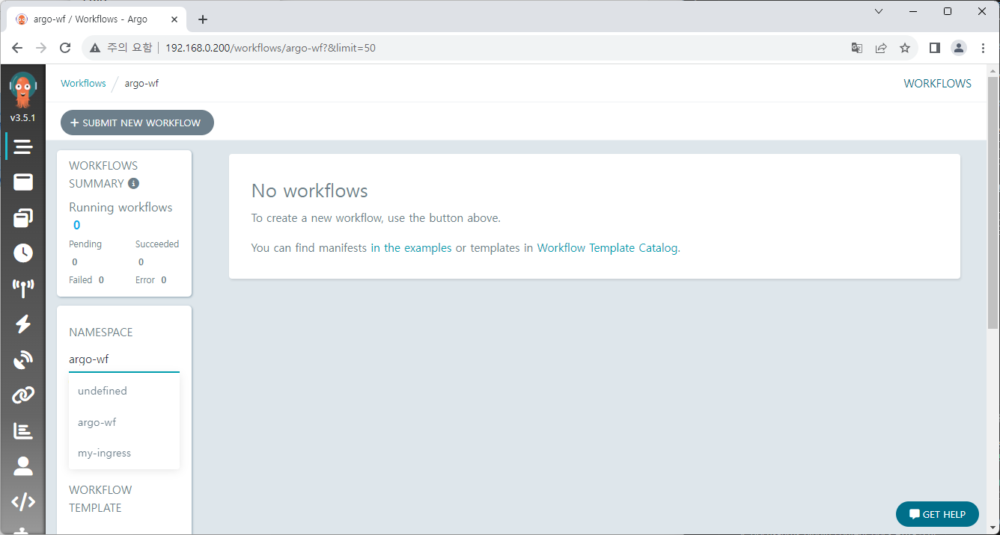
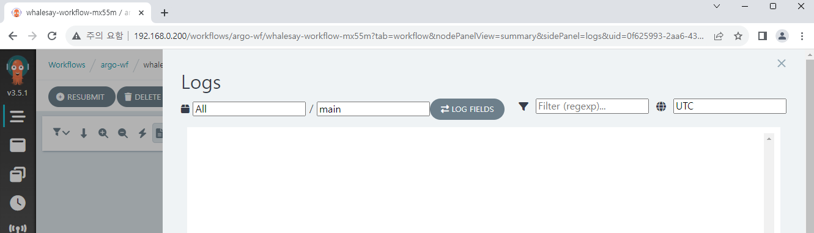

# Basic workflow

In this document we'll explore Argo Workflows UI, and create/run a simple workflow directly.

## View workflow list

After we log in to Argo Workflows, we can check the workflow list on the first page.  
But if a namespace other than `argo-wf` is selected (including `undefined` which may be set by default) the error occurs as follows.


This is because the created service account is set in the `argo-wf` namespace and has permissions only within that namespace.



Setting the namespace to `argo-wf` removes the error.

:::info
Argo Workflows works this way because it is basically set up to monitor all namespaces in the cluster. However, since service account permissions are all different, access errors can occur due to permission.  
Argo Workflows can be configured to run workflows in a namespace only where Argo is installed, and this can be controlled through the Helm chart using the `singleNamespace` option. Additionally, there is _Managed Namespace_ option that allows you to specify the namespace for running workflows.  
The detailed information can be found on the link below.

https://argo-workflows.readthedocs.io/en/latest/installation/
:::

## Write a first workflow

Now, let's try to create basic workflow.

### Save workflow template

Workflow template can save part or all of the workflow.  
First, we'll save a part of the workflow in the template and then call it as a reference.

Press **CREATE NEW WORKFLOW TEMPLATE** on the **Workflow Templates** menu.


We'll use a sample from document with a little modification.  
Delete the original data and paste the following content.

```yaml
apiVersion: argoproj.io/v1alpha1
kind: WorkflowTemplate
metadata:
  name: whalesay-template
spec:
  templates:
    - name: whalesay
      inputs:
        parameters:
          - name: message
            value: "hello world"
      container:
        image: docker/whalesay
        command: [cowsay]
        args: ["{{inputs.parameters.message}}"]
```

It's a very simple workflow that prints `hello world` with the whale.  
Press the **CREATE** button to create a workflow template.


You can also check created template with the `kubectl` command.

```
kubectl get workflowtemplate -n argo-wf
```

### Create workflow

Let's create workflow also.  
Go back to the **Workflows** menu and click on **SUBMIT NEW WORKFLOW** button.


Select **Edit using full workflow options** and paste the following content below.

```yaml
apiVersion: argoproj.io/v1alpha1
kind: Workflow
metadata:
  generateName: whalesay-workflow-
spec:
  entrypoint: whalesay
  templates:
    - name: whalesay
      steps:
        - - name: ref-template
            templateRef:
              name: whalesay-template
              template: whalesay
```

We will create a workflow using the content of `whalesay` in the existing workflow template.  
A random tag is attached to the prefix set by `generateName` in order to distinguish workflows, and we set starting point with `entrypoint` option. In this case there's only one process, but if there are multiple processes, you can set `entrypoint` among them.


Workflow will be executed after press the **CREATE** button.

### Check the workflow log



However, when you click on logs menu to check the execution, there is no content displayed.  
Did workflow not worked properly?


When we check with `kubectl`, it worked normally.  
The real cause can be checked by DevTools, that the API for getting logs returns a 403 Forbidden error.


This is because we currently don't have permission related to pods. We can check our service account's role by looking at the `workflow-aggregate-roles.yaml` file, which only has permissions for workflows but not for pods.  
Let's add a role and a role binding to grant the permission.

<!-- prettier-ignore -->
```yaml title="pod-reader.yaml"
apiVersion: rbac.authorization.k8s.io/v1
kind: Role
metadata:
  namespace: {{ .Release.Namespace | quote }}
  name: pod-reader
rules:
  - apiGroups: [""] # "" indicates the core API group
    resources: ["pods", "pods/log"]
    verbs: ["get", "watch", "list"]
```

<!-- prettier-ignore -->
```yaml title="rb-admin-pod.yaml"
apiVersion: rbac.authorization.k8s.io/v1
kind: RoleBinding
metadata:
  name: huadmin-pod-rb
  namespace: {{ .Release.Namespace | quote }}
subjects:
  - kind: ServiceAccount
    name: huadmin
roleRef:
  kind: Role
  name: pod-reader
  apiGroup: rbac.authorization.k8s.io
```

Apply changes with `helm upgrade` or other command.  
If you run a new workflow and check the log this time, it should be printed normally.


### Create workflow from saved format

Templates can also be saved as a whole workflow.  
Press **CREATE NEW WORKFLOW TEMPLATE** on the **Workflow Templates** menu,  
and we'll save the content of the workflow used above this time.

:::info

1. Of course, it works equally well when saved with WorkflowTemplate kind.
2. You can store a fixed name using `metadata.name` instead of `metadata.generateName`.  
   A random tag will be attached on execution, similar to prior.

:::


The created workflow can be easily executed through the SUBMIT button.


