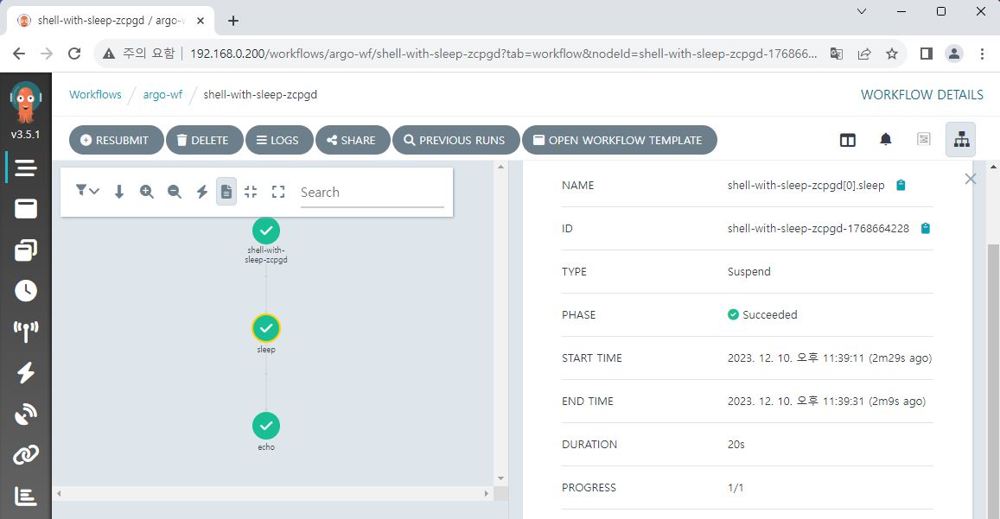
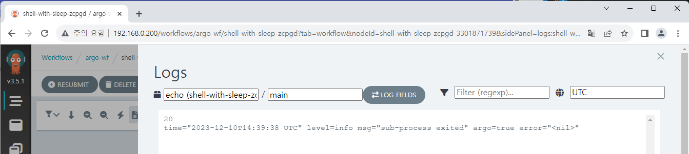

# Various workflows

Having learned the basic method of creating a workflow, we'll create various types of workflows that are commonly used.

## Script

It is possible to directly write and execute scripts with workflow.  
Python code is written in here, but shell scripts are also possible.  
The code below prints ten random numbers and then adds them up at the end.

<!-- prettier-ignore -->
```yaml
apiVersion: argoproj.io/v1alpha1
kind: Workflow
metadata:
  name: python-script-workflow
spec:
  entrypoint: sum-random-ten
  templates:
    - name: sum-random-ten
      script:
        image: python:alpine3.8
        command: [python]
        source: |
            import random

            sum = 0
            for _ in range(10):
                i = random.randint(1, 100)
                print(i)
                sum += i
            print(sum)
```


## Passing variables from workflow

You can pass variables from workflow if you need to control indiviual steps or other various situations from workflow.  
This workflow receives the `count-from-workflow` variable before execution, passes it to the `sum-random-n` template, and template receives it as the 'count' variable for use in the script.

<!-- prettier-ignore -->
```yaml
apiVersion: argoproj.io/v1alpha1
kind: Workflow
metadata:
  name: python-wf-with-variables
spec:
  entrypoint: sum-random-n
  arguments:
    parameters:
    - name: count-from-workflow
  templates:
    - name: sum-random-n
      inputs:
        parameters:
          - name: count
            value: "{{workflow.parameters.count-from-workflow}}"
      script:
        image: python:alpine3.8
        command: [python]
        source: |
            import random

            sum = 0
            n = {{inputs.parameters.count}}
            for _ in range(n):
                i = random.randint(1, 100)
                print(i)
                sum += i
            print(sum)
```

The below is a screen where the variable is set to 5.  
You can see five random numbers and their sum being printed.


## Suspend and Step

Suspend temporarily stops workflow execution and resuming requires a certain amount of time or manual commands to be sent. It has no special function on its own, so it is mainly used with Step or DAG, which will be described later.  
The Step feature allows you to literally divide into multiple stages and configure the workflow. It is useful when distinguishing between different roles or combining content from multiple sources in a workflow.

This is the example using Suspend & Step.  
We insert value to `number-from-workflow` variable and pass to the individual templates, `suspend-sleep` and `echo-num`.  
For example, if you input 20, workflow will wait for 20 seconds and then print 20 using the `echo` command.

<!-- prettier-ignore -->
```yaml
apiVersion: argoproj.io/v1alpha1
kind: Workflow
metadata:
  name: shell-with-sleep
spec:
  entrypoint: total-wf
  arguments:
    parameters:
    - name: number-from-workflow
  templates:
  - name: total-wf
    steps:
    - - name: sleep
        template: suspend-sleep
        arguments:
          parameters:
          - name: sleep-time
            value: "{{workflow.parameters.number-from-workflow}}"
    - - name: echo
        template: echo-num
        arguments:
          parameters:
          - name: number
            value: "{{workflow.parameters.number-from-workflow}}"

  - name: suspend-sleep
    inputs:
      parameters:
      - name: sleep-time
    suspend:
      duration: "{{inputs.parameters.sleep-time}}s"

  - name: echo-num
    inputs:
      parameters:
      - name: number
    script:
      image: bash:latest
      command: [bash]
      source: |
        echo {{inputs.parameters.number}}
```

Below is the actual result of inputting 20.





## DAG

DAG(Directed Acyclic Graph) is often used to compose pipeline. You can specify the conditions required for executing a specific step by setting dependency, divide Workflow into multiple branches, or integrate results from multiple branches by setting multiple dependencies. You can use DAG in various ways.  
This example is a simple implementation of a DAG.

<!-- prettier-ignore -->
```yaml
apiVersion: argoproj.io/v1alpha1
kind: Workflow
metadata:
  name: dag-example
spec:
  entrypoint: total-wf
  templates:
  - name: total-wf
    dag:
      tasks:
      - name: stepA
        template: echo-sth
        arguments:
          parameters:
          - name: word
            value: "start"
      - name: stepB-1
        dependencies: [stepA]
        template: suspend-sleep
        arguments:
          parameters:
          - name: sleep-time
            value: "120"
      - name: stepB-2
        dependencies: [stepB-1]
        template: echo-sth
        arguments:
          parameters:
          - name: word
            value: "end of B"
      - name: stepC-1
        dependencies: [stepA]
        template: suspend-sleep
        arguments:
          parameters:
          - name: sleep-time
            value: "180"
      - name: stepC-2
        dependencies: [stepC-1]
        template: echo-sth
        arguments:
          parameters:
          - name: word
            value: "end of C"
      - name: stepD
        dependencies: [stepC-2, stepB-2]
        template: echo-sth
        arguments:
          parameters:
          - name: word
            value: "end of all workflow"

  - name: suspend-sleep
    inputs:
      parameters:
      - name: sleep-time
    suspend:
      duration: "{{inputs.parameters.sleep-time}}s"

  - name: echo-sth
    inputs:
      parameters:
      - name: word
    script:
      image: bash:latest
      command: [bash]
      source: |
        echo {{inputs.parameters.word}}
```

Simple explanation: it prints `start` on step A, then branch into two paths for step B and C. When both sides are completed, it prints `end of all workflow` on step D and end the process.  
When we execute the workflow, even though Suspend is set to 2/3 minutes on each side, since each step progresses simultaneously it takes about 3-4 minutes including `bash` setup time, instead of more than 2 + 3 = 5 minutes.


