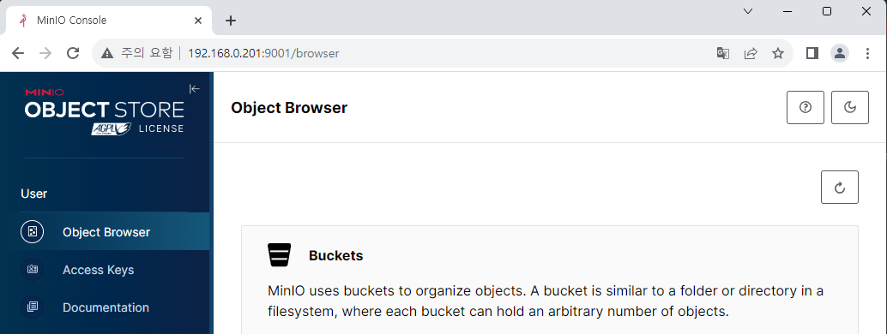

# Build CI Workflow

In this document, we'll configure the CI workflow for the actual application.  
Basically CI process includes code work, build and test, but we'll focus on build process and not explain about others on here.

The ultimate goal is to automatically detect `git push` event and build/push images by the workflow, but it needs other application: Argo Events. So let's configure the workflow first.

## Workflow Overview

0. Receive git URL as a variable.
1. Clone the git repository.
2. Build the image using `Dockerfile` in the root folder. We'll use Kaniko.
3. Push the created image to Docker Hub.  
   Harbor and other repository services can also okay, but we'll not discuss about it since it goes beyond the scope.

[Kaniko][kaniko] does not use the Docker daemon, so it can solve one of the problems with Docker - authorization issues - while building images quickly.

## Select Sample App

I wrote a simple application sample and `Dockerfile` for test.  
You don't have to use this source, any Docker-deployable application is fine.

[dive-argo-fastapi Repository][fastapi]

## Create Docker Secret

To upload an image to Docker Hub, you need to create a account secret.  
There is a method to create secret manually in the [official Kubernetes docs][ref1], but we'll also refer [Helm official document][ref2], to create secret with Helm chart as well. This is not a silver bullet, so please consider various factors in your work. You can also consider third-party tools such as [Vault][vault].

Perform the following steps in the Argo Workflows Helm chart.

1. Add account information as follows in the `values.yaml` file.

   ```yaml title="values.yaml" {3-7}
   (...)
   # Add this below
   imageCredentials:
     registry: https://index.docker.io/v1/ # for Docker Hub
     username: your-name
     password: your-pw
     email: your@mail.com
   ```

2. Set up additional templates in the `_helpers.tpl` file.

   ```tpl title="_helpers.tpl" {3-7}
   (...)
   # Add this below
   {{- define "imagePullSecret" }}
   {{- with .Values.imageCredentials }}
   {{- printf "{\"auths\":{\"%s\":{\"username\":\"%s\",\"password\":\"%s\",\"email\":\"%s\",\"auth\":\"%s\"}}}" .registry .username .password .email (printf "%s:%s" .username .password | b64enc) | b64enc }}
   {{- end }}
   {{- end }}
   ```

3. Write a configuration file for secret in the `templates` folder as follows.

   <!-- prettier-ignore -->
   ```yaml title="docker-secret.yaml"
    apiVersion: v1
    kind: Secret
    metadata:
      name: docker-secret
      namespace: {{ .Release.Namespace | quote }}
    type: kubernetes.io/dockerconfigjson
    data:
      .dockerconfigjson: {{ template "imagePullSecret" . }}
   ```

Apply changes with `helm upgrade` command.

```
helm upgrade my-argowf ./argo-workflows -n argo-wf
```

You can check created secret by `kubectl` command.


## Configure workflow

Because it becomes too long if we write all the contents in one file,  
let's write each step as a individual template and combine them, for convenience.

### Git Clone

Git cloning can be implemented using the artifact feature.  
Create and save a workflow template as follows.

<!-- prettier-ignore -->
```yaml title="git-clone.yaml"
apiVersion: argoproj.io/v1alpha1
kind: WorkflowTemplate
metadata:
  name: git-clone
spec:
  templates:
  - name: checkout
    inputs:
      parameters:
        - name: git-url
        - name: revision
          value: "main"
      artifacts:
      - name: source-code
        path: /code
        git:
          repo: "{{inputs.parameters.git-url}}"
          revision: "{{inputs.parameters.revision}}"
    outputs:
      artifacts:
      - name: source-code
        path: /code
    container:
      image: bash:latest
      command: [ls]
      args: ["/code"]
```

You can clone from `inputs.artifacts` using the `git` option and store it in a specific path. You receive two variables: `repo`, where you enter the Git URL, and `revision`, where you enter the branch or tag name to be fetched from the repository.  
The cloned files must be used when building an image later, so we'll export them as output and type `ls` command to check if the correct file has been imported.


But if you try to run workflow, an error will occur that there is no artifact storage.  
To use the artifact, you need separate storage connected to Argo Workflows. Argo Workflows supports several S3-compatible storages for this, so we will configure MinIO on K8S environment and try it out.

### Install MinIO

MinIO is an open-source S3-compatible storage.  
Download Helm chart from following link:  
https://github.com/bitnami/charts/tree/main/bitnami/minio

In the downloaded Helm chart, set `service.type` and `service.loadBalancerIP` in the `values.yaml` file for setting up load-balancer.

We'll deploy MinIO in the same namespace as Argo Workflows.  
If it is deployed in a different Namespace, you cannot share account secrets and may have to copy additional ones, making management more difficult.

Deploy MinIO with the following command.

```
helm dependency update ./minio
helm install minio ./minio -n argo-wf
```

You can access the MinIO console through this address: `<set IP>:9000`.  
The account information can be checked using the following command in the Linux-based terminal.

```
export ROOT_USER=$(kubectl get secret --namespace argo-wf minio -o jsonpath="{.data.root-user}" | base64 -d)
export ROOT_PASSWORD=$(kubectl get secret --namespace argo-wf minio -o jsonpath="{.data.root-password}" | base64 -d)
```



After you logged in, create a bucket named `argo-bucket`.  
Now, you need to modify the Helm chart so that the created bucket can be used.

```yaml title="values.yaml" {9-18}
artifactRepository:
  # -- Archive the main container logs as an artifact
  archiveLogs: false
  # -- Store artifact in a S3-compliant object store
  # @default -- See [values.yaml]
  s3:
    # # Note the `key` attribute is not the actual secret, it's the PATH to
    # # the contents in the associated secret, as defined by the `name` attribute.
    accessKeySecret:
      name: minio
      key: root-user
    secretKeySecret:
      name: minio
      key: root-password
    # insecure will disable TLS. Primarily used for minio installs not configured with TLS
    insecure: true
    bucket: argo-bucket
    endpoint: minio:9000
```

Connect a account secret to enable access to MinIO and specify the address & bucket name.  
Since TLS is not currently applied, we'll also activate the `insecure` option.

### Set new permission

There is additional content to be set up. The existing `pod-reader` role that we had set up only included the contents of checking pods, but now an additional `patch` permission is needed to control pods for CI.  
For this, change the existing role name to 'pod-controller', and add `patch` permission.

<!-- prettier-ignore -->
```yaml title="pod-controller.yaml" {5,9}
apiVersion: rbac.authorization.k8s.io/v1
kind: Role
metadata:
  namespace: {{ .Release.Namespace | quote }}
  name: pod-controller
rules:
  - apiGroups: [""] # "" indicates the core API group
    resources: ["pods", "pods/log"]
    verbs: ["get", "watch", "list", "patch"]
```

<!-- prettier-ignore -->
```yaml title="rb-admin-pod.yaml" {11}
apiVersion: rbac.authorization.k8s.io/v1
kind: RoleBinding
metadata:
  name: huadmin-pod-rb
  namespace: {{ .Release.Namespace | quote }}
subjects:
  - kind: ServiceAccount
    name: huadmin
roleRef:
  kind: Role
  name: pod-controller
  apiGroup: rbac.authorization.k8s.io
```

Apply changes after the settings are complete.  
There is something to be careful about here. We changed the contents of `roleRef` above, but this value is immutable after being created once. Therefore, in order to apply changes, you need to delete the existing role binding and re-create it.

```
kubectl delete rolebinding huadmin-pod-rb -n argo-wf
helm upgrade my-argowf ./argo-workflows -n argo-wf
```

Additionally, workflow also needs to be changed. When a `default` service account is used for performing tasks, it may lack sufficient permissions. Therefore, it is recommended to specify the service account having appropriate permission. Since I ran just a simple workflow earlier, it worked well without any settings; however, we'll specify the service account from now on.

<!-- prettier-ignore -->
```yaml title="git-clone.yaml" {6}
apiVersion: argoproj.io/v1alpha1
kind: WorkflowTemplate
metadata:
  name: git-clone
spec:
  serviceAccountName: huadmin
  templates:
  - name: checkout
    inputs:
      parameters:
        - name: git-url
        - name: revision
          value: "main"
      artifacts:
      - name: source-code
        path: /code
        git:
          repo: "{{inputs.parameters.git-url}}"
          revision: "{{inputs.parameters.revision}}"
    outputs:
      artifacts:
      - name: source-code
        path: /code
    container:
      image: bash:latest
      command: [ls]
      args: ["/code"]
```

Now, you can check the file list in the log after running workflow.


### Kaniko build

As mentioned earlier, Kaniko is a tool that can build images securely and quickly without the need for a docker daemon. Although Buildah or Buildkit are other tools that perform similar functions, I chose it because it is the most versatile to use.

The workflow template for the image build part is as follows.

<!-- prettier-ignore -->
```yaml title="image-build.yaml"
apiVersion: argoproj.io/v1alpha1
kind: WorkflowTemplate
metadata:
  name: image-build
spec:
  serviceAccountName: huadmin
  templates:
  - name: build-push
    inputs:
      parameters:
        - name: FROM_ARGO
        - name: user_name
          value: haulrest
        - name: image_name
        - name: image_tag
      artifacts:
      - name: source-code
        path: /code
    container:
      name: kaniko
      image: gcr.io/kaniko-project/executor:debug
      command: ["/kaniko/executor"]
      workingDir: '{{ inputs.artifacts.source-code.path }}'
      args:
      - "--dockerfile=Dockerfile"
      - "--context=."
      - "--destination={{inputs.parameters.user_name}}/{{inputs.parameters.image_name}}:{{inputs.parameters.image_tag}}"
      - "--build-arg=FROM_ARGO={{inputs.parameters.FROM_ARGO}}"
      volumeMounts:
      - name: kaniko-secret
        mountPath: /kaniko/.docker/
    volumes:
    - name: kaniko-secret
      secret:
        secretName: docker-secret
        items:
          - key: .dockerconfigjson
            path: config.json
```

In the input parameter, other variables are for accounts · image names and tags. The remaining `FROM_ARGO` variable, which is a variable to pass to the sample FastAPI app, will be explained later.  
You must specify the command and arguments for building an image with Kaniko and pushing it to Docker Hub. The main content can be summarized as follows.

- To use an artifact cloned from git repository, additional inputs are required.
- The `workingDir` option specifies the folder to work in.
- The `--dockerfile` option specifies the path to a Dockerfile. Since the `workingDir` option is already set, just enter the remaining path.
- The `--context` option specifies the folder to be referenced during build, but since we've already set the `workingDir` option, simply enter `.` to specify the root directory.
- The `--destination` option sets the destination for Docker Hub. Currently targeting a personal Docker Repository, so `user_name` is fixed as the user account name and you can set the name and tag freely.
- Mount the secret information created earlier for Docker Hub access.

### Complete workflow

Now, both two parts are prepared. Combine these two to configure a workflow that can be actually executed.

<!-- prettier-ignore -->
```yaml title="argo-ci.yaml"
apiVersion: argoproj.io/v1alpha1
kind: Workflow
metadata:
  name: argo-ci
spec:
  serviceAccountName: huadmin
  entrypoint: total-wf
  arguments:
    parameters:
    - name: git-url
    - name: FROM_ARGO
    - name: image_name
      value: fastapi-sample
    - name: image_tag
      value: v1
  templates:
  - name: total-wf
    dag:
      tasks:
      - name: clone
        arguments:
          parameters:
            - name: git-url
              value: "{{workflow.parameters.git-url}}"
        templateRef:
          name: git-clone
          template: checkout
      - name: kaniko-process
        dependencies: [clone]
        arguments:
          parameters:
            - name: FROM_ARGO
              value: "{{workflow.parameters.FROM_ARGO}}"
            - name: image_name
              value: "{{workflow.parameters.image_name}}"
            - name: image_tag
              value: "{{workflow.parameters.image_tag}}"
          artifacts:
          - name: source-code
            from: "{{tasks.clone.outputs.artifacts.source-code}}"
        templateRef:
          name: image-build
          template: build-push
```

The existing variables that were needed have all been set to receive values as arguments and pass them to the template.  
In KaniKo, the output artifact generated from git cloning is used as an input.

The related example code can be checked at the link below.  
https://github.com/argoproj/argo-workflows/blob/main/examples/artifact-passing.yaml

## Workflow test

Created workflow will be executed as follows, and you can check that an image is pushed to Docker Hub.


Let's create a test pod to check the generated image.

```yaml
apiVersion: v1
kind: Pod
metadata:
  name: fastapi-test
  labels:
    env: test
spec:
  containers:
    - name: fastapi
      image: haulrest/fastapi-sample:v1
      imagePullPolicy: Always
  nodeSelector:
    kubernetes.io/hostname: k3s-worker-1
```

Create a pod with `kubectl`, and expose it.  
We'll use `kubectl port-forward` command this time for short check. After connecting the CD pipeline later, we will connect this application to ingress and observe updates.

```
kubectl apply -f fastapi-sample.yaml

kubectl expose pod fastapi-test --name=lb-fastapi --port=8000

kubectl port-forward svc/lb-fastapi 8000:8000
```


Before checking the result, let's briefly look at the structure of the sample FastAPI app.

```py title="main.py"
import os
from fastapi import FastAPI
from fastapi.responses import RedirectResponse

app = FastAPI()

git_value = "github main branch"
outer_value = os.environ.get("FROM_ARGO", "Not from Argo")

@app.get("/")
def read_root():
    return RedirectResponse("/docs")


@app.get("/value/git")
def read_git():
    return git_value


@app.get("/value/argo")
def read_git():
    return outer_value
```

Very simple two APIs are configured.

- The `GET /value/git` API returns a variable defined as `git_value`.  
  This value is currently fixed, but after introducing Argo CD and Argo Events later, we'll change the variable while pushing to the git and check the result.
- The `GET /value/argo` API returns a variable defined as `outer_value`.  
  Currently, the sample app doesn't have other any environment variable settings, so the value of the variable will be `Not from Argo` if it is deployed by default.  
  But while building the image you can inject environment variables, and so in the above Kaniko build process, the `FROM_ARGO` value is received and set as an environment variable.

Let's navigate to the address assigned to FastAPI.


Just by connecting with the IP address, you are automatically redirected to Swagger Docs because the redirect setting has been configured.


When calling the `GET /value/git` API, the value is outputted as it is in the code.


When calling the `GET /value/argo` API, we can see the `argo test` value which was passed as a variable in Argo Workflows.

[kaniko]: https://github.com/GoogleContainerTools/kaniko
[fastapi]: https://github.com/BeaverHouse/dive-argo-fastapi
[ref1]: https://kubernetes.io/ko/docs/tasks/configure-pod-container/pull-image-private-registry/
[ref2]: https://helm.sh/docs/howto/charts_tips_and_tricks/#creating-image-pull-secrets
[vault]: https://www.vaultproject.io

[^1]: https://about.gitlab.com/topics/ci-cd/
