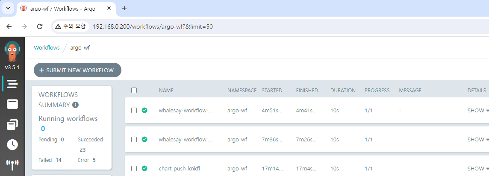
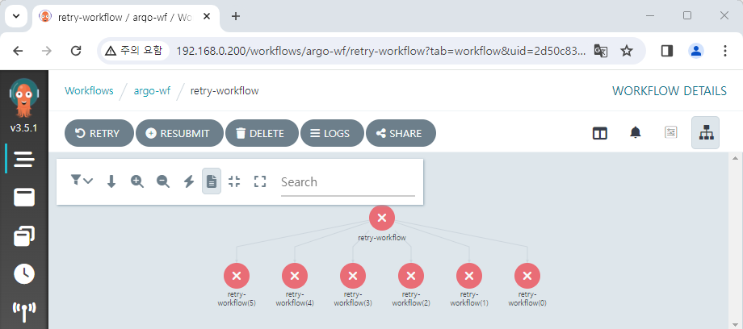

# Other features

## Set deletion conditions for workflow

If no settings are made, the execution history of Workflow will continue to accumulate.  
If the application usage is high, management will be difficult accordingly.



So, in Argo Workflows, there are three main options provided.

- `retentionPolicy`: Retains a specific number of identical workflows based on the state.
- `ttlStrategy` : Resources are deleted when the specified condition is met and a certain amount of time has passed.
- `podGC`: If the state condition of a Pod or Workflow is met, resources will be deleted.

```yaml title="values.yaml" {4-7}
(...)
controller:
  (...)
  workflowDefaults:
    spec:
      ttlStrategy:
        secondsAfterCompletion: 5
(...)
```

The above example is of applying `ttlStrategy`.  
Setting the `values.yaml` file as follows will delete the Workflow history 5 seconds after execution is complete.

## Retry setting

Depending on the situation, you can retry the workflow.

The example is a workflow set to retry up to 5 times.  
The code is executing the non-existent `console.log()` function, so it will be executed 5+1 = 6 times.

```yaml
apiVersion: argoproj.io/v1alpha1
kind: Workflow
metadata:
  name: retry-workflow
spec:
  entrypoint: must-fail
  templates:
    - name: must-fail
      retryStrategy:
        limit: "5"
      script:
        image: python:alpine3.8
        command: [python]
        source: |
          console.log(app)
```



The `retryStrategy` can be applied globally in the template[^1] or set separately.  
Retry conditions can also be customized.[^2]

## Archive setting

When executing workflow, it usually remains as a K8s object after execution by default.  
You can activate the archive feature to store it in an independent RDBMS.

Activate options in the `values.yaml` file and enter the desired database information.  
For more details, please refer to the link below.  
https://argo-workflows.readthedocs.io/en/latest/workflow-archive/

[^1]: https://github.com/argoproj/argo-workflows/blob/main/examples/template-defaults.yaml
[^2]: https://argo-workflows.readthedocs.io/en/latest/retries/#retry-policies
