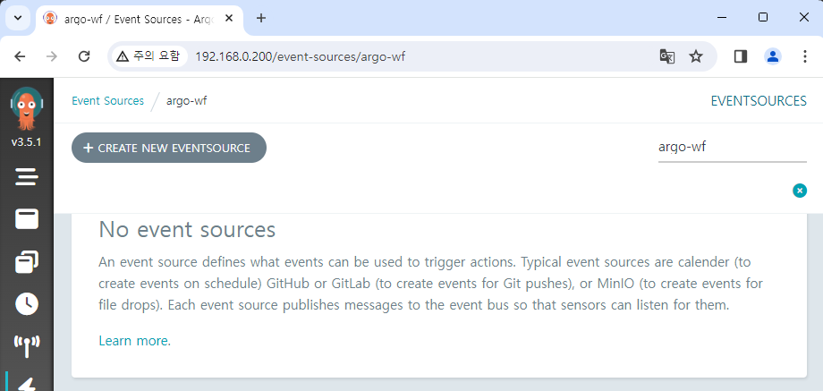

# Deploy Argo Events

In this document, we'll deploy Argo Events and control it through the UI.

If you haven't downloaded the Helm chart yet, download it from following link:  
https://github.com/argoproj/argo-helm

## Argo Workflows & Argo Events

For Argo Workflows v3.0 or later version, you can also control Argo Events from the UI.[^1]  
Since we'll also use Argo Workflows together, we'll install Argo Events in the same `argo-wf` namespace for convenience.

We'll also unify the `fullnameOverride` option of Argo Events as same as Argo Workflows.  
So it'll be set to `myargo`.

## Grant additional permissions to service account

It might be possible to separate the service account, but it would be more convenient to control all with one.  
Therefore, we'll set additional permissions to control Argo Events on the original service account.

Create an event-related role as follows.  
In here all permissions have been granted, so change it if you need.

<!-- prettier-ignore -->
```yaml title="event-admin.yaml"
apiVersion: rbac.authorization.k8s.io/v1
kind: Role
metadata:
  name: event-admin
  namespace: {{ .Release.Namespace | quote }}
rules:
- apiGroups:
  - argoproj.io
  resources:
  - sensors
  - sensors/finalizers
  - sensors/status
  - eventsources
  - eventsources/finalizers
  - eventsources/status
  - eventbus
  - eventbus/finalizers
  - eventbus/status
  verbs:
  - create
  - delete
  - deletecollection
  - get
  - list
  - patch
  - update
  - watch
```

Also create role binding for granting additional role.

<!-- prettier-ignore -->
```yaml title="rb-admin-event.yaml"
apiVersion: rbac.authorization.k8s.io/v1
kind: RoleBinding
metadata:
  name: huadmin-event-rb
  namespace: {{ .Release.Namespace | quote }}
subjects:
  - kind: ServiceAccount
    name: huadmin
roleRef:
  kind: Role
  name: event-admin
  apiGroup: rbac.authorization.k8s.io
```

After the settings are complete, apply the chart through Helm.

```
helm upgrade my-argowf ./argo-workflows -n argo-wf

helm install my-argoevents ./argo-events -n argo-wf
```

Now you can control Argo Events in the UI.



[^1]: https://blog.argoproj.io/argo-workflows-v3-0-4d0b69f15a6e
