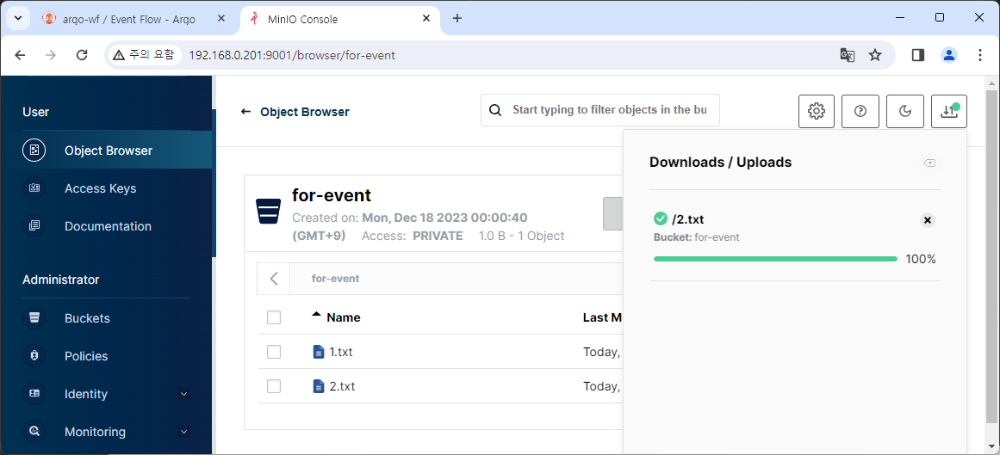
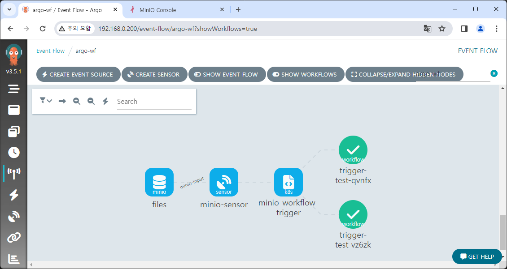

# Execute workflow using a event

In this document, we'll configure the event flow to trigger workflow automatically by detecting specific events.

Argo Events supports multiple event sources but will use MinIO as an example here.

:::info
Event sources supported by Argo Events and examples can be checked through the following links.

https://argoproj.github.io/argo-events/concepts/event_source/  
https://github.com/argoproj/argo-events/tree/master/examples/event-sources
:::

## Configure MinIO

For convenience, we'll separate the buckets for Argo Events & Argo Workflows.  
Create a new bucket `for-event`.


## Create event bus

Event bus performs the role as a transport layer, connecting the objects of Argo Events.  
If not set, Argo Events will not work properly.

3 options are supported: [NATS][nats], [JetStream][jetstream], [Kafka][kafka]. Here we'll use JetStream for simple setup.

Add this file to the Argo Events Helm chart.

```yaml title="eventbus-jetstream.yaml"
apiVersion: argoproj.io/v1alpha1
kind: EventBus
metadata:
  name: eventbus-jetstream
  namespace:
spec:
  jetstream:
    version: "latest"
```

Apply changes with `helm upgrade` command.

:::note personal opinion
Among supported event buses, NATS is marked as deprecated.  
JetStream was also relatively difficult to find documents and information.

Personally, I recommend Kafka when applying it in a real-work.
:::

## Create event source

Let's make an event flow in earnest.

First, we need to create an event source to detect the event.  
In the **Event Sources** menu, click on **CREATE NEW EVENTSOURCE**, and paste the following content below.

```yaml title="minio-event-source.yaml"
apiVersion: argoproj.io/v1alpha1
kind: EventSource
metadata:
  name: minio-event
spec:
  eventBusName: eventbus-jetstream
  minio:
    files:
      bucket:
        name: for-event
      endpoint: minio:9000
      # list of events to subscribe to
      # Visit https://docs.minio.io/docs/minio-bucket-notification-guide.html
      events:
        - s3:ObjectCreated:Put
        - s3:ObjectRemoved:Delete
      insecure: true
      accessKey:
        name: minio
        key: root-user
      secretKey:
        name: minio
        key: root-password
```

The `eventBusName` attribute is used to specify the event bus created before.  
The rest is an information about MinIO, and the event is set to detect file addition/deletion events.[^1]


Press the **CREATE** button to create an event source.  
Since no action has been set after receiving the event, there is no change with this alone.

## Create sensor

Sensor defines that which event will be received and what operation to trigger.

In the **Sensors** menu, click on **CREATE NEW SENSOR**, and paste the following content below.

<!-- prettier-ignore -->
```yaml {41-46}
apiVersion: argoproj.io/v1alpha1
kind: Sensor
metadata:
  name: minio-sensor
spec:
  eventBusName: eventbus-jetstream
  template:
    serviceAccountName: huadmin
  dependencies:
    - name: minio-input
      eventSourceName: minio-event
      eventName: files
  triggers:
    - template:
        name: minio-workflow-trigger
        k8s:
          operation: create
          source:
            resource:
              apiVersion: argoproj.io/v1alpha1
              kind: Workflow
              metadata:
                generateName: trigger-test-
              spec:
                entrypoint: whalesay
                arguments:
                  parameters:
                    - name: message
                      # the value will get overridden by event payload from test-dep
                      value: THIS_WILL_BE_REPLACED
                templates:
                  - name: whalesay
                    inputs:
                      parameters:
                        - name: message
                    container:
                      command:
                        - cowsay
                      image: docker/whalesay:latest
                      args: ["{{inputs.parameters.message}}"]
          # The container args from the workflow are overridden by the s3 notification key
          parameters:
            - src:
                dependencyName: minio-input
                dataKey: notification.0.s3.object.key
              dest: spec.arguments.parameters.0.value
      retryStrategy:
        steps: 3
```

Each created event bus and event source is set with `eventBusName` and `dependencies` respectively.  
In the `triggers` property, an action to be triggered is set, and here we'll create a new workflow and execute it.

The workflow format is the same as the previous chapter's one.  
However, the highlighted part is different, which contains configuration about inputting some of the event info as workflow's parameter. Here, detected file name from MinIO will be set into the `message` variable.

Press the **CREATE** button to create a sensor.  
After that, move to the **Event Flow** menu to check the link between sensor and event source.


(The workflow in the photo is for testing)

## Test event flow

Now, let's generate an event.  
We'll upload a file named `2.txt` to the `for-event` bucket.



Then, a new workflow will be triggered by new detected event.



Checking the log, you can see that our uploaded file name `2.txt` is displayed.


[^1]: https://github.com/minio/minio/blob/master/docs/bucket/notifications/README.md

[nats]: https://nats.io/
[jetstream]: https://docs.nats.io/nats-concepts/jetstream
[kafka]: https://kafka.apache.org/
