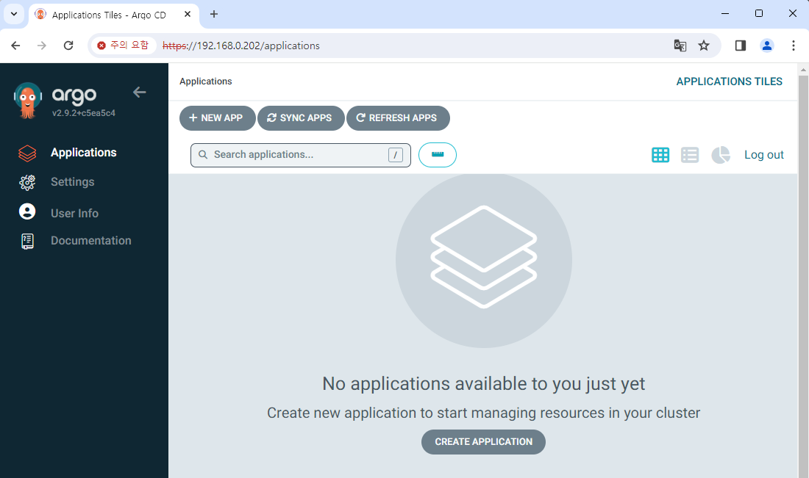

# Deploy Argo CD

In this document, we will deploy and log in to Argo CD.

If you haven't downloaded the Helm chart yet, download it from following link:  
https://github.com/argoproj/argo-helm

## Modify Helm chart

As we did previously, let's simply modify the chart.

1. Change `fullnameOverride` to the name what you want.  
   For example: `myargocd`.

2. To set up load-balancer, modify `values.yaml` like below:

   ```yaml title="values.yaml" {11,27}
   (...)
   server:
     (...)
     ## Server service configuration
     service:
       # -- Server service annotations
       annotations: {}
       # -- Server service labels
       labels: {}
       # -- Server service type
       type: LoadBalancer
       # -- Server service http port for NodePort service type (only if `server.service.type` is set to "NodePort")
       nodePortHttp: 30080
       # -- Server service https port for NodePort service type (only if `server.service.type` is set to "NodePort")
       nodePortHttps: 30443
       # -- Server service http port
       servicePortHttp: 80
       # -- Server service https port
       servicePortHttps: 443
       # -- Server service http port name, can be used to route traffic via istio
       servicePortHttpName: http
       # -- Server service https port name, can be used to route traffic via istio
       servicePortHttpsName: https
       # -- Server service https port appProtocol. (should be upper case - i.e. HTTPS)
       # servicePortHttpsAppProtocol: HTTPS
       # -- LoadBalancer will get created with the IP specified in this field
       loadBalancerIP: "192.168.0.202"
       # -- Source IP ranges to allow access to service from
       loadBalancerSourceRanges: []
       # -- Server service external IPs
       externalIPs: []
       # -- Denotes if this Service desires to route external traffic to node-local or cluster-wide endpoints
       externalTrafficPolicy: ""
       # -- Used to maintain session affinity. Supports `ClientIP` and `None`
       sessionAffinity: ""
   ```

3. Argo CD chart has a dependency, and it's usually downloaded as a `.tgz` file.  
   If there is an item `/*.tgz` in the `.helmignore` file, delete this.

## Deploy & Log in

Argo CD has a separated UI and can be used independently from other Argo apps.  
So we'll deploy it in a separate namespace here as well.

Deploy Argo CD with the following command.

```
helm dependency update ./argo-cd

helm install my-argocd ./argo-cd -n argo-cd --create-namespace
```

Now we need login information.  
Argo CD requires ID/password for login.  
The default ID is `admin`, and password can be checked with the following command.

```
kubectl -n argo-cd get secret argocd-initial-admin-secret -o jsonpath="{.data.password}" | base64 -d
```

Access to the IP address set in Argo CD and log in, then you can check a screen like this.


