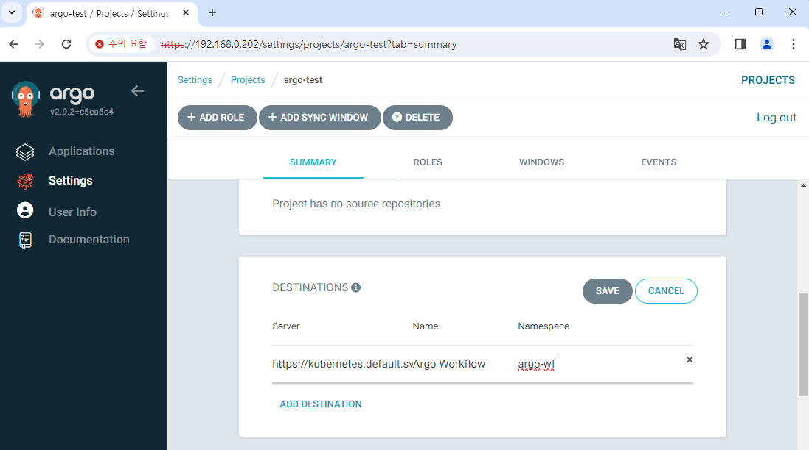
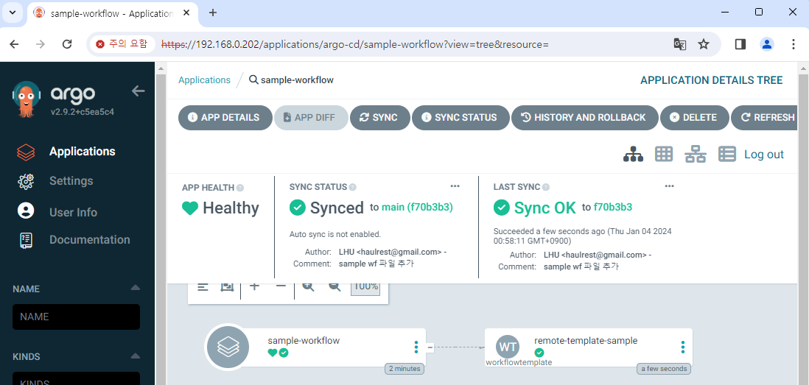
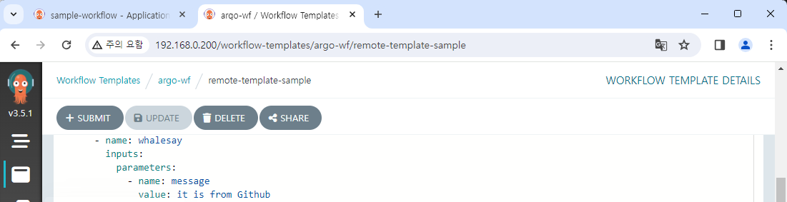

# Control workflow with Argo CD

With Argo CD you can connect the git source, and deploy K8s resources according to them.  
As an example, let's try to control the workflow in Argo Workflows with Argo CD.

We will upload following content to git and connect to Argo CD.  
This is just a simple workflow that we learned Argo Workflows at past.

```yaml title="sample-wf.yaml"
apiVersion: argoproj.io/v1alpha1
kind: WorkflowTemplate
metadata:
  name: remote-template-sample
spec:
  templates:
    - name: whalesay
      inputs:
        parameters:
          - name: message
            value: "it is from Github"
      container:
        image: docker/whalesay
        command: [cowsay]
        args: ["{{inputs.parameters.message}}"]
```

## Create project

First, we'll create a project.  
Project is a group for the application to be created later, and it can manage common settings and permissions for them.

Go into the **Settings/Projects** tab and create a project called `argo-test`.


In the project, you can specify the scope of available git repository and deployable destination.  
For here, we'll add the `argo-wf` namespace as a destination,  
and the repository will be set up without restrictions: `*`.




## Create application

Now, let's create an application.

In the **Applications** tab, press **NEW APP**, and then write an application like this.  
Press the **EDIT AS YAML** button and paste the content below.

```yaml {7-9,11-13,17}
apiVersion: argoproj.io/v1alpha1
kind: Application
metadata:
  name: sample-workflow
spec:
  destination:
    name: ""
    namespace: argo-wf
    server: "https://kubernetes.default.svc"
  source:
    path: step5-3
    repoURL: "<your-git-address>"
    targetRevision: main
  sources: []
  project: argo-test
  syncPolicy:
    automated: null
    syncOptions: []
```

To simply summarize, it refers to the files in the `step5-3` folder under the `main` branch.  
Destination is set to `argo-wf` namespace.  
We set `automated: null` to disable auto-sync on purpose.

Create an application as it is.


Auto-sync is disabled, so it shows "OutOfSync".  
The workflow has not been created either.


Now, we'll run manual sync.  
Press **Sync** button to manually perform sync.

After some time, we can see that the sync process is complete and the workflow has been created.




You can also check the created workflow in Argo Workflows.  
Also, you can execute it and check the logs.



## Sync changes

We synced the workflow file in git to Argo CD and created resources.  
Then what would happen if we change a file?

We will change the value of the variable and push to the git.


Checking Argo CD, it has returned to "OutOfSync" again.  
It is because the settings of source code and current resource are different.


If you re-sync the application, it changed to "Synced" again.  
The change in value will be reflected in the workflow.


