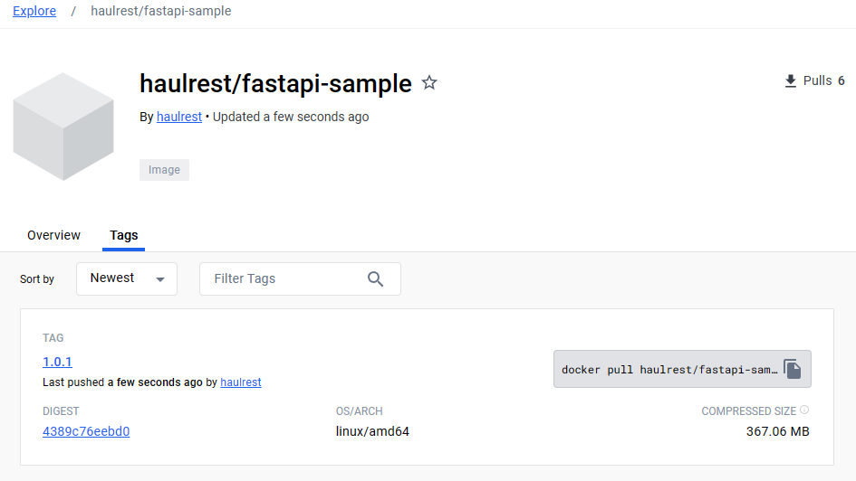

# Complete CI/CD pipeline

In this document, we'll integrate Argo CD to the previously built CI pipeline and complete the CI/CD pipeline.

## Additional project settings

We have already done the process of building a FastAPI sample app as an image.  
We'll deploy this app to the `fastapi` namespace through Argo CD.

Add the `fastapi` namespace to the project's destination.


When we create an application, various objects will be created like namespace, deployment, service, and so on.  
To grant permission for this, we need to configure cluster resource allow list.  
For here, we'll grant permission for all kind of resources.


## Connect Helm chart

Helm charts can also be controlled by Argo CD.  
https://argo-cd.readthedocs.io/en/stable/user-guide/helm/

Create application with the information as follows.

```yaml {19-23}
apiVersion: argoproj.io/v1alpha1
kind: Application
metadata:
  name: fastapi-deploy
  namespace: argo-cd
spec:
  destination:
    namespace: fastapi
    server: "https://kubernetes.default.svc"
  source:
    path: fastapi-argo
    repoURL: "https://github.com/BeaverHouse/dive-argo-fastapi-helm.git"
    targetRevision: main
    helm:
      releaseName: dive-argo-fastapi
  sources: []
  project: argo-test
  syncPolicy:
    automated:
      prune: false
      selfHeal: false
    syncOptions:
      - CreateNamespace=true
```

Like the previous one, it refers to the files in the `fastapi-argo` folder under the `main` branch.  
Destination is set to `fastapi` namespace.

And for creating a namespace automatically, specify `CreateNamespace=true`.  
Auto-sync is also activated. Other options are not set.


After creating, resources are deployed as configured in the Helm chart.  
Since I have set up ingress in the Helm chart, you can navigate to the IP address of Ingress NGINX Controller, `192.168.0.222`, and check the FastAPI app.


## Update changes automatically

Now, let's modify the original FastAPI app.  
I added an simple additional API and tagged the version with `1.0.1`.


In the previous chapter, instead of receiving events directly from GitHub, we generated a event with MinIO maually.  
Add or delete files in MinIO to trigger events.


Then the CI pipeline will be triggered by the event.




Image has been pushed to Docker Hub, and the Helm chart has also been changed.  
Return to Argo CD and you can see that it automatically execute rolling updates.


After all processes are completed, you can check the new API in the FastAPI app.


